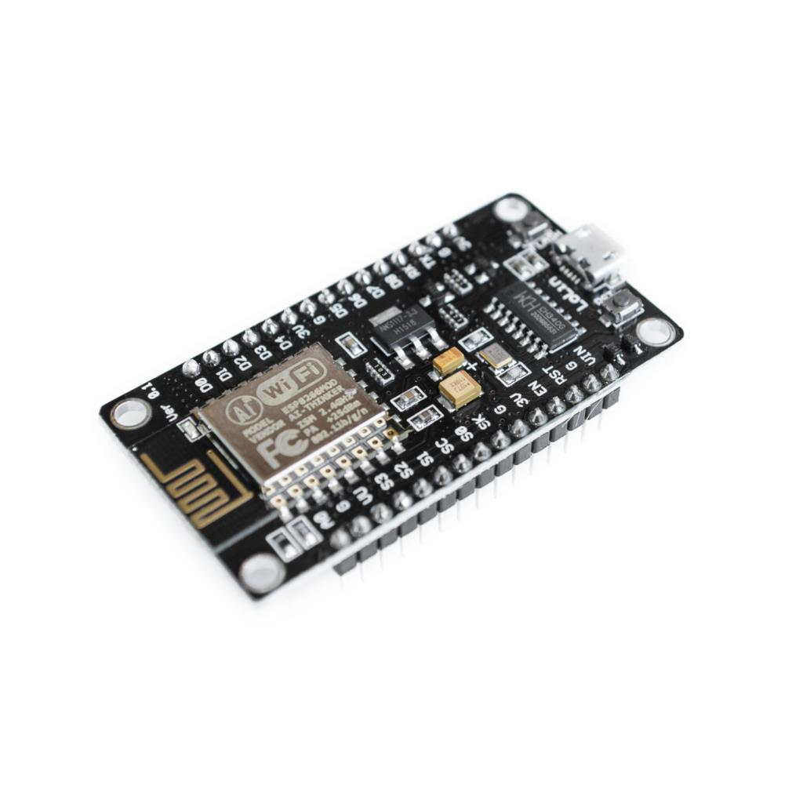

# Capa de percepción - clase 1

> ## Objetivos
> * Repasar los componentes básicos de un sistema IoT.
> * Explorar los componentes básicos que conforman el concepto de cosa.
> * Hablar sobre el software de desarrollo a emplear
> * Investigar sobre los sistemas de desarrollo disponibles en el laboratorio.

## Referencias principales

La mayor parte de esta clase tomará como base la lección 2 **A deeper dive into IoT** ([lección 2](https://github.com/microsoft/IoT-For-Beginners)) del curso **IoT for Beginners** ([link](https://github.com/microsoft/IoT-For-Beginners)) de Microsoft.

# Orden de la clase

### 1. Ejemplo introductorio

A continuación se muestra el diagrama de un sistema de control en tiempo real para jugar con un laberinto hecho en la universidad de Curtin (https://www.curtin.edu.au/):

En el siguiente video se puede observar el funcionamiento de dicho sistema:

### 2. Componentes de las aplicaciones IoT

Esta parte tomara como referencia el material del siguiente [link](https://github.com/microsoft/IoT-For-Beginners/blob/main/slides/lesson-2.pdf)

### 3. Placas de desarrollo disponibles

**Arduino UNO**

Las principales caracteristicas del Arduino UNO se resumen en la siguiente tabla:

|Item |Arduino UNO|
|---|---|
|Microcontrolador |ATmega328P (Atmel)|
|Microprocesador |ATMega 16U2|
|I/O Voltage |5 V|
|Input voltage (nominal) |7 - 12 V (Power jack)|
|Power jack | yes|
|Voltaje de alimentación (Pin)||
|Voltaje de Entradas/Salidas |5 V|
|Voltaje de referencia en el ADC| 5V|
|DC Current per I/O Pin| 20 mA|
|Built-in LED Pin |13|
|Digital I/O Pins |14 (I/O)|
|Analog input pins |6 (ADC 10-bit)|
|PWM pins| 6|
|UART| yes|
|I2C| yes|
|SPI| yes|
|I2S|| 
|WIFI| no|
|Bluetooth| no|
|Programmable | Arduino IDE, Micropython, VS Code|
|Marca | Arduino|

Para mas informacion ver el siguiente [link](https://udea-iot.gitbook.io/introduccion-al-iot/primeros-pasos/placas-de-desarrollo/arduino-uno)

**ESP8266**

La siguiente tabla resume las especificaciones tecnicas del ESP-8266:

|Item |ESP8266|
|---|---|
|Microcontrolador |SoC ESP9266EX|
|Microprocesador |Tensilica's L106 Diamond series 32-bit|
|I/O Voltage |5 V|
|Input voltage (nominal) |5 - 12 V (VIN, VCC)|
|Power jack | no|
|Voltaje de alimentación (Pin)|5 V (VIN)|
|Voltaje de Entradas/Salidas |3.3 V|
|Voltaje de referencia en el ADC|3.3 V|
|DC Current per I/O Pin| 12 mA|
|Built-in LED Pin |---|
|Digital I/O Pins |9 (GPIO)|
|Analog input pins |1|
|PWM pins| 4|
|UART| yes|
|I2C| yes|
|SPI| yes|
|I2S| yes| 
|WIFI| IEEE 802.11 b/g/n|
|Bluetooth| no|
|Programmable | Arduino IDE, Micropython, VS Code|
|Marca | Ai-Thinker|

Para mas informacion ver el siguiente [link](https://udea-iot.gitbook.io/introduccion-al-iot/primeros-pasos/placas-de-desarrollo/esp8266)

**ESP32**

La siguiente tabla resume las especificaciones tecnicas del ESP32:

|Item |ESP32|
|---|---|
|Microcontrolador |SoC ESP32|
|Microprocesador |Xtensa single-/dual-core 32-bit LX6|
|I/O Voltage |5 V|
|Input voltage (nominal) |---|
|Power jack | no|
|Voltaje de alimentación (Pin)|3.3 V (VIN)|
|Voltaje de Entradas/Salidas |3.3 V|
|Voltaje de referencia en el ADC| |
|DC Current per I/O Pin| 12 mA|
|Built-in LED Pin ||
|Digital I/O Pins |24 (GPIO - Algunos pines solo como entrada)|
|Analog input pins |2 (8-bit)|
|PWM pins| 4|
|UART| yes|
|I2C| yes|
|SPI| yes|
|I2S| | 
|WIFI| IEEE 802.11 b/g/n|
|Bluetooth| yes|
|Programmable | Arduino IDE, Micropython, VS Code|
|Marca | Ai-Thinker|

Para mas informacion ver el siguiente [link](https://udea-iot.gitbook.io/introduccion-al-iot/primeros-pasos/placas-de-desarrollo/esp32)

**ARDUINO NANO 33 BLE Sense Lite**

El Arduino Nano 33 BLE Sense ([datasheet](https://docs.arduino.cc/resources/datasheets/ABX00031-datasheet.pdf)) esta basado en el microcontrolador nRF52840 ([datasheet](https://content.arduino.cc/assets/Nano_BLE_MCU-nRF52840_PS_v1.1.pdf))

La siguiente tabla resume las especificaciones tecnicas del Arduino Nano 33 BLE Sense:

|Item |Arduino Nano 33 BLE Sense|
|---|---|
|Microcontrolador|	nRF52840 ([datasheet](https://content.arduino.cc/assets/Nano_BLE_MCU-nRF52840_PS_v1.1.pdf))|
|Operating Voltage|	3.3V|
|Input Voltage (limit)|	21V|
|DC Current per I/O Pin|	15 mA|
|Clock Speed	|64MHz|
|CPU Flash Memory	1MB |(nRF52840)|
|SRAM|	256KB (nRF52840)|
|EEPROM|	none|
|Digital Input / Output Pins|	14|
|PWM Pins|	all digital pins|
|UART|	1|
|SPI|	1|
|I2C|	1|
|Analog Input Pins|	8 (ADC 12 bit 200 ksamples)|
|Analog Output Pins|	Only through PWM (no DAC)|
|External Interrupts	|all digital pins|
|LED_BUILTIN|	13|
|USB	|Native in the nRF52840 Processor|
|IMU|	LSM9DS1 ([datasheet](https://content.arduino.cc/assets/Nano_BLE_Sense_lsm9ds1.pdf))|
|Microphone|	MP34DT05 ([datasheet](https://content.arduino.cc/assets/Nano_BLE_Sense_mp34dt05-a.pdf))|
|Gesture, light, proximity|	APDS9960 ([datasheet](https://content.arduino.cc/assets/Nano_BLE_Sense_av02-4191en_ds_apds-9960.pdf))|
|Barometric pressure	|LPS22HB ([datasheet](https://content.arduino.cc/assets/Nano_BLE_Sense_lps22hb.pdf))|
|Temperature, humidity|	HTS221 ([datasheet](https://content.arduino.cc/assets/Nano_BLE_Sense_HTS221.pdf))|
|Tamaño (length × width) |45 mm × 18 mm|

A diferencia de los otros sistemas disponibles en el laboratorio, el Arduino Nano 33 BLE Sense tiene algunos sensores integrados que pueden ser usados para soluciones IoT.

> **Importante**: Hay diferentes versiones del Arduino Nano 33 BLE Sense (conocidas como "revisions": NANO 33 BLE SENSE y NANO 33 BLE SENSE REV2). En ambas se usa el nRF52840 como procesador, pero los sensores son diferentes. Por lo tanto, es importante tener cuidado al elegir la versión correcta con la tarjeta con la que se va a trabajar en el Arduino IDE.

### 4. Sobre los componentes

**Fabricantes**

En la siguiente tabla se muestran algunas de las principales empresas que se dedican a la fabricación de modulos para prototipado IoT:

|Fabricante|Link|
|---|---|
|Adafruit Industries|https://www.adafruit.com/|
|SparkFun Electronics|https://www.sparkfun.com/|
|dfrobot|https://www.dfrobot.com/|
|Seeeed Studio|https://www.seeedstudio.com/|
|Elegoo|https://www.elegoo.com/|

Ademas de la fabricación, tambien documentan y muestran ejemplos demostrativos de como usar los componentes que allí se fabrican.

**Distribuidores**

Si lo que se quiere es comprar son componentes electronicos existen distribuidores para ello, en la siguiente tabla se muestran algunos de los principales distribuidores de componentes a nivel mundial (tomados de la pagina **2023 Top 50 Electronics Distributors List** ([link](https://www.supplychainconnect.com/rankings-research/article/21264998/2023-top-50-electronics-distributors-list))):

|Distribuidores|Link|
|---|---|
|Mouser Electronics|https://www.mouser.com/|
|DigiKey Corporation|https://www.digikey.com/|
|Arrow Electronics|https://www.arrow.com/|
|WPG Holdings|https://www.wpgholdings.com/main/index/en|
|Avnet|https://www.avnet.com/wps/portal/us/|
|Future Electronics|https://www.futureelectronics.com/|

En el caso colombiano, la siguiente lista (tomada del foro **Listado de proveedores de Electrónica - Colombia** ([link](https://www.forosdeelectronica.com/resources/listado-de-proveedores-de-electr%C3%B3nica-colombia.105/))) contiene algunos de los distribuidores en Colombia:

|Distribuidores|Link|
|---|---|
|I + D|https://didacticaselectronicas.com/|
|Sigma Electronica|https://www.sigmaelectronica.net/|
|Electronilab|https://electronilab.co/|
|Suconel|https://suconel.com/|
|La Red Electronica|https://laredelectronica.com/|

### 5. Actividad para la proxima clase

1. Instalar en su maquina los siguientes programas:
   - [x] Arduino IDE
   - [x] Visual Studio Code
   - [x] Platformio (Complemento de Visual Studio Code)
   - [x] Fritzing
   - [x] draw.io
   - [ ] Mosquito
   - [ ] Mqtt explorer 
   - [ ] Node-red 
   
   Para mas información sobre estas puede consultar el siguiente [link](https://udea-iot.gitbook.io/introduccion-al-iot/pasos-previos/herramientas-necesarias/software)

2. A continuación se listan los directorios de cada uno de los proyectos a trabajar a lo largo del semestre. Teniendo en cuenta las instrucciones dadas en clase editar el archivo **README.md** disponible dentro de cada directorio (para ver la sintaxis markdown puede consultar el siguiente [link](https://github.com/adam-p/markdown-here/wiki/Markdown-Here-Cheatsheet)). A continuación se listan los proyectos:
   
   |#|Proyecto|
   |---|---|
   |1| HAMMER 2.0 ([link](hammer-2/README.md))|
   |2| Smart Scent ([link](smart-scent/README.md))|
   |3| Luft Scntry ([link](luft-sentry/README.md))|
   |4| Sistemas de automatizado de una cava de vino ([link](cava-vino/README.md))|

## Referencias

### Arduino Nano BLE Sense

* https://docs.arduino.cc/hardware/nano-33-ble-sense
* https://edgeimpulse.com/blog/announcing-support-for-the-arduino-tiny-machine-learning-kit
* https://store-usa.arduino.cc/products/arduino-tiny-machine-learning-kit?selectedStore=us
* https://www.edx.org/es/certificates/professional-certificate/harvardx-tiny-machine-learning
* https://www.datacamp.com/blog/what-is-tinyml-tiny-machine-learning
* https://docs.edgeimpulse.com/docs/development-platforms/officially-supported-mcu-targets/arduino-nano-33-ble-sense