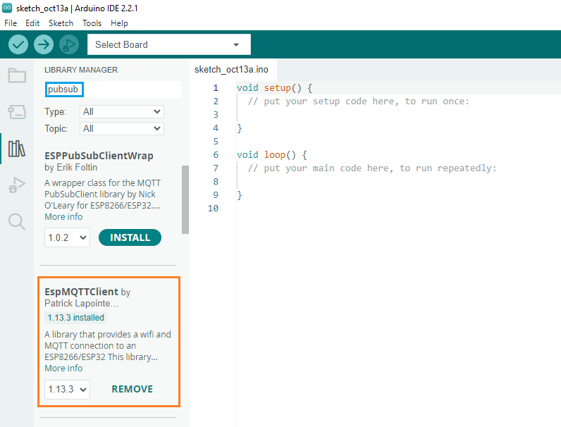
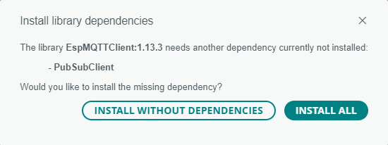
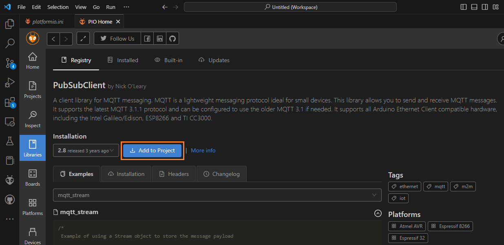
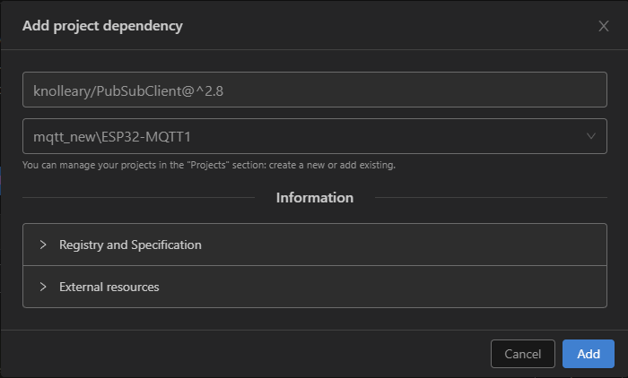

# Implementación de una aplicación MQTT

## Sobre MQTT

Dentro de los diferentes protocolos ([link](https://learn.adafruit.com/alltheiot-protocols)) usados en la industria IoT, el protocolo **MQTT (Message Queue Telemetry Transport)** ([link](https://mqtt.org/)) se ha convertido en uno de los mas populares. El protocolo MQTT (Message Queuing Telemetry Transport) es un protocolo diseñado para transferir mensajes mediante el uso de un modelo **publish and subscribe**. Mediante este modelo, es posible enviar mensajes a 0, 1 o multiples clientes.


Para permitir la comunicación entre los diferentes dispositivos, MQTT requiere del uso de un Broker central (tal y como se muestra en la figura de abajo (tomada de [link](https://learn.sparkfun.com/tutorials/introduction-to-mqtt/all))):


Tal y como se muestra en la figura anterior, los elementos de involucrados en una red MQTT son:
* **Broker**: Es el servidor encargado de distribuir la información entre los diferentes clientes conectados a la red.
* **Cliente**: Es el dispositivo que se conecta a la red MQTT a traves del broker para enviar y recibir información.

Los mensajes entre los clientes son direccionados por el broker por medio del **topic**. Para transferencia de mensajes en la red MQTT un cliente puede:
* **publish**: en este caso el cliente envia información a broker para que esta sea distribuida a los demas clientes interesados con base en el nombre del **topic**.
* **subscribe**: cuando se suscriben, los clientes indican al broker cuales son los **topic(s)** en los que estos se encuentran interesados, de manera que cualquier mensaje publicado por el broker es distribuido a los clientes que se encuentra **suscritos** (interesados) a dicho topic. Un cliente tambien puede **unsubscribe** a un tipico para parar de recibir mensajes desde el broker a traves de dicho topic.

## Elementos necesarios

Para trabajar con MQTT es necesario tener como minimo instalados los siguientes programas:
1. **El broker**: El software que implementa el broker debe estar instalado en uno de los dispositivos de la red MQTT (normalmente un PC, una RPi, cualquier dispositivo de borde o incluso en la nube) para hacer posible el redireccionamiento de los mensajes. 
2. **Clientes**: Los clientes pueden implentarse como aplicaciones de usuario (como **mosquito_pub**, **mosquito_sub** o **MQTT Explorer**) o pueden integrarsen a programas por medio de algun API MQTT (**Eclipse Paho** por ejemplo) mediante el uso de librerias en algun lenguaje de programación.

Antes de empezar implementar una red MQTT, asegurese de tener instalados los siguientes elementos:
1. Un **broker MQTT** en una maquina (el mosquitto ([link](https://mosquitto.org/download/)) fue la opción empleada en nuestro caso).
2. Un cliente MQTT para el envio y recepción de paquetes. En nuestro caso se instalaron:
   *  **mosquitto_pub** (Viene integrado en el broker MQTT Mosquitto).
   *  **el mosquito_sub** (Viene integrado en el broker MQTT Mosquitto).
   *  **MQTT Explorer**
3. Una libreria, en algún lenguaje de programación, para el desarrollo de clientes que usen MQTT. En nuestro caso se empleó la libreria **Eclipse Paho** ([link](https://projects.eclipse.org/projects/iot.paho))
   
Despues de realizar esto, es bueno verificar el correcto funcionamiento de las aplicaciones instaladas realizando una prueba sencilla en la que se verifique el funcionamiento del broker y los clientes.

## Implementación de clientes MQTT en las cosas

Por cosas hacemos referencia a los dispositivos que interactuan con el ambiente en la capa de percepción, en otras palabras las placas. En nuestro caso, como estamos trabajando con la placa **ESP32** es necesario instalar las librerias necesarias para que un ESP32 pueda funcionar como cliente en una red MQTT.

### Instalación en Arduino

El repositorio de la libreria **EspMQTTClient** se encuentra en el siguiente [link](https://github.com/plapointe6/EspMQTTClient). Para llevar a cabo la instalación de esta libreria en el IDE de Arduino, siga los siguientes pasos:
1. Abra el administrador de librerias: **Tools -> Manage Libraries...**
2. Digite en el campo de busqueda la palabra clave **pubsub**, seleccione la libreria **EspMQTTClient** e instalela:
      
   

3. Como esta libreria depende se otras dependencias, acepte la opcion que permite la instalación de todas las librerias (Install All) incluyendo las dependencias:

   


Si todo esta bien, ya esta todo listo para realizar programas que permitan la comunición de la ESP32 usando MQTT empleando como IDE el Arduino.

### Instalación en Platformio

La instalación en platformio se reduce simplemente a agregar la libreria MQTT (en nuestro caso se instalo la libreria **Arduino Client for MQTT** ([link](https://pubsubclient.knolleary.net/))) en el archivo de configuración **platformio.ini** (tal y como se ha hecho con las otras librerias). Este quedará de la siguiente forma: 

```ini
[env:nodemcu-32s]
platform = espressif32
board = nodemcu-32s
framework = arduino
lib_deps = knolleary/PubSubClient@^2.8
```

Sin embargo a continuación se explica como se realiza el procedimiento paso a paso (para profundizar ver la pagina *FSM Lecture 31- Adding arduino Library to project in platformIO* ([link](https://fastbitlab.com/fsm-lecture-31-adding-arduino-library-to-project-in-platformio/))):
1. Dar click en el boton **Libraries** y colocar en el cuadro de busqueda una palabra clave relacionada con la libreria de interes (en nuestro caso se coloco **mqtt** como palabra de busqueda). Luego, seleccionar de la lista de librerias que aparece aquella que deseamos instalar:
   
   
   
2. Agregar la libreria al proyecto.
   
   

3. En la lista de proyectos desplegadas, elegir el proyecto en el cual se va a realizar la instalación de la libreria.
   
   

4. Si todo sale bien, la libreria se agregará al archivo de configuración del proyecto **platformio.ini**
   
   

Si todo esta bien, ya es posible, para este proyecto, codificar programas que permitan la comunicación de la ESP32 por medio del protocolo MQTT usand platformio.


## Caso de prueba

Para comprender una implementación de una red MQTT sencilla vamos a plantear el caso de prueba mostrado en la siguiente figura:


El objetivo en este caso es simular la implementación del control de iluminación de una oficina mediante MQTT. La siguiente tabla describe cada uno de los clientes de la red MQTT:

| Dispositivo | Cliente |Rol|Topic (message-topic)|Mensaje (message)|Observaciones|
|---|---|---|---|---|---|
| PC |C1|publisher| ```home/office/lamp```|<ul><li>```ON```<li>```OFF```</ul>|<ul><li>**```ON```**: Comando con el que se prende la luz de la oficina.<li>**```OFF```**: Comando con el que se prende la luz de la oficina.</ul>|
|C2|ESP32|susbcriber|```home/office/lamp```|```---```|Cuando se recibe el comando **```ON```** se enciende la lampara y cuando se recibe el comando **```OFF```** se apaga la lampara|

Una vez que esta definido el caso de prueba vamos a realizar la puesta en marcha de manera gradual en dos fases tal y como se describirá a continuación:

### Fase 1 - Pruebas en el PC

Inicialmente vamos a realizar las pruebas basicas del caso de uso empleando las aplicaciones de escritorio. Asumiendo que el broker y los clientes se encuentran en la misma maquina, vamos a realizar los siguientes pasos:

1. Arrancar el broker ejecutando el comando:
   
   ```
   mosquito
   ```

   La siguiente imagen muestra el caso en un computador con windows:

   

2. Desde otra terminal, arrancar el cliente suscriptor:
   
   ```
   mosquito_sub -t /home/office/lamp
   ```

   La siguiente figura muestra el resultado:

   

3. Empleando una nueva terminal, enviar el comandos y visualizar el resultado en la terminal asociada al suscriptor:
   

   ```
   mosquito_pub -t /home/office/lamp -m ON
   mosquito_pub -t /home/office/lamp -m OFF
   ```

   El resultado se muestra a continuación:

   

Como se puede evidenciar, la red MQTT funciona. Como segunda parte, vamos a implementar el cliente suscritor en el ESP32. 

### Fase 2 - Implementación de un cliente en la ESP

Para saber como implementar un cliente en la ESP32, es necesario consultar la documentación del API **EspMQTTClient** en el siguiente [link](https://github.com/plapointe6/EspMQTTClient). 

A continuación vamos a explorar como realizar la implementación usando una plantilla lo mas general posible (para ver un ejemplo paso a paso ver el siguiente [link](https://hackmd.io/@fablabbcn/rydUz5cqv)):

```ino
/* ----- Include Libraries ----- */
#include <WiFi.h>
#include <PubSubClient.h>

/* ------ Wifi ------ */
const char* ssid = "SSID-AP";   // name of your WiFi network
const char* password = "PASS_AP"; // password of the WiFi network
WiFiClient wifiClient;

/* ----- MQTT Network ----- */
const char* mqttBroker = "192.168.1.50";; // IP address of your MQTT broker eg. 192.168.1.50

const char *ID = "id_thing";  // Name of our device, must be unique

// Topics
const char *topic1 = "topic1_name"; 
const char *topic2 = "topic2_name"; 
...

// Setup MQTT client
PubSubClient mqttclient(wclient); 

/* ----- Ports ----- */
// Code...
...

/* ----- Variables ----- */
// Code...
...

/* ----- Helper funtions ----- */

// Connect fuction
void mqttConnect() {
  // Loop until we're reconnected
  while (!mqttClient.connected()) {
    Serial.print("Attempting MQTT connection...");
    if (mqttClient.connect(ID)) {
      Serial.println("OK");
    
      // Topic(s) subscription
      mqttClient.subscribe(topic1);
      ...

    } else {     
      // Retry connection
      Serial.print("failed, rc=");
      Serial.print(mqttClient.state());
      Serial.println(" try again in 5 seconds");
      delay(5000);    
    }
  }
}

// Subscription callback
void callback(char* topic, byte* message, unsigned int length) {
   // Code...
   ...
}

// Ports Setup
void setup_ports() {
  // Code...
  ...
}


// Wifi conection
void setup_wifi() {
  Serial.print("\nConnecting to ");
  Serial.println(ssid);

  WiFi.begin(ssid, password); // Connect to network

  while (WiFi.status() != WL_CONNECTED) { // Wait for connection
    delay(500);
    Serial.print(".");
  }

  Serial.println();
  Serial.println("WiFi connected");
  Serial.print("IP address: ");
  Serial.println(WiFi.localIP());
}


/* ----- Main funtions ----- */

// setup
void setup() {
  // Setup ports
  setup_ports();
  // Serial setup
  Serial.begin(115200);

  // Setup wifi
  setup_wifi();

  // MQTT setup
  mqttClient.setServer(mqttBroker, 1883);
  mqttClient.setCallback(callback);
}

// loop
void loop() {
  // Check if we are still connected to the MQTT broker
  if (!mqttClient.connected()) {
    mqttConnect();
  }
  // Let PubSubClient library do his magic
  mqttClient.loop();

  // Publish based on events
  //Code...
  ...
}
```

Antes de adaptar la plantilla a nuestro ejemplo, es necesario conocer la información solicitada en la siguiente tabla:

|Dato|Variable plantilla|Valor|
|---|---|---|
|IP del broker|```mqttBroker```|Consultar la IP con el comando ```ifconfig``` o ```ipconfig```|
|SSID AP|```ssid```|Elegir el access point de la red|
|Pasword AP|```password```|Consultar el password del access point o dejar el valor vacio si no tiene|


Teniendo en cuenta la plantilla anterior, si la adaptamos de acuerdo a la logica del caso de uso el resultado será el mostrado a continuación:

```ino
/* ----- Include Libraries ----- */
#include <WiFi.h>
#include <PubSubClient.h>

/* ------ Wifi ------ */
const char* ssid = "SSID_AP";   // name of your WiFi network
const char* password = "PASS_AP"; // password of the WiFi network
WiFiClient wifiClient;

/* ----- MQTT Network ----- */
const char* mqttBroker = "192.168.1.50"; // IP address of your MQTT broker eg. 192.168.1.50

const char *ID = "001";  // Name of our device, must be unique

// Topics
const char *topic = "home/office/lamp";  // Topic to subcribe to


// Setup MQTT client
PubSubClient mqttClient(wifiClient); 

/* ----- Ports ----- */
const byte LIGHT_PIN = LED_BUILTIN;           // Pin to control the light


/* ----- Variables ----- */


/* ----- Helper funtions ----- */

// Connect fuction
void mqttConnect() {
  // Loop until we're reconnected
  while (!mqttClient.connected()) {
    Serial.print("Attempting MQTT connection...");
    if (mqttClient.connect(ID)) {
      Serial.println("OK");
    
      // Topic(s) subscription
      mqttClient.subscribe(topic);

    } else {     
      // Retry connection
      Serial.print("failed, rc=");
      Serial.print(mqttClient.state());
      Serial.println(" try again in 5 seconds");
      delay(5000);    
    }
  }
}

// Subscription callback
void callback(char* topic, byte* payload, unsigned int length) {
  String response;

  for (int i = 0; i < length; i++) {
    response += (char)payload[i];
  }
  Serial.print("Message arrived [");
  Serial.print(topic);
  Serial.print("] ");
  Serial.println(response);
  if(response == "ON")  // Turn the light on
  {
    digitalWrite(LIGHT_PIN, HIGH);
  }
  else if(response == "OFF")  // Turn the light off
  {
    digitalWrite(LIGHT_PIN, LOW);
  }
}


// Ports Setup
void setup_ports() {
  pinMode(LIGHT_PIN, OUTPUT); // Configure LIGHT_PIN as an output
}


// Wifi conection
void setup_wifi() {
  Serial.print("\nConnecting to ");
  Serial.println(ssid);

  WiFi.begin(ssid, password); // Connect to network

  while (WiFi.status() != WL_CONNECTED) { // Wait for connection
    delay(500);
    Serial.print(".");
  }

  Serial.println();
  Serial.println("WiFi connected");
  Serial.print("IP address: ");
  Serial.println(WiFi.localIP());
}


/* ----- Main funtions ----- */

// setup
void setup() {
  // Setup ports
  setup_ports();
  // Serial setup
  Serial.begin(115200);
  delay(100);
  // Setup wifi
  setup_wifi();
  // MQTT setup
  mqttClient.setServer(mqttBroker, 1883);
  mqttClient.setCallback(callback);
}

// loop
void loop() {
  // Check if we are still connected to the MQTT broker
  if (!mqttClient.connected()) {
    mqttConnect();
  }
  // Let PubSubClient library do his magic
  mqttClient.loop();
}
```

Para realizar la prueba, se procede de manera similar solo que esta vez, el cliente que suscribe (recibe los comandos) es la ESP32 la cual; en este caso, dependiendo si se envia el comando **ON** o **OFF** prenderá o apagará el led que viene integrado a esta. 

Una vez que se descargue la aplicación en el ESP32 y teniendo en cuenta que el broker se encuentra funcionando, al abrir el monitor serial del Arduino IDE, el resultado se vera similar al mostrado a continuación:


De acuerdo a los mensajes de log mostrados se puede notar, que el cliente se logro enganchar y por lo tanto, esta listo para recibir los comandos que enviados desde cualquier otro cliente que publique al mismo **topic**. Para esto, desde una terminal empleando el **mosquitto_pub** procedemos a enviar los comandos para prender y apagar la luz tal y como se muestra en la siguiente figura:


Si todo esta bien, el led de la placa ESP32 se deben encender y apagar; asi mismo, según el programa, el monitor serial debe mostrar información sobre este evento lo cual se corrobora en la siguiente figura:


## Ejemplos de aplicación

### Ejemplo 1 - Control de la luz de una oficina

Control de encendido y apagado de luz empleando MQTT ([link ejemplo 1](ejemplo_1/README.md)).


### Ejemplo 2 - Smart Home 

Interfaz grafica para el monitoreo y control de un hogar. El repo principal con el modelo actualizado se encuentra en el siguiente [link](https://github.com/jilopezv/IoT/tree/newModel). La arquitectura que se implementa aqui es la mostrada en la siguiente figura:


En esta ejemplo solo se aborda una pequeña parte de este proyecto la cual es puede encontrar en el [link ejemplo 2](ejemplo_2/README.md).

La interfaz de la casa completa (con algunas funciones deshabilidatas de muestra a continuación)


La interfaz de la sala se muestra a continuación:


> **Nota**
> Todo esto, aun se encuentra en construcción. Disculpas por las molestias causadas...

## Referencias

* https://cedalo.com/blog/mqtt-and-arduino-setup-guide/
* https://www.valvers.com/open-software/arduino/esp32-mqtt-tutorial/#debug-output
* https://cedalo.com/blog/enabling-esp32-mqtt/
* https://randomnerdtutorials.com/esp32-mqtt-publish-subscribe-arduino-ide/
* https://hackmd.io/@fablabbcn/rydUz5cqv
* https://www.hackster.io/harshkc2000/toit-and-esp32-mqtt-based-motion-alert-system-7f281a
* https://esp32tutorials.com/esp32-mqtt-publish-ds18b20-node-red-esp-idf/
* https://doc.asksensors.com/docs/d/s3/connect-esp32-over-mqtt/
* https://learn.sparkfun.com/tutorials/introduction-to-mqtt/all
* https://learn.adafruit.com/adafruit-io/mqtt-api
* https://io.adafruit.com/api/docs/mqtt.html#adafruit-io-mqtt-api
* https://github.com/SensorsIot/MQTT-Examples/blob/master/ESP_MQTT_ADAFRUIT_LIBRARY/ESP_MQTT_ADAFRUIT_LIBRARY.ino
* https://learn.adafruit.com/mqtt-adafruit-io-and-you
* https://learn.adafruit.com/alltheiot-protocols
* https://espressif-docs.readthedocs-hosted.com/projects/arduino-esp32/en/latest/
* https://docs.espressif.com/projects/esp-idf/en/latest/esp32/api-reference/protocols/index.html
* https://esp32tutorials.com/esp32-mqtt-client-publish-subscribe-esp-idf/
* https://learn.sparkfun.com/tutorials/introduction-to-mqtt/all
* http://kio4.com/arduino/curso.htm
* https://github.com/antaresdocumentation/antares-esp32-mqtt
* https://microdigisoft.com/esp32-mqtt-publish-and-subscribe-with-arduino-ide/
* https://forum.arduino.cc/t/esp32-mqtt-client/973629/2
* https://randomnerdtutorials.com/esp32-mqtt-publish-ds18b20-temperature-arduino/
* https://randomnerdtutorials.com/esp32-mqtt-publish-subscribe-arduino-ide/
* https://www.valvers.com/open-software/arduino/esp32-mqtt-tutorial/#debug-output
* https://cedalo.com/blog/enabling-esp32-mqtt/
* http://esp32.net/
* https://ubidots.com/community/t/solved-esp32-subscribing-via-mqtt/2770/2
* https://community.home-assistant.io/t/mqtt-light-and-esp32/125252
* https://randomnerdtutorials.com/esp32-mqtt-publish-ds18b20-temperature-arduino/
* https://hackmd.io/@fablabbcn/rydUz5cqv
* https://www.hackster.io/harshkc2000/toit-and-esp32-mqtt-based-motion-alert-system-7f281a
* http://www.edubox.org/openmqttgateway-un-proyecto-para-convertir-diferentes-protocolos-a-mqtt/
* https://esp32tutorials.com/esp32-mqtt-publish-ds18b20-node-red-esp-idf/
* https://doc.asksensors.com/docs/d/s3/connect-esp32-over-mqtt/
* https://randomnerdtutorials.com/esp32-mqtt-publish-bme280-arduino/
* https://www.theengineeringprojects.com/2021/11/esp32-mqtt.html
* https://learn.adafruit.com/diy-esp8266-home-security-with-lua-and-mqtt
* https://learn.adafruit.com/desktop-mqtt-client-for-adafruit-io
* https://learn.adafruit.com/manually-bridging-mqtt-mosquitto-to-adafruit-io
* https://learn.adafruit.com/alltheiot-protocols
* https://learn.adafruit.com/set-up-home-assistant-with-a-raspberry-pi
* https://learn.adafruit.com/pm25-air-quality-sensor
* https://learn.adafruit.com/search?q=All%2520the%2520Internet%2520of%2520Things
* https://piolabs.com/blog/news/microsoft-leverages-platformio.html
* https://abstractexpr.com/2023/06/29/structures-in-c-from-basics-to-memory-alignment/
