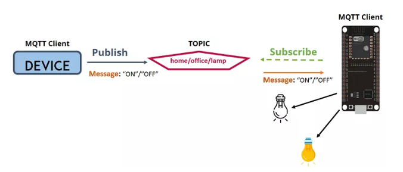
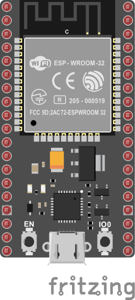

# Ejemplo 1

Para comprender una implementación de una red MQTT sencilla vamos a plantear el caso de prueba mostrado en la siguiente figura:



El objetivo en este caso es simular la implementación del control de iluminación de una oficina mediante MQTT. La siguiente tabla describe cada uno de los clientes de la red MQTT:

| Dispositivo | Cliente |Rol|Topic (message-topic)|Mensaje (message)|Observaciones|
|---|---|---|---|---|---|
| PC |C1|publisher| ```home/office/lamp```|<ul><li>```ON```<li>```OFF```</ul>|<ul><li>**```ON```**: Comando con el que se prende la luz de la oficina.<li>**```OFF```**: Comando con el que se prende la luz de la oficina.</ul>|
|C2|ESP32|susbcriber|```home/office/lamp```|```---```|Cuando se recibe el comando **```ON```** se enciende la lampara y cuando se recibe el comando **```OFF```** se apaga la lampara|

Una vez que esta definido el caso de prueba vamos a realizar la puesta en marcha de manera gradual en dos fases tal y como se describirá a continuación...

## Hardware

### Lista de componentes

|Elemento |Descripcion |
|1 | Placa de desarrollo ESP32|

### Conexión

A continuación se muestra el diagrama de conexión de la cosa (thing) la cual esta implementada en un ESP32.



El esquematico se muestra a continuación:


## Software implementado

Aca va la descripción del codigo...


```
mosquitto_pub -h test.mosquitto.org -t home/office/lamp -m ON
```


```
mosquitto_pub -h test.mosquitto.org -t home/office/lamp -m OFF
```

* ¿Es bueno este topic?

```
mosquitto_sub -h test.mosquitto.org -t home/# 
```


```
mosquitto_sub -h test.mosquitto.org -t home/office/lamp 
```


**Codigo**: config.h

```h
#pragma once

#include <string>

using namespace std;

// ESP32 I/O config
const byte LIGHT_PIN = LED_BUILTIN; 

// WiFi credentials
const char *SSID = "Wokwi-GUEST";
const char *PASSWORD = "";

// MQTT settings
const string ID = "thing-001";

const string BROKER = "test.mosquitto.org";
const string CLIENT_NAME = ID + "lamp_client";

const string TOPIC = "home/office/lamp";
```

**Codigo**: main.cpp

```cpp
#include <WiFi.h>
#include <PubSubClient.h>

#include "config.h"

WiFiClient espClient;
PubSubClient client(espClient); // Setup MQTT client

// --- ESP32

void setup_ports() {
  pinMode(LIGHT_PIN, OUTPUT); // Configure LIGHT_PIN as an output
}


// ---- Wifi

void connectWiFi() {
  Serial.print("Connecting to ");
  Serial.print(SSID);
  while (WiFi.status() != WL_CONNECTED) {   
    Serial.print(".");
    WiFi.begin(SSID, PASSWORD, 6);
    delay(500);
  }
  Serial.println();
  Serial.print(ID.c_str());
  Serial.println(" connected!");
  Serial.print("IP address: ");
  Serial.println(WiFi.localIP());
}

// ---- MQTT


// Handle incomming messages from the broker
void clientCallback(char* topic, byte* payload, unsigned int length) {
  String response;

  for (int i = 0; i < length; i++) {
    response += (char)payload[i];
  }
  Serial.print("Message arrived [");
  Serial.print(TOPIC.c_str());
  Serial.print("] ");
  Serial.println(response);
  if(response == "ON")  // Turn the light on
  {
    digitalWrite(LIGHT_PIN, HIGH);
  }
  else if(response == "OFF")  // Turn the light off
  {
    digitalWrite(LIGHT_PIN, LOW);
  }
}

void reconnectMQTTClient() {
  while (!client.connected()) {
    Serial.println("Attempting MQTT connection...");
    if (client.connect(CLIENT_NAME.c_str())) {
      Serial.print("connected to Broker: ");
      Serial.println(BROKER.c_str());
      // Topic(s) subscription
      client.subscribe(TOPIC.c_str());
    }
    else {
      Serial.print("Retying in 5 seconds - failed, rc=");
      Serial.println(client.state());
      delay(5000);
    }
  }
}

void createMQTTClient() {
  client.setServer(BROKER.c_str(), 1883);
  client.setCallback(clientCallback);
  reconnectMQTTClient();
}

void setup() {
  // Setup ports
  setup_ports();
  // Serial setup
  Serial.begin(9600);
  while (!Serial)
    ; // Wait for Serial to be ready
  delay(1000);
  connectWiFi();
  createMQTTClient();
}

void loop() {
  reconnectMQTTClient();
  client.loop();
  delay(1000);
}
```

## Simulacion

Simulación: [link](https://wokwi.com/projects/378532525347307521)

# Actividad

- [ ] Cambiar la IP del broker.
- [ ] Poner la IP fija ()
- [ ] Cambiar la forma del topic (teniendo en cuenta lo de abajo)
- [ ] Hacer un ejemplo que imite https://cedalo.com/blog/mqtt-and-arduino-setup-guide/

## Simulación

```python
import paho.mqtt.client as mqtt
import time

# Variables de la aplicacion
BROKER_IP = "127.0.0.1"
TOPIC = "room/light"

# Comandos
messLampOn = "on"
messLampOff = "off"

# Mensajes
messReceibed = False

def on_connect(mqttc, obj, flags, rc):
    print("Conexion MQTT Establecida")

# 1. Creacion de la isntanca del cliente
CLIENT_ID = "officeLamp"
mqtt_client = mqtt.Client(client_id=CLIENT_ID)
mqtt_client.on_connect = on_connect

# 2. Incovacion del metodo connect
mqtt_client.connect(BROKER_IP, 1883, 60)

# 3. Llamando el loop para mantener el flujo de trafico de red en el broker
# 4. No se llevo a cabo en este caso.
mqtt_client.loop_start()

print("SISTEMA DE CONTROL DE LA LAMPARA DE LA SALA")
while True:
    print("Menu de control de la sala")
    print("1. Encender lampara")
    print("2. Apagar lampara")
    print("3. Salir de la aplicacion")
    opc = input("Seleccione una opcion: ")
    if opc == '1':
        print("--> Encendiendo la lampara\n")
        mqtt_client.publish(TOPIC,messLampOn)  # Uso de publish para prender la lampara
    elif opc == '2':
        print("--> Apagando la lampara\n")
        mqtt_client.publish(TOPIC,messLampOff) # Uso de publish para apagar la lampara
    elif opc == '3':
        messReceibed = False
        print("--> Chao bambino\n")
        break
    else:
        messReceibed = False
        print("--> OPCION INVALIDA\n")
mqtt_client.loop_stop()

```

**Topic**:  
* A string that identifies a resource it looks like a relative URI
* Topics can follow a tree structure using a ```"/"```
  * E.g. ```Earth/Australia/Vic/Melbourne/temperature/device1234``` identifies temperature from **device1234** in Melbourne
*  Wild cards are used with a ```#```
   *  ```Earth/Australia/Vic/Melbourne/#```
 This identifies all Melbourne devices
A device can have as many topics as it likes


