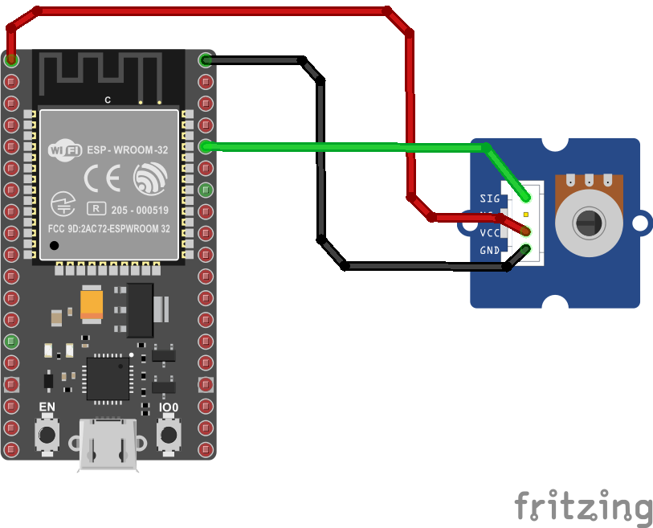
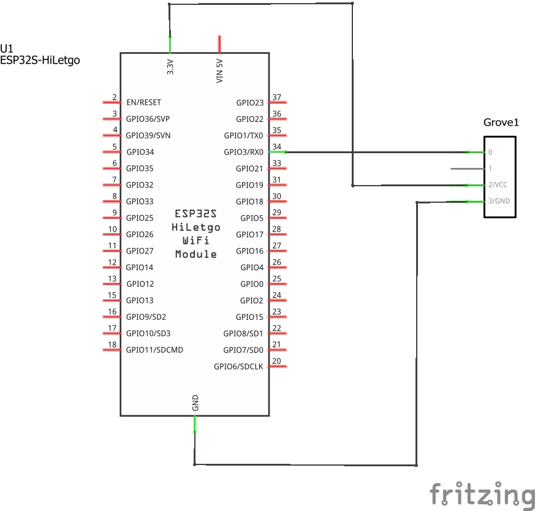
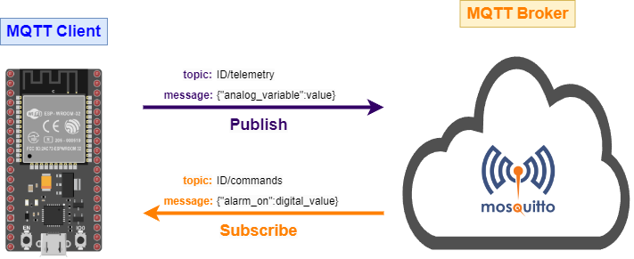

# Paso 1 - Implentacion del programa en la plataforma

> **Importante**: Este ejemplo se basa en el capitulo **Connect your device to the Internet** ([link](https://github.com/microsoft/IoT-For-Beginners/blob/main/1-getting-started/lessons/4-connect-internet/README.md)) del repositorio **IoT for Beginners** ([link](https://github.com/microsoft/IoT-For-Beginners/tree/main)) de Microsoft.  


## Hardware

### Lista de componentes

|Elemento|Descripcion|
|--|--|
|1|Placa de desarrollo ESP32|
|2|Grove - Rotary Angle Sensor|


### Conexion

A continuación se muestra el diagrama de conexión de la cosa (thing) la cual esta implementada en un ESP32. 



El esquematico se muestra a continuación:



## Sofware

### Cliente MQTT implementado en el ESP32

El programa implementado en el ESP32 (thing) permite la medición de una variable Analoga (potenciometro) y el encendido y apagado de un led (el que viene integrado en la tarjeta) mediante el uso del protocolo MQTT. La siguiente tabla muestra la información asociada al protocolo MQTT:

|Type|Topic|Messaje|
|---|---|---|
|Subscriber|```ID/commands```| <ul><li>**```{"alarm_on": 1}```**: Comando enviado para encender el led. <li> **```{"alarm_on": 0}```**: Comando enviado para apagar el led.</ul>|
|Publisher|```ID/telemetry```| ```{"analog_variable":valor}```: Mensaje que contiene el valor de la variable medida.|

En la tabla anterior, el ```ID``` es el identificador de la cosa (el cual debe ser unico dentro de la red MQTT). El ESP32, se conectara a un broker publico el cual se encuentra en la URL *test.mosquitto.org*. La siguiente tabla describe esto:

|Variable|Valor|Observaciones|
|---|---|---|
|```BROKER```|```"test.mosquitto.org"```|Dirección del broker|
|```ID```|```IOT_UDEA-001```|Identificador de la **cosa** en la red|
|```CLIENT_NAME```|```ID + "sensor_client"```|Nombre del cliente|
|```CLIENT_TELEMETRY_TOPIC```|```ID + "/telemetry"```|Topico a traves del cual el ESP32 envia (publica) la información asociada al sensor analogo leido|
|```SERVER_COMMAND_TOPIC```|```ID + "/commands"```|Topico a traves del cual el ESP32 recibe (suscribe) el comando para el encendido y apagado del led|

Finalmente, es importante tener en cuenta que la aplicación del ESP32 usa comunicación serial por UART para mostrar los mensajes enviados con la información del valor medido por el sensor y los valores recibidos asociados al comando que prende y apaga el led.

### Configuración de la red wifi
  
  |Variable| Valor|Observaciones|
  |---|---|---|
  |```*SSID```|```"WIFI_LIS"```|Nombre del Access Point a la que se conectara el ESP32|
  |```*PASSWORD```|```""```|Passoword del Access Point al que se conectara el ESP32|

### Anatomia del proyecto en platformio

El proyecto se desarrollo en platformio. A continuación resaltamos los tres archivos mas importantes:

* **platformio.ini**: Archivo de configuración del proyecto. Aqui se configura la tarjeta empleada (en este caso la nodemcu-32s) y las liberias empleadas:
  
  ```ini
  [env:nodemcu-32s]
  platform = espressif32
  board = nodemcu-32s
  framework = arduino
  lib_deps = 
    knolleary/PubSubClient @ 2.8
    bblanchon/ArduinoJson @ 6.17.3
  ```

* **config.h**: Parametros de configuración de la red Wifi, la red MQTT y demas parametros asociados a la cosa (ESP32). Modifique los valores de acuerdo a una configuración similar a la dada en la segunda tabla:
  
  ```h
  #pragma once

  #include <string>

  using namespace std;

  // WiFi credentials
  const char *SSID = "<SSID>";
  const char *PASSWORD = "<PASSWORD>";

  // MQTT settings
  const string ID = "<ID>";

  const string BROKER = "test.mosquitto.org";
  const string CLIENT_NAME = ID + "sensor_client";

  const string CLIENT_TELEMETRY_TOPIC = ID + "/telemetry";
  ```

* **main.cpp**: Programa que implementa la logica del cliente:
  
    ```cpp
    #include <Arduino.h>
    #include <ArduinoJson.h>
    #include <PubSubClient.h>
    #include <WiFi.h>
    
    #include "config.h"
    
    #define LIGHT_PIN LED_BUILTIN // Pin to control the light with P2 (GPIO2)
    #define ANALOG_SENSOR 34      // Pin to measure the analog variable P15 (GPIO15)
    
    WiFiClient espClient;
    PubSubClient client(espClient); // Setup MQTT client
    
    void connectWiFi() {
      while (WiFi.status() != WL_CONNECTED) {
        Serial.println("Connecting to WiFi...");
        WiFi.begin(SSID, PASSWORD);
        delay(500);
      }
      Serial.println("Connected!");
    }
    
    // Handle incomming messages from the broker
    void clientCallback(char *topic, uint8_t *payload, unsigned int length) {
      char buff[length + 1];
      for (int i = 0; i < length; i++) {
        buff[i] = (char)payload[i];
      }
      buff[length] = '\0';
    
      Serial.print("Message received:");
      Serial.println(buff);
    
      DynamicJsonDocument doc(1024);
      deserializeJson(doc, buff);
      JsonObject obj = doc.as<JsonObject>();
    
      bool alarm_on = obj["alarm_on"];
    
      if (alarm_on) {
        digitalWrite(LIGHT_PIN, HIGH);
      }
      else {
        digitalWrite(LIGHT_PIN, LOW);
      }
    }
    
    void reconnectMQTTClient() {
      while (!client.connected()) {
        Serial.print("Attempting MQTT connection...");
        if (client.connect(CLIENT_NAME.c_str())) {
          Serial.println("connected");
          client.subscribe(SERVER_COMMAND_TOPIC.c_str());
        }
        else {
          Serial.print("Retying in 5 seconds - failed, rc=");
          Serial.println(client.state());
          delay(5000);
        }
      }
    }
    
    void createMQTTClient() {
      client.setServer(BROKER.c_str(), 1883);
      client.setCallback(clientCallback);
      reconnectMQTTClient();
    }
    
    void setup() {
      Serial.begin(9600);
      while (!Serial)
        ; // Wait for Serial to be ready
      delay(1000);
    
      pinMode(ANALOG_SENSOR, INPUT);
      pinMode(LIGHT_PIN, OUTPUT);
    
      connectWiFi();
      createMQTTClient();
    }
    
    void loop() {
      reconnectMQTTClient();
      client.loop();
    
      int analog_variable = analogRead(ANALOG_SENSOR);
    
      DynamicJsonDocument doc(1024);
      doc["analog_variable"] = analog_variable;
    
      string telemetry;
      serializeJson(doc, telemetry);
    
      Serial.print("Sending telemetry ");
      Serial.println(telemetry.c_str());
    
      client.publish(CLIENT_TELEMETRY_TOPIC.c_str(), telemetry.c_str());
    
      delay(1000);
    }
    ```

### Cliente MQTT asociado al ESP32

La siguiente siguiente figura muestra la red MQTT con el ESP32 como unico cliente:



### Descargando la aplicación


## Prueba

Pasos

1. Verificar que el broker esta corriendose. En el caso de linux usar:

```bash
sudo netstat -tanlp | grep 1883
```

Para Windows usar:

```cmd
netstat -an | findstr "1883"
```

En nuestro caso (teniamos una maquina con windows) y el resultado se muestra a continuación:


Para ver que el mosquito esta bien puede ademas usar el comando:

```bash
mosquitto -v
```

Antes de proseguir al registro de los topicos, se recomienda que ejecute el comando de ayuda del mosquito y observe brevemente las opciones a usar:

```bash
mosquitto -h
```

2. Inicialmente vamos a usar el **mosquito** probar los topicos definidos en la tabla inicial:

* **Terminales que simulan el ESP32**:

|Terminal|Type|Topic|Comando en mosquito|Observaciones|
|---|---|---|---|---|
|1|Subscriber|```room/light```|```mosquitto_sub -h 127.0.0.1 -t "room/light"```|Terminal que simulara los comandos recibidos por el ESP32|
|2|Publisher|```room/light/state```|<ul><li>**Led on**: <br> ```mosquitto_pub -h 127.0.0.1 -t "room/light/state" -m "on"``` </li>**Led off**: <br> ```mosquitto_pub -h 127.0.0.1 -t "room/light/state" -m "off"``` </li>|Terminal que simulara los comandos que envia el ESP32 para indicar el estado de las luces|
 
* **Terminales que simulan la aplicación de escritorio**:

|Terminal|Type|Topic|Comando en mosquito|Observaciones|
|---|---|---|---|---|
|3|Subscriber|```room/light/state```|```mosquitto_sub -h 127.0.0.1 -t "room/light/state"```|Terminal que simulara los comandos recibidos por la aplicación de escritorio (recibidos desde el publisher del ESP32)| 
|4|Publisher|```room/light/```|<ul><li>**Led on**: <br> ```mosquitto_pub -h 127.0.0.1 -t "room/light" -m "on"``` </li><li>**Led off**: <br> ```mosquitto_pub -h 127.0.0.1 -t "room/light" -m "off"``` </li></ul>| Terminal que simulara los comandos de control enviados desde la aplicación de escritorio para controlar el ESP32|

Para realizar las pruebas registre primero las terminales que funcionaran como suscriptores, tal y como se muestra en el siguiente orden:

* **Terminal 1**: Subscriber del ESP32


* **Terminal 3**: Subscriber de la aplicación de escritorio.


Luego, simule el encendido y apagado de una luz enviando a traves de la **terminal 4** los comandos de encendido y apagado del led:

```bash
mosquitto_pub -h 127.0.0.1 -t "room/light" -m "on"
mosquitto_pub -h 127.0.0.1 -t "room/light" -m "off"
```

A continuación se muestra el resultado de la aplicación de estos comandos en la terminal 4:

* **Terminal 4**: Terminal de la aplicación de escritorio a partir de la cual se envian los comandos de encendido y apagado de luz al ESP32: 
  


Si todo esta bien, en la **terminal 1** (subscriber en el ESP32), se deberan mostrar los **comandos** (mensajes) enviados desde la **terminal 4**:


Finalmente, simulemos el caso en el cual en la aplicación de escritorio se visualiza el mensaje publicado desde el ESP32 en el cual se informa del estado del led conectado a este. Para ello usando la **terminal 2** ejecute los siguientes comandos:

```bash
mosquitto_pub -h 127.0.0.1 -t "room/light/state" -m "on"
mosquitto_pub -h 127.0.0.1 -t "room/light/state" -m "off"
```

A continuación se muestra el resultado de la aplicación de estos comandos en la **terminal 2**:


El anterior seria el mensaje que se enviaria a traves del ESP32 a la aplicación de escritorio. 

Para ver el resultado de la aplicación de escritorio al recibir los mensajes desde el ESP32, observe la salida de la **terminal 3**, la cual recibe el estado de la luz publicado por el ESP32:


Con lo anterior queda simulada la comunicación en la red MQTT.

3. Probar la correcta conexión del ESP32 a la red MQTT.
   
   En este caso, se pueden cerrar las **terminales 1 y 2** pues estas eran las que hacian las veces del ESP32. Solo se dejarian las correspondientes a la aplicación de escritorio (**terminales 3 y 4**) tal y como se muestra en la siguiente figura:

   

   Sin embargo para mayor comodidad vamos a cerrar todas las terminales asociadas al mosquito y vamos a iniciar de nuevo la prueba. Para lo cual se debe realizar lo siguiente:

   * **Paso 1 - Suscritor asociado a la aplicación**: Recuerde que esto se hace con base en el siguiente comando (ya visto para la **terminal 3**):

   ```bash 
   mosquitto_sub -h 127.0.0.1 -t "room/light/state"
   ```

<!--
> **Nota importante (Dio por que mi Dios es muy bueno)**: Antes de seguir al siguinte paso, si la instalación del mosquitto fue realizada en una maquina con Windows 10, es necesario desbloquear el puerto 1883 en el firewall. Para mas información se recomienda que vea la parte final del siguiente video: **How to configure an MQTT Mosquitto broker and enable user authentication on Windows** ([link](https://www.youtube.com/watch?v=72u6gIkeqUc)) 
-->
   * **Paso 2 - Aplicación del ESP32**: Una vez codificado el programa, se puede descargar el programa en el ESP32. Despues de hacer esto, abrir el **monitor serial**  configuradolo a una velocidad de ```115200``` la  cual fue la que se configuro en el programa en el ESP32 para la comunicación serial. Si la conexión con la red WiFi y el broker es exitosa, la salida será similar a la mostrada en la siguiente figura:
  
   
  
  * **Paso 3 - Interacción con el ESP32 desde el Mosquito**: Como se habia menciodado previamente, suscribiendo dos terminales (**clientes**) las cuales van a simular la comunicación que se da entre la aplicación de escritorio y el ESP32 mediante MQTT. Retomemos la tabla asociada las **terminales 3 y 4** las cuales simulaban la aplicación del PC:

|Terminal|Type|Topic|Comando en mosquito|
|---|---|---|---|
|1|Subscriber|```room/light/state```|```mosquitto_sub -t "room/light/state"```|T
|2|Publisher|```room/light/```|<ul><li>**Led on**: <br> ```mosquitto_pub -t "room/light" -m "on"``` </li><li>**Led off**: <br> ```mosquitto_pub -t "room/light" -m "off"``` </li></ul>| T

Como se puede ver en la tabla anterior, si se hace una comparación con los comandos mostrados en la tabla asociada a las **temirminales 3 y 4**, no se hizo uso de la opción ```-h```, ya que la maquina en la cual se estan haciendo las pruebas por consola es la misma en la cual se encuentra instalado el broker.

A continuación se muestra el envio de comandos de encendido y apagado desde la terminal al ESP 32:


Si todo esta bien, cuando se envian comandos ```on``` y ```off```, el led se deberá apagar y prender respectivamente, asi mismo, deberá aparecer un mensaje que evidencie esto en el monitor serial:


Adicionalmente, ya que el ESP32 publica el estado del led cuando este cambia, en la terminal suscriptora al topico para esto (```room/light/state```), el resultado será el siguiente:


Finalmente, si todo esto esta bien hecho, es por que la aplicación asociada al ESP32 ya esta lista por lo que puede seguir con el siguiente paso.

> ### Errores
> Hay unos errores debido a la inconsistencia entre los comandos que se aplicaron y los que se mostraron en algunas de las figuras. Se espera corregir este error en proximas revisiones.


## Referencias

* https://www.seeedstudio.com/blog/2021/02/19/build-an-mqtt-intercom-with-wio-terminal-with-code/
* https://files.seeedstudio.com/products/SenseCAP/114992170/Developer%20Guide%20for%20Private%20MQTT%20Messaging%20of%20SenseCAP%20SensorHub%20v2.0.pdf
* https://www.hackster.io/Salmanfarisvp/mqtt-on-wio-terminal-4ea8f8
* https://www.seeedstudio.com/Wio-Terminal-Getting-Started-with-TinyML-Kit-p-5324.html
* https://www.seeedstudio.com/environment-monitoring.html
* https://www.seeedstudio.com/Wio-Terminal-p-4509.html
* https://www.seeedstudio.com/IoT-for-beginners-with-Seeed-and-Microsoft-Wio-Terminal-Starter-Kit-p-5006.html
* https://www.seeedstudio.com/iot_into_the_wild.html
* https://wiki.keyestudio.com/KS0085_Keyestudio_Smart_Home_Kit_for_Arduino
* https://keyestudio.com/
* https://wiki.keyestudio.com/Main_Page
* https://thingsboard.io/docs/samples/raspberry/grove/
* https://www.seeedstudio.com/IoT-for-beginners-with-Seeed-and-Microsoft-Wio-Terminal-Starter-Kit-p-5006.html


  