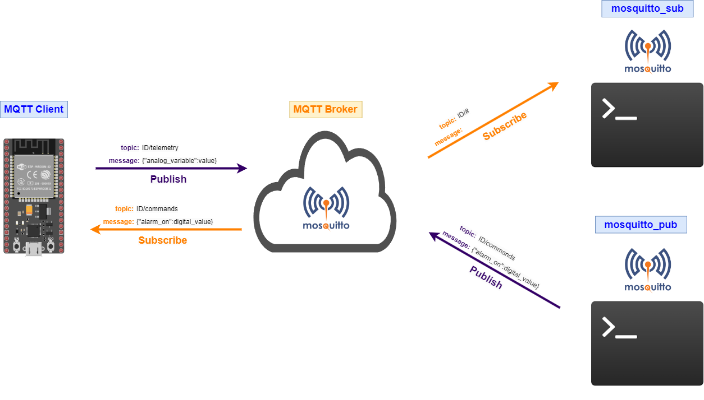

# Prueba usando el cliente mosquito pub y sub





```bash
mosquitto_pub -h test.mosquitto.org -t IOT_UDEA-001/commands -m '{"alarm_on":1}'
mosquitto_pub -h test.mosquitto.org -t IOT_UDEA-001/commands -m '{"alarm_on":0}'
```


```bash
mosquitto_sub -h test.mosquitto.org -t IOT_UDEA-001/#
```

