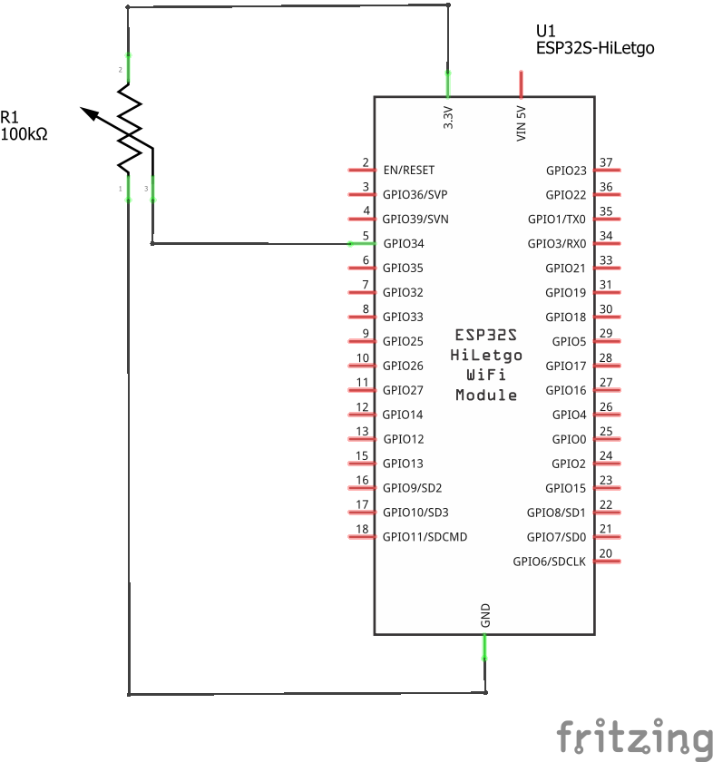
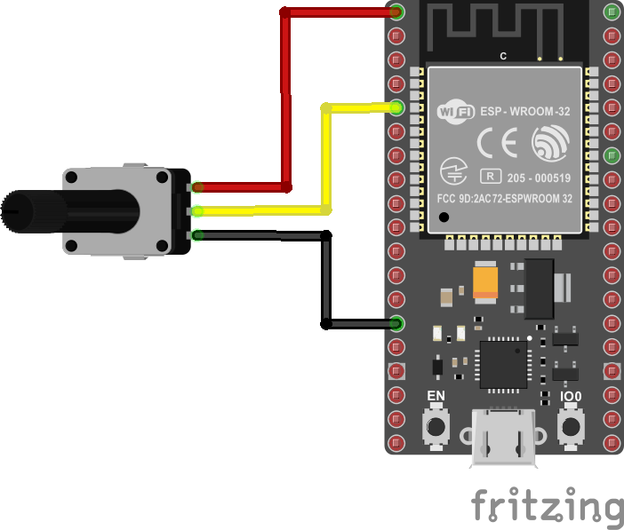

# Ejemplo 1 - OTA

There are different ways to perform OTA updates. In this tutorial, we’ll cover how to do that using the AsyncElegantOTA library. In our opinion, this is one of the best and easiest ways to perform OTA updates.

The AsyncElegantOTA library creates a web server that you can access on your local network to upload new firmware or files to the filesystem (SPIFFS). The files you upload should be in .bin format. We’ll show you later in the tutorial how to convert your files to .bin format.

Este ejemplo fue tomado y documentado de la pagina **ESP32 OTA (Over-the-Air) Updates – AsyncElegantOTA using Arduino IDE** [[link]](https://randomnerdtutorials.com/esp32-ota-over-the-air-arduino/) de Random Nerd Tutorials. En esta pagina se describe el procedimiento de realizar actualizaciones usando la libreria **AsyncElegantOTA**. 

La libreria **AsyncElegantOTA** [[repo]](https://github.com/ayushsharma82/AsyncElegantOTA) crea un servidor en la red local que permite actualizar firmware o archivos del filesystem (SPIFFS). Los archivos deben ser convertidos en formato bin. La siguiente imagen (tomada de Random Nerd Tutorials) resume el procedimiento:


## Pasos previos

Al seguir la guia solo se tuvo problemas en la instalación de la libreria ESPAsyncWebServer la cual se instalo manualmente a partir del repositorio. En el siguiente [link](install/README.md) se describe el proceso de instalación.

## Prueba 

Lo siguiente que se hizo fue probar la instalación. Para ello se cargo el ejemplo de prueba el procedimiento se muestra en el link a continuación [link](test/README.md)

## Subiendo el archivo

El procedimiento se muestra a continuación [link](upload/README.md) 

## Ejercicio

A continuación se muestra un programa que permite modificar la intensidad del LED del ESP32 usando un potenciometro. El esquematico se muestra a continuación:



El diagrama de conexión se muestra a continuación:




Y el codigo adaptado para que se pueda descargar usando OTA se muestra a continuación:

```ino
#if defined(ESP8266)
  #include <ESP8266WiFi.h>
  #include <ESPAsyncTCP.h>
#elif defined(ESP32)
  #include <WiFi.h>
  #include <AsyncTCP.h>
#endif

#include <ESPAsyncWebServer.h>
#include <AsyncElegantOTA.h>

const char* ssid = "Alberto";
const char* password = "22181224";

AsyncWebServer server(80);

// Potentiometer is connected to GPIO 34 (Analog ADC1_CH6) 
const int potPin = 34;
const int ledPin = LED_BUILTIN;

// setting PWM properties
const int freq = 5000;
const int ledChannel = 0;
const int resolution = 8;

// variable for storing the potentiometer value
int potValue = 0;

void setup() {
  // configure LED PWM functionalitites
  ledcSetup(ledChannel, freq, resolution);
  
  // attach the channel to the GPIO to be controlled
  ledcAttachPin(ledPin, ledChannel);

  Serial.begin(115200); 
  // Connect to Wi-Fi
  WiFi.begin(ssid, password);
  while (WiFi.status() != WL_CONNECTED) {
    delay(1000);
    Serial.println("Connecting to WiFi..");
  }

  // Print ESP Local IP Address
  Serial.println("");
  Serial.print("Connected to ");
  Serial.println(ssid);
  Serial.print("IP address: ");
  Serial.println(WiFi.localIP());
  
  server.on("/", HTTP_GET, [](AsyncWebServerRequest *request) {
    request->send(200, "text/plain", "Hi! This is a sample response.");
  });

  AsyncElegantOTA.begin(&server);    // Start AsyncElegantOTA
  server.begin();
  Serial.println("HTTP server started");
}

void loop() {
  // Reading potentiometer value
  potValue = analogRead(potPin);
  ledcWrite(ledChannel, potValue);
  delay(15);
}
```

https://wokwi.com/projects/382965064787379201


