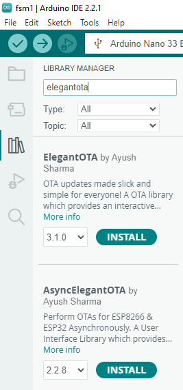
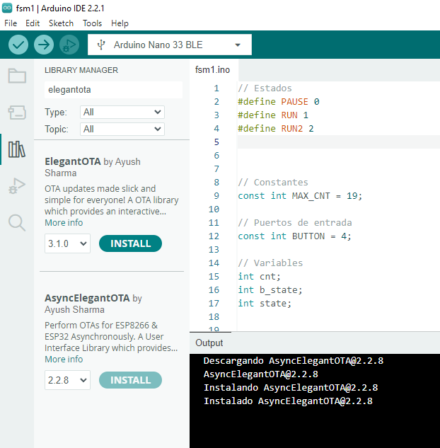
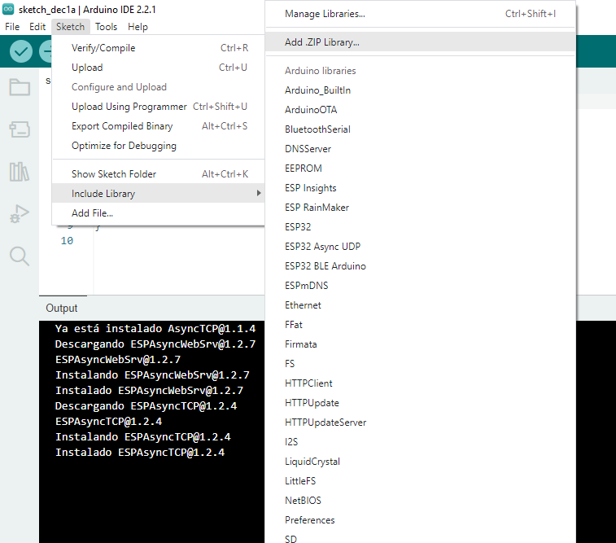
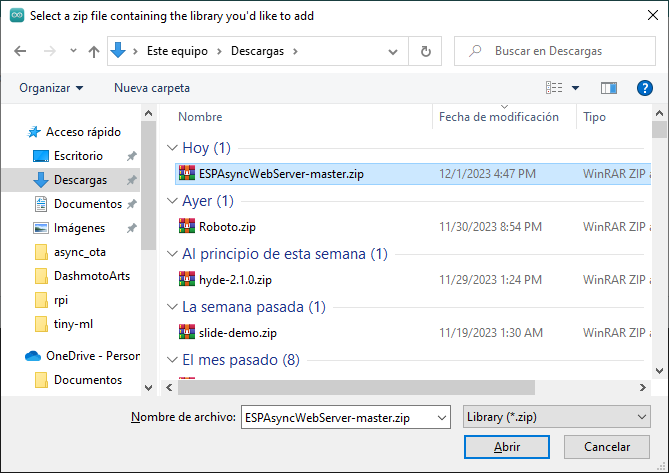

# Instalacion requisitos

Para poder correr Elegant OTA se necesita

## Instalación libreria Elegant Ota

Se hace desde el Arduino IDE; sin embargo el repositorio asociado a esta es: https://github.com/ayushsharma82/AsyncElegantOTA, hay que tener en cuenta que segun el autor este ha sido deprecado por ElegantOTA V3 https://github.com/ayushsharma82/ElegantOTA. Los pasos de la instalación se muestran a continuación:
   
1. Imagen 1:
   
   

2. Imagen 2:

   

3. Imagen 3:

   

## Instalación libreria ESPAsyncWebServer

Esta libreria tuvo que ser instalada manualmente desde el repositorio https://github.com/me-no-dev/ESPAsyncWebServer pues, al seguir la explicación **ESP32 OTA (Over-the-Air) Updates – AsyncElegantOTA using Arduino IDE** [[link]](https://randomnerdtutorials.com/esp32-ota-over-the-air-arduino/) no dio. Las siguientes imagenes resumen el proceso de instalación:

1. Imagen 1:
   
   

2. Imagen 2:

   

3. Imagen 3:

   

Una vez todo esta listo puede seguir con la parte de la ejecución.
