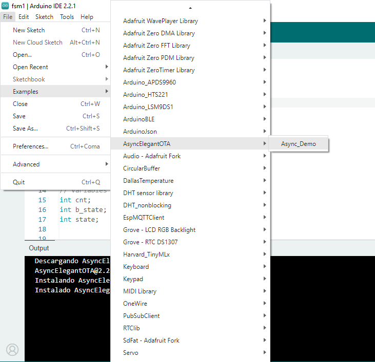
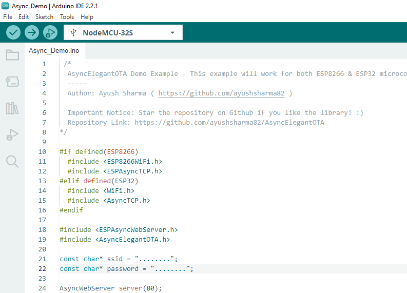
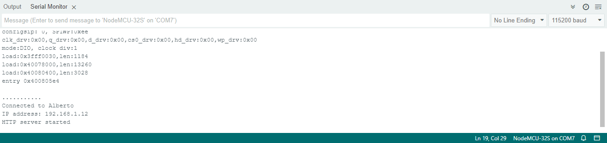
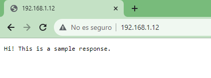
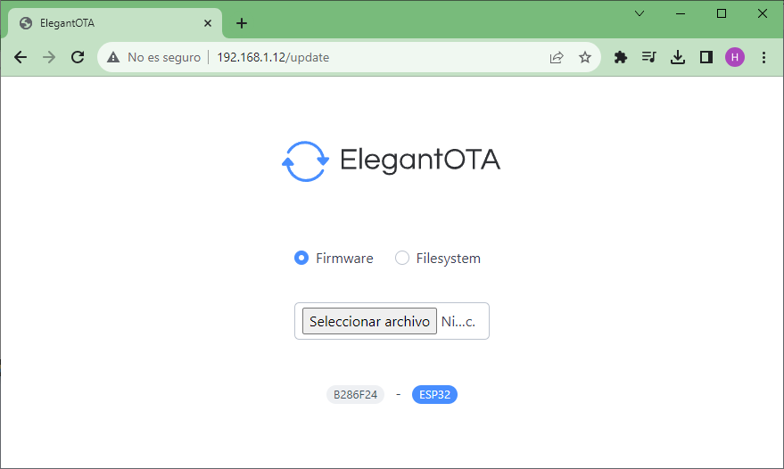

El ejemplo por defecto [Async_Demo.ino](https://github.com/ayushsharma82/AsyncElegantOTA/blob/master/examples/Async_Demo/Async_Demo.ino) se encuentra localmente en el IDE se Arduino cuando es descargado. A continuación se muestran los pasos para llevar a cabo la prueba.

Las siguientes imagenes resumen el proceso:

1. Imagen 1
   
   

2. Imagen 2
   
   

3. Imagen 3
   
   

Luego accediendo al servidor a traves del navegador tenemos:

4. Imagen 4
   
   

5. Imagen 5
   
   

