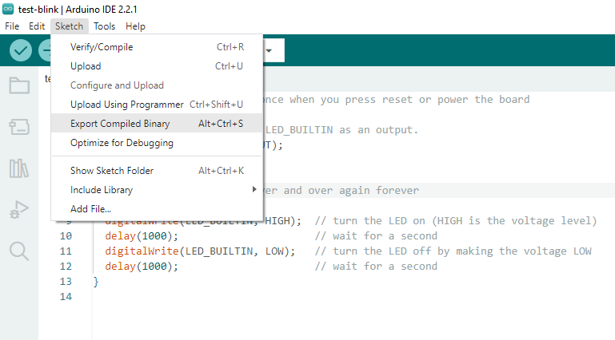

# Subida del programa

A continuación se muestra la subida del programa mediante OTA.

Inicialmente, se verifica la conexion de la red. En nuestro caso tenemos las siguiente IPs:

|Equipo|IP|
|--|--|
|PC|```192.168.1.4```|
|ESP32|```192.168.1.12```|

Esto se verifica mediante la aplicación de los siguientes comandos:

1. IP maquina:

   

2. IP ESP32:

   

3. Test de conectividad

   

Luego, lo que hacemos es verificar que el servidor **AsyncElegantOTA** este en funcionamiento usando la URL ```ÈSP32_IP/upload```  en el browser, en nuestro caso tenemos: ```192.168.1.12/upload```


Ahora, vamos a proceder a codificar el programa de prueba en el IDE de Arduino como siempre se hace. 

1. Codificar el programa. En nuestro caso creamos el ejemplo del parpadeo cuyo codigo se muestra a continuación:
    
    ```ino
    // the setup function runs once when you press reset or power the board
    void setup() {
      // initialize digital pin LED_BUILTIN as an output.
      pinMode(LED_BUILTIN, OUTPUT);
    }
    
    // the loop function runs over and over again forever
    void loop() {
      digitalWrite(LED_BUILTIN, HIGH);  // turn the LED on (HIGH is the voltage level)
      delay(1000);                      // wait for a second
      digitalWrite(LED_BUILTIN, LOW);   // turn the LED off by making the voltage LOW
      delay(1000);                      // wait for a second
    }
    ```

   Para el caso el programa se guardo como **test-blink**: 

   

2. Crear el binario:

   

   Si todo esta bien dentro del directorio asociado al proyecto **test-blink** se crea un directorio **build**.

   

   Dentro del directorio **build** se crea otro directorio **esp32.esp32.nodemcu-32s** y dentro de este se encuentran las imagenes asociadas al programa:

   

Si todo esta bien lo que resta es subir la imagen a traves del servidor que se esta ejecutando en la ESP32. Tal y como se resalta en las siguientes capturas:

1. Upload 1:
   
   

2. Upload 2:

   

3. Upload 3:

   

4. Upload 4:

   

Si todo esta bien, una vez hecho anterior, el ESP32 debera estar ejecutando el programa en cuestion, en el caso el que permite el parpadeo del led. 

Finalmente, retornando a la pagina de upload del servidor tenemos:


Si todo esta bien, se deberia actualizar la ESP32 desde con cualquier otra aplicación.

