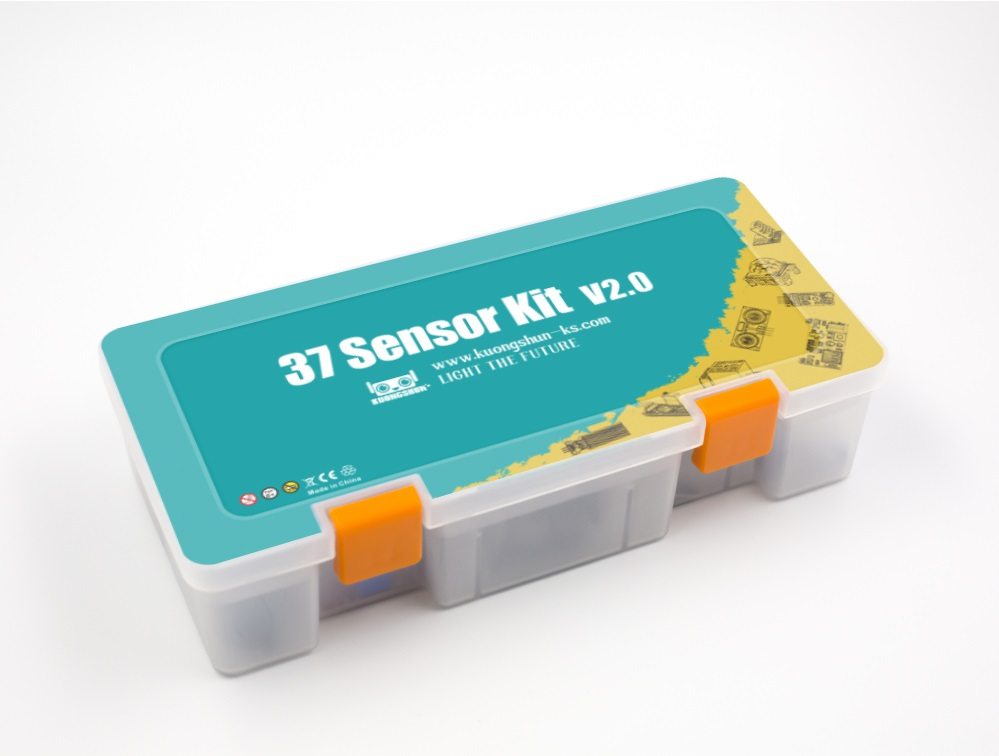

# Capa de percepción - clase 2

> ## Objetivos
> * Comprender los conceptos básicos para realizar prototipado.
> * Explorar algunos de los sensores disponibles en el laboratorio

## Introducción

El uso de sensores y actuadores permiten que las cosas interactuen con el mundo real. En esta sesión vamos a explorar los principales conceptos relacionados con los sensores y actuadores analizando una serie de ejemplos que demuestren su uso básico.

## Componentes del laboratorio

En el laboratorio hay un gran numero de elementos para prototipado. En la siguiente tabla describe los elementos de hardware que usaremos en este laboratorio:

### Sistemas de desarrollo

|Elemento|Descripción|
|--|--|
|Arduino Uno|Placa de desarrollo Arduino Uno ([link](https://docs.arduino.cc/hardware/uno-rev3))|
|Tarjeta de desarrollo ESP8266 NodeMCU WiFi Devkit|Tarjeta de desarrollo basada en ESP8266 ([link](NodeMCU-V3.pdf))|
|Tarjeta de desarrollo NodeMCU-32S| Tarjeda de desarrollo basada en el ESP-32S ([link](nodemcu-32s_product_specification.pdf))

### Kit de sensores

|Elemento|Descripción|
|--|--|
|Grove - Starter Kit v3|Kit de desarrollo para prototipado rapido ([link](https://wiki.seeedstudio.com/Grove_Starter_Kit_v3/))|
|37 sensor kit Elegoo| Kit de sensores Elegoo para prototipado rapido ([link](http://spot.pcc.edu/~dgoldman/labs/37SENSORKIT.pdf))|
|AlphaBot2 robot building kit for Arduino/Pi/PiZero| Kit para prototipado de robots AlphaBot2 ([link](https://www.waveshare.com/wiki/AlphaBot2))|
|Landzo 37 In 1 Sensors Kit For Arduino|Kit de sensores Landzo para prototipado ([link](https://www.instructables.com/Arduino-37-in-1-Sensors-Kit-Explained/))

## Placas de desarrollo a estudiar

### Placa Arduino

La placa Arduino UNO es una plataforma de código abierto basada en el microcontrolador ATmega328P cuya alimentación es a 5V (cuando la alimentación es por USB) o en un voltaje DC entre 7 - 12 V cuando la alimentación es a traves del conector jack.

Antes de empezar a trabajar con cualquier plataforma de desarrollo es necesario conocer como mínimo el mapa de pines de esta. A continuación, se muestra el mapa de pines para la tarjeta Arduino UNO ([link](https://store-usa.arduino.cc/products/arduino-uno-rev3))


La siguiente tabla resume la información del mapa de pines para el Arduino UNO:

Para mayor información sobre la placa puede consultar el enlace **Arduino Uno Board Anatomy** ([link](https://docs.arduino.cc/tutorials/uno-rev3/board-anatomy)) . La siguiente tabla resume la información sobre los pines para esta placa:

|Tipo|Notación pines (placa)|
|---|---|
|Digital/GPIO|```D0```, ```D1```, ```D2```, ```~D3```, ```D4```, ```~D5```, ```~D6```, <br> ```D7```, ```D8```, ```~D9```|
|Analog in|```A0```, ```A1```, ```A2```, ```A3```, ```A4```, ```A5```|
|PWM|```~D3```, ```~D5```, ```~D6```, ```~D9```, ```~D10```, ```~D11```|
|Serial (UART)|```Tx->```, ```Rx<-```|
|I2C|```A4/SDA```, ```A5/SCL```|
|Digital SPI|```~D10/SS```, ```~D11/MOSI```, ```D12/MISO```, ```D13/SCK```|
|Interrupt|```D1/INT0```, ```D3/INT1```|

### Placa ESP32

Un sistema de desarrollo ESP32 (por ejemplo el NodeMCU-32S) esta basado en el microcontrolador ESP32 el cual cuenta con funcionalidad Wi-Fi y Bluetooth. La tarjeta de desarrollo opera a 3.3 V y es alimentada a traves de una conexión micro-USB de 5 V o directamente a 3.3 V a traves del pin VIN. Cuando se usa esta tarjeta de desarrollo es importante tener en cuenta que los pines GPIO no son tolerantes a 5 V, y la maxima corriente que pueden suministrar es de 12 mA.

La siguiente figura muestra el diagrama de pines asociado a la tarjeta de desarrollo **Nodemcu-32s WIFI MODULE** ([link](https://docs.ai-thinker.com/_media/esp32/docs/nodemcu-32s_product_specification.pdf))


Tal y como se muestra en la siguiente figura, el modulo Nodemcu-32s tiene un total de 38 puertos:


La siguiente tabla resume la función principal algunos de estos:

|Tipo|Notación pines (placa)|
|---|---|
|Digital (Only input)|```P34 [GPIO34]```, ```P35 [GPIO35]```, ```SVP [GPIO36]```, ```SVN [GPIO39]```|
|Analog in|```SVP [GPIO36]```, ```SVN [GPIO39]```, ```P35 [GPIO 35]```, <br>```P34 [GPIO34]```, ```P32 [GPIO32]```, ```P33 [GPIO 33]```, <br>```P25 [GPIO25]```, ```P26 [GPIO26]```, ```P27 [GPIO27]```, <br>```P14 [GPIO14]```, ```P12 [GPIO12]```,  ```P13 [GPIO13]```, <br>```P15 [GPIO15]```, ```P2 [GPIO2]```, ```P0 [GPIO0]```, <br>```P4 [GPIO4]```|
|PWM|```SVP [GPIO36]```, ```SVN [GPIO39]```, ```P35 [GPIO 35]```, <br>```P34 [GPIO 34]```, ```P32 [GPIO 32]```, ```P33 [GPIO 33]```, <br>```P25 [GPIO25]```, ```P26 [GPIO26]```, ```P27 [GPIO27]```, <br>```P14 [GPIO14]```, ```P12 [GPIO12]```,  ```P13 [GPIO13]```, <br>```P15 [GPIO15]```, ```P2 [GPIO2]```, ```P0 [GPIO0]```, <br>```P4 [GPIO4]```|
|Serial (UART)|```Tx [GPI1]```, ```Rx [GPI3]```, ```D8 [TXD2]```, ```D7 [RXD2]```|
|I2C|```P22 [GPI22/SCL]```, ```P21 [GPI21/SDA]```|
|Digital SPI|```P23 [MOSI]```, ```P19 [MISO]```, ```P18 [SCK]```, ```P5 [SS]```|
|Flash SPI|```CLK [GPIO6/FLASHCLK]```, ```SD0 [GPIO7/FLASHD0]```, <br>```SD1 [GPIO7/FLASHD1]```, ```CMD [GPIO7/FLASHCMD]```,<br> ```SD2 [GPIO9/FLASHD2]```, ```SD3 [GPIO9/FLASHD3]```|
|Capacitive touch|```P0 [GPIO4]/TOUCH1```, ``` P4 [GPIO0]/TOUCH0```, <br>``` P2 [GPIO2/TOUCH2]```, ``` P15 [GPIO15/TOUCH3]```, <br>``` P13 [GPIO13/TOUCH4]```, ``` P12 [GPIO12/TOUCH5]```,<br> ``` P14 [GPIO14/TOUCH6]```, ``` P27 [GPIO7/TOUCH7]```|

## Sensores y actuadores

Los sensores y actuadores tienen como papel principal  permitir la interación del dispositivo IoT con el medio ambiente.

### Clasificación de los sensores

Existen diferentes tipos de sensores que permiten medir diferentes variables, desde propiedades naturales tales como la temperatura del aire a interacciones fisicas como el movimiento.
Algunos tipos de sensores existentes son:
* **Sensores de temperatura**: Permiten medir la temperatura del aire o el medio en el cual se encuentran inmersos. A veces suelen venir cominados con sensores de humedad y presión en un mismo modulo.
* **Botones**: Permiten sensar cuando estos son presionados
* **Sensores de luz**: Estos detectan niveles de luz. Tambien permiten medir distintos tipos de luz (de colores especificos, ultravioleta, infraroja o luz visible en general).
* **Acelerometros**: Permiten medir el movimiento en multiples direcciones.
* **Microfonos**: estos permiten detectar sonidos.

La siguiente tabla muestra una lista mas amplia de algunos tipos de sensores:


### Tipos de sensores

De acuerdo al tipo de señal entregada, los sensores se pueden clasificar en dos tipos basicos:
* **Sensores Analógicos**: Son el tipo de sensores mas basicos que existen. Estos, son alimentados con voltaje (voltaje de alimentación) desde el dispositivo IoT y devolvuelven a este, para su lectura, un voltaje cuya variación depende de la variable medida.
  
  

  Debido a que los dispositivos IoT son digitales, los valores obtenidos al usar sensores analogos deben ser convertidos a una señal digital antes de ser procesados de modo que muchos dispositivos IoT tienen Conversores analogo a digital (ADCs) para convertir señales analogas a representaciones digitales de su valor.


* **Sensores Digitales**: Los sensores digitales detectan cambios de voltaje que solo pueden tomar dos posibles valores (alto y bajo).
  
  El tipo mas simple de sensor de este tipo es un **boton** o **switch**, el cual es un sensor con dos estados **ON** y **OFF**.

  

  Existen otros tipos de sensores digitales mas avanzados los cuales permiten sensar variables analógicas gracias a que possen el hardware necesario para poder procesar la señal leida y enviar su valor como datos digitales mediante el uso de un protocolo de comunicación.

  


### Comunicación entre sensores

* 1-Wire
* RS232
* I2C
* SPI
* USB


Links: https://resources.altium.com/p/comparing-all-serial-communications-protocols

### Sensores y actuadores disponibles en el laboratorio

El laboratorio cuenta con tres kits de sensores los cules se muestrana continuación:

**Grove - Starter Kit v3**

El **Starter Kit** ([link](https://wiki.seeedstudio.com/Grove_Starter_Kit_v3/)) es un kit de prototipado rapido compuesto por varios modulos que permiten la conexión de sensores y actuadores sin necesidad de usar un protoboard.


La siguiente tabla muestra una lista de sensores y actuadores disponibles en el Kit:

|Tipo|Módulos|
|---|---|
|Sensor|<li> Grove - Sound Sensor <li> Grove - Touch Sensor <li>  Grove - Rotary Angle Sensor <li>  Grove – Temperature Sensor|
|Actuador|<li> Grove - LCD RGB Backlight <li>  Grove – Relay <li>  Grove – Buzzer <li>  Grove - LED <li> Grove - Light Sensor|


**37 Sensor Kit - Elegoo**



Este kit de prototipado rapido contiene varios modulos con sensores y actuadores integrados:

|Tipo|Módulos|
|---|---|
|Sensor|<li> DHT11 Temperature and Humidity Module <li> DS18B20 Temperature Sensor Module <li> Button switch module <li> Tilt Switch module <li> Photo Interrupter Module <li> Light Dependent Resistor Module <li> Large Microphone Module <li> Small microphone module <li> Reed Switch Module <li> digital temperature sensor module <li> Linear Magnetic Hall Sensor <li> Flame Sensor Module <li> Touch Sensor <li> Joystick Module <li> Line Tracking Module <li> Obstacle Avoidance Sensor <li> Rotary Encode Module <li> Ultrasonic Sensor Module <li> MPU 6050 Module <li> HC SR501 PIR Sensor <li> Water Level Detection Sensor Module <li> DS1307 Serial Real Time Clock <li> Keypad Module <li> IR Receiver Module|
|Actuador|<li> Two Color LED Module (5mm) <li> IR Transmitter Module <li> seven Color flash Module <li> Passive Buzzer <li> Laser Module <li> RGB LED Module <li> SMD RGB LED Module <li> Seven Color flash Module <li> Relay module <li> LCD display|

**Landzo 37 In 1 Sensors Kit For Arduino**

kit de prototipado rapido generico.


|Tipo|Módulos|
|---|---|
|Sensor|<li> KY-023 Joystick module <li> KY-026 Flame Sensor Module <li> KY-039 Heartbeat Sensor module <li> KY-027 2PCS Light Cup module <li> KY-003 Hall Magnetic Sensor <li> KY-024 Linear Hall Sensor <li> KY-017 Mercury Tilt Switch <li> KY-001 18B20 Temperature Sensor <li> KY-037 Big Sound Sensor <li> KY-036 Touch Sensor <li> KY-020 Ball Switch <li> KY-013 Analog Temperature Sensor <li> KY-038 Small Sound Sensor <li> KY-028 Digital Temperature Sensor <li> KY-004 Button <li> KY-018 Photoresistor <li> KY-033 Tracking Sensor <li> KY-025 Reed Switch <li> KY-002 Shock Sensor <li> KY-015 Temperature and Humidity Sensor <li> KY-022 IR Receiver <li> KY-032 Avoidance Sensor <li> KY-021 Mini Reed Switch <li> KY-040 Rotary Encoder <li> KY-035 Analog Hall Sensor <li> KY-031 - Tap Module <li> KY-010 - Light blocking|
|Actuador|<li> KY-016 RGB LED Module <li> KY-019 Relay Module <li> KY-009 SMD RGB LED <li> KY-034 7 Color Flash LED <li> KY-011 Two Color LED <li> KY-008 Laser Emitter <li> KY-029 Mini Two-color LED <li> KY-005 IR Emitter <li> KY-012 Buzzer <li> KY-006 Passive Buzzer|


## Prototipado básico usando fritzing

Fritzing es una plataforma para plataforma permitira prototipar hardware en su computador y verificar su funcionamiento antes de hacer el montaje en fisico. Esta puede ser descargada del siguiente [link](https://fritzing.org/).

Para realizar prototipado empleando elementos (de diferentes fabricantes) disponibles en kits de desarrollo puede seguir cualquiera de los dos enlaces que se muestran a continuación: 
1. **How to Add Components in Fritzing** ([link](https://steemit.com/utopian-io/@thinkingmind/how-to-add-components-in-fritzing)) 
2. **Fritzing** ([link](https://chem.libretexts.org/Courses/University_of_Arkansas_Little_Rock/IOST_Library/07%3A_Electronics_Book/01%3A_Electric_Fundamentals/05%3A_Fritzing))
3. agregando los siguientes componentes:

|Fabricante|Información|Repositorio|Link descarga|
|----|----|----|----|
|Adafruit|<li>**Using the Adafruit Library with Fritzing** ([link](https://learn.adafruit.com/using-the-adafruit-library-with-fritzing))|https://github.com/adafruit/Fritzing-Library|[descarga](https://github.com/adafruit/Fritzing-Library/archive/master.zip)|
|Sparkfun|<li>**Make Your Own Fritzing Parts** ([link](https://learn.sparkfun.com/tutorials/make-your-own-fritzing-parts)) <li> **Fritzing!** ([link](https://www.sparkfun.com/news/663))|https://github.com/sparkfun/Fritzing_Parts||
|Seeed Studio||https://github.com/Seeed-Studio/fritzing_parts|[seeed_fritzing_parts.fzbz](https://github.com/Seeed-Studio/fritzing_parts/blob/master/seeed_fritzing_parts.fzbz)|
|Elegoo||https://github.com/marcinwisniowski/ElegooFritzingBin|[Elegoo-0.6.3.fzbz](https://github.com/marcinwisniowski/ElegooFritzingBin/releases/download/0.6.3/Elegoo-0.6.3.fzbz)|
|NodeMCU y otros componentes||https://github.com/AchimPieters/Fritzing-Custom-Parts|[](https://github.com/AchimPieters/Fritzing-Custom-Parts/releases/download/0.0.4/Fritzing.parts.rar)|
|ESP32 NodeMCU|<li>**ESP32S-HiLetgo Dev Boad with Pinout Template**<li> ([link](https://forum.fritzing.org/t/esp32s-hiletgo-dev-boad-with-pinout-template/5357))||[ESP32S_HiLetgo.fzpz](https://forum.fritzing.org/uploads/default/original/2X/1/1c6c1b0e5bff03730a40b696b354783432fbb506.fzpz)|

## Actividad de laboratorio


Template: https://wiki.seeedstudio.com/Name_your_website/


## Para profundizar sobre prototipado


Para profundizar un poco mas en la teoria sobre algunos de los diferentes tipos de sensores, en la siguiente tabla se muestra una lista de compenentes electronicos importantes:

|Elemento|Tutorial|
|--|--|
|Resistencias|[Resistors](https://learn.sparkfun.com/tutorials/resistors)|
|Leds|[Light-Emitting Diodes (LEDs)](https://learn.sparkfun.com/tutorials/light-emitting-diodes-leds?_ga=2.225295578.159243291.1638157468-812475524.1634861735)|
|Potenciometros|[Voltage Dividers](https://learn.sparkfun.com/tutorials/voltage-dividers)|
|Capacitores|[Capacitors](https://learn.sparkfun.com/tutorials/capacitors)|
|Diodos|[Diodes](https://learn.sparkfun.com/tutorials/diodes)|
|Transistores|[Transistors](https://learn.sparkfun.com/tutorials/transistors)|
|Motores|[Motors and Selecting the Right One](https://learn.sparkfun.com/tutorials/motors-and-selecting-the-right-one)|
|Display LCD|[Basic Character LCD Hookup Guide](https://learn.sparkfun.com/tutorials/basic-character-lcd-hookup-guide?_ga=2.57652842.159243291.1638157468-812475524.1634861735)|
|Acelerometro|[Accelerometer Basics](https://learn.sparkfun.com/tutorials/accelerometer-basics)|
|Led Infrarrojo|[IR Communication](https://learn.sparkfun.com/tutorials/ir-communication)|
|Sensor de humedad|[Soil Moisture Sensor Hookup Guide](https://learn.sparkfun.com/tutorials/soil-moisture-sensor-hookup-guide?_ga=2.70021712.159243291.1638157468-812475524.1634861735)|
|Giroscopo|[Gyroscope](https://learn.sparkfun.com/tutorials/gyroscope)|
|Joystick|[Thumb Joystick Hookup Guide](https://learn.sparkfun.com/tutorials/thumb-joystick-hookup-guide?_ga=2.67418961.159243291.1638157468-812475524.1634861735)|
|Cables|[Working with Wire](https://learn.sparkfun.com/tutorials/working-with-wire?_ga=2.225295578.159243291.1638157468-812475524.1634861735)|
|Fotocelda|[Photocell Hookup Guide](https://learn.sparkfun.com/tutorials/photocell-hookup-guide?_ga=2.225295578.159243291.1638157468-812475524.1634861735)|
|Servomotores|[Hobby Servo Tutorial](https://learn.sparkfun.com/tutorials/hobby-servo-tutorial?_ga=2.57505002.159243291.1638157468-812475524.1634861735)|
|Baterias|[Battery Technologies](https://learn.sparkfun.com/tutorials/battery-technologies)|
|Sensor de temperatura|[DHT11, DHT22 and AM2302 Sensors](https://learn.adafruit.com/dht)|
|Sensor de ultrasonido|[Ultrasonic Sonar Distance Sensors](https://learn.adafruit.com/ultrasonic-sonar-distance-sensors)|
|Sensor de proximidad|[PIR Motion Sensor](https://learn.adafruit.com/pir-passive-infrared-proximity-motion-sensor)|


Importat libreria en fritzing: 
* https://learn.adafruit.com/using-the-adafruit-library-with-fritzing/import-the-library-into-fritzing
* https://learn.sparkfun.com/tutorials/make-your-own-fritzing-parts/all#what-is-fritzing
* https://github.com/UdeA-IoT/actividad-4
* 

De donde nos vamos a pegar


## Referencias

* https://randomnerdtutorials.com/
* https://hci.rwth-aachen.de/arduino
* https://cdn.sparkfun.com/assets/7/2/a/4/f/SerLCDReactionTimerActivity.pdf
* https://www.bildr.com/
* https://github.com/UdeA-IoT/iot-2022_1/tree/main/percepcion/sesion1/esp32
* https://github.com/UdeA-IoT/actividad-4
* https://www3.gobiernodecanarias.org/medusa/ecoescuela/recursosdigitales/2015/02/10/diseno-electronico-con-fritzing/
* https://fritzing.org/media/uploads/learning/translations/Fritzing-PrimerosPasos.pdf
* https://fritzing.org/learning/
* https://arxiv.org/ftp/arxiv/papers/2206/2206.07146.pdf
* https://chem.libretexts.org/Courses/University_of_Arkansas_Little_Rock/IOST_Library/07%3A_Electronics_Book
* https://www.instructables.com/Fritzing-A-Tutorial/
* https://forum.fritzing.org/t/fritzing-part-of-an-esp32/5355/5
* https://www.studiopieters.nl/homekit-accessoires/
* https://en.wikipedia.org/wiki/Open-design_movement
* https://www.embedded.com/serial-protocols-compared/
* https://circuitdigest.com/tutorial/serial-communication-protocols
* https://www.totalphase.com/blog/2017/08/serial-communication-protocols-the-basics/
* https://www.linkedin.com/pulse/communication-protocols-embedded-system-keroloes-girgis
* https://www.weare5vmedia.com/media/communication-protocols-for-an-embedded-engineer-to-know
* https://embeddedsecurity.io/protocols
* https://resources.altium.com/p/comparing-all-serial-communications-protocols

