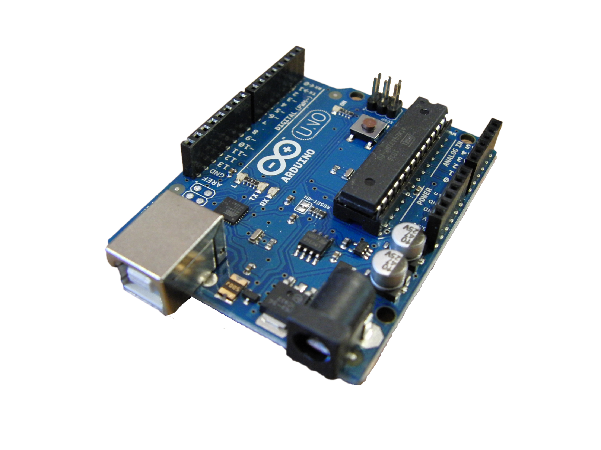
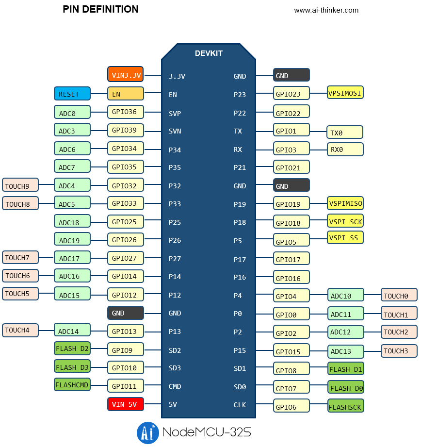
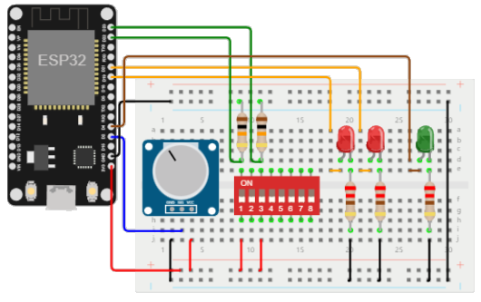

# Capa de percepción - clase 3

> ## Objetivos
> * Aprender a usar la tarjeta de desarrollo ESP32.
> * Comprender la API básica de entrada y salida del lenguaje Arduino.

## Referencias principales

* La mayor parte de esta clase tomará como base la lección 2 A deeper dive into IoT (lección 2) del curso IoT for Beginners ([link](https://github.com/microsoft/IoT-For-Beginners)).
* También mucha de la información se tomó de la pagina: https://randomnerdtutorials.com/ 
* ESP32 Arduino Core’s documentation ([link](https://espressif-docs.readthedocs-hosted.com/projects/arduino-esp32/en/latest/))
* Páginas de referencia fundamentales (para ver lo que se puede hacer): 
  * https://randomnerdtutorials.com/
  * https://www.adafruit.com/
  * https://www.sparkfun.com/
  * https://www.seeedstudio.com/
  * https://projecthub.arduino.cc/
  * https://www.hackster.io/ubidots/projects 


## Componentes de una aplicacion IoT

Una **Cosa** (**Thing**) se refiere a un dispositivo que interactua con el mundo fisico a traves de sensores y actuadores. Para aprender a realizar aplicaciones para IoT el primer paso es disponer de un kit de desarrollo IoT.

Un kit de desarrollo IoT consiste de varios dos positivos IoT de uso general (con caracteristicas que no poseen los dispositivos de producción, tales como pines externos para conectar a sensores y actuadores y hardware adicional para soporte de debugging entre otras cosas) empleados por los desarrolladores para realizar prototipado. Existen dos tipos de kits de desarrollo:
* **Computadora monoplaca (single-board Computer)**


* **Microcontroladores (microcontrollers)**



A lo largo de esta parte del curso, solo nos centraremos los **microcontroladores** ya que, las computadores monoplaca se estudiaran con mas detalle en la parte de **capa de red**.

### Microcontroladores

Un microcontrolador (tambien conocido como MCU), es un pequeño computador que consiste de:
* **Una o mas unidades centrales de procesamiento (CPUs)**: Este, es el cerebro del microcontrolador encargado de la ejecución del programa.
* **Memoria (RAM + memoria de programa)**: Lugar donde es almacenado el programa, los datos y las variables.
* **Conexiones de entrada/salida programables**: Para permitir la comunicación con perifericos externos (dispositivos conectados) tales como sensores y actuadores.

Debido a los recursos limitados que poseen los microcontroladores, estos solo pueden ejecutar un numero limitado de  limitado de tareas.

En cuanto a los kits de desarrollo basados en microcontroladores, existen algunos que suelen venis con sensores, actuadores (Por ejemplo el **SparkFun Inventor's Kit Experiment** ([link](https://learn.sparkfun.com/tutorials/sparkfun-inventors-kit-experiment-guide---v41?_ga=2.150401727.841450445.1693442272-1122723610.1691641161&_gl=1*8wq17e*_ga*MTEyMjcyMzYxMC4xNjkxNjQxMTYx*_ga_T369JS7J9N*MTY5MzQ0MjI3MS4xNS4wLjE2OTM0NDIyNzEuNjAuMC4w))) y otros componentes adicionales.

Sin embargo tambien existen algunos microcontroladores con conectividad inalambrica, como Bluetooth o WiFi, ya sea incorporada o mediante la conexión con otro microcontrolador adicional en la placa el cual implenta dicha conectividad.  


## Arduino Framework

Cuando hablamos de arduino no solo nos referimos a un microcontrolador especifico, en realidad estamos hablando del **framework para microcontroladores** mas popular en la actualidad.

**Arduino**  es una plataforma opensource de electronica que combina software y hardware. Al ser esta plataforma open hardware, es posible usar el modelo de programación de Arduino para escribir codigo para cualquier otra plataforma compatible con Arduino (placas genericas o de otroa fabricantes).

El modelo de programación de arduino esta basado en el **API de arduino** el cual espone un conjunto de funciónes y estructuras (constantes, variables, tipos de datos, objetos, etc) que permiten la interacción del microcontrolador con hardware externo (sensores y actuadores). La información del API se encuentra en la pagina **Language Reference** ([link](https://www.arduino.cc/reference/en/)).


### Funciones basicas del API de Arduino

Las funciones basicas del API de Arduino se encuentran online en **Language Reference** ([link](https://www.arduino.cc/reference/en/))

**Entrada y Salida digital** 

Las funciones de entrada y salida permiten básicamente dos cosas: 
1. Configurar los puertos (**pines**) como entradas o salidas digitales.
2. Leer o escribir dichos puertos de acuerdo a la forma como fueron configurados.

|Función|Información de la función|
|--|--|
|```digitalWrite()```|**Descripción** ([link](https://www.arduino.cc/reference/en/language/functions/digital-io/digitalwrite/)): <br> Escribe un valor HIGH o LOW  en un puerto determinado.<br><br>**Sintaxis**: <br> ```digitalWrite(pin, value)```<br><br>**Parámetros**: <li> **pin**: Número del puerto del Arduino. <li> **value**: Valor que se escribe en el puerto (```HIGH``` o ```LOW```).
|```digitalRead()```|**Descripción** ([link](https://www.arduino.cc/reference/en/language/functions/digital-io/digitalread/)):<br>Lee el valor de un puerto determinado.<br><br>**Sintaxis**: <br>```digitalRead(pin)```<br><br>**Parámetros**: <li>**pin**: Pin del Arduino a ser leído. <li>**Valores retornados**: El valor del puerto al ser leído (```HIGH``` o ```LOW```).
|```pinMode()```|**Descripción** ([link](https://www.arduino.cc/reference/en/language/functions/digital-io/pinmode/)):<br>Permite configurar un puerto como entrada o salida. <br><br>**Sintaxis**: <br>```pinMode(pin, mode)```<br><br>**Parámetros**: <li>**pin**: Pin del Arduino a ser configurado<li>**mode**: Modo: ```INPUT```, ```OUTPUT``` o ```INPUT_PULLUP```.|

**Funciones de entrada y salida análoga**

Permiten interactuar (leer o escribir) con puertos que funcionan como entradas o salidas análogas. La siguiente tabla muestra resume algunas de estas:

|Función|Información de la función|
|---|---|
|```analogRead()```|**Descripción** ([link](https://www.arduino.cc/reference/en/language/functions/analog-io/analogread/)):<br>Lee el valor de un puerto análogo determinado devolviendo un valor entero asociado al voltaje que tiene este puerto.<br><br>**Sintaxis**:<br>```analogRead(pin)```<br><br>**Parámetros**:<br><li>**pin**: Número del puerto análogo (```A0``` – ```A5``` para la mayoría de las placas) del Arduino<br><br>**Valores retornados**:<br>Valor análogo  leído en el pin. El rango dependerá de la resolución del conversor análogo digital asociado a el pin (0 – 1024 cuando la resolución es de 10 bits o 0 – 4096 cuando la resolución es de 12 bits).|
|```analogWrite()```|**Descripción** ([link](https://www.arduino.cc/reference/en/language/functions/analog-io/analogwrite/)):<br>Escribe un valor análogo (modificando el valor del ciclo de dureza de una onda PWM) a un puerto.<br><br>**Sintaxis**:<br>```analogWrite(pin, value)```<br><br>**Parámetros**: <li>**pin**: Pin del Arduino (denotado en la placa con el símbolo ~) en el que se escribe.<li>**value**: Ciclo de dureza entre cero (siempre apagado) y 255 (siempre on).|

**Bases de tiempo**

Son funciones empleadas para la crear retardos y generar marcas de tiempos en los programas, existen varias funciones para este fin como ```delay()```, ```delayMicroseconds()```, ```micros()``` y ```millis()```. La siguiente tabla describe la función ```delay()``` que fue la empleada en los ejemplos anteriores:

|Función|Información de la función|
|---|---|
|```delay()```|**Descripción** ([link](https://www.arduino.cc/reference/en/language/functions/time/delay/)): <br>Detiene el programa por una cantidad de tiempo (en milisegundos) especificada como parámetro.<br><br>**Sintaxis**:<br>```delay(ms)```<br><br>**Parámetros**:<li>**ms**: Número de milisegundos a detener el programa.|

**Funciones de interacción con el puerto serial**

Son funciones empleadas para la configuración e interacción con el puerto serial ([link](https://www.arduino.cc/reference/en/language/functions/communication/serial/)). La siguiente figura muestra algunas funciones de uso común

|Función|Descripción|
|---|---|
|```Serial.begin()```|Configura la velocidad de transmisión serial (bits por segundo = baud).<br><br>**Sintaxis**:<br>```Serial.begin(speed)``` <br><br>**Parámetros**: <ul><li>**```speed```**: Velocidad de transmisión</ul>|
|```Serial.print()```|Imprime los datos del puerto serial en formato ASCII.<br><br>**Sintaxis**:<br>```Serial.print(val)```<br>```Serial.print(val, format)```<br><br>**Parámetros**: <ul><li>**```val```**: Valor a imprimir. El valor puede ser de cualquier tipo.<li>**```format```**: Formato de representación del ASCII (```DEC```, ```HEX```, ```OCT``` o ```BIN```).</ul>|
|```Serial.available()```|Obtiene el número de bytes (caracteres) disponibles por leer en el puerto serial. Estos son datos que ya han llegado y han sido almacenados en el buffer de recepción serial (el cual almacena 64 bytes).<br><br>**Sintaxis**:<br>```Serial.available()```<br><br>**Valores retornados**: Número de bytes disponibles para leer.|
|```Serial.read()```|Lee un dato que entra a través del serial.<br><br>**Sintaxis**:<br>```Serial.read()```<br><br>**Valores retornados**: Primer byte de los datos seriales disponibles (o ```-1``` si no hay datos disponibles). El tipo de dato leído es ```int```.|

### Pasos para programar un dispositivo usando el Framework de Arduino

> **Arduino Cheat Sheet**: Existen referencias breves que muestran de manera resumida el API de arduino. La referecia **Arduino Cheat Sheet** ([link](Arduino_Cheat_Sheet.pdf)) es uno de estos casos ([URL principal](https://github.com/liffiton/Arduino-Cheat-Sheet))

Para usar el API de arduino es necesario tener en cuenta los siguientes pasos:
1. Si la placa es generica, verificar esta es Arduino compatible ([link wikipedia](https://en.wikipedia.org/wiki/List_of_Arduino_boards_and_compatible_systems))
2. Identificar claramente, las caracteristicas, los pines y la funcionalidad de la placa a usar. Para esto es necesario revisar el manual de usuario de la placa, A continuación se muestran algunos ejemplos: 
   * Arduino UNO ([link](https://docs.arduino.cc/hardware/uno-rev3)) 
   * NodeMCU-32s ([link](https://docs.ai-thinker.com/_media/nodemcu32-s_specification_v1.3.pdf))
3. Proceder a programar el codigo del firmware siguiendo el modelo de programación de Arduino.

A continuación se muestra mediante varios ejemplos como se aplican los pasos mencionados para tres de las plataformas basadas en microcontroladores disponibles en el laboratorio:
1. Arduino UNO ([link](arduino_uno/README.md)) 
2. ESP8266 ([link](esp8266/README.md)) 
3. ESP32 ([link](esp32/README.md))

A lo largo de lo que resta la capa de percepción nos vamos a enfocar en la placa **ESP32** la cual es una de las mas empleadas en la actualidad en proyectos IoT.

## Trabajo de laboratorio

### Primeros pasos con el ESP32

Existen diferentes plataformas basadas en el ESP32 ([link wikipedia](https://en.wikipedia.org/wiki/ESP32)). En el laboratorio del LIS se encuentra la placa **NodeMCU-32s** ([NodeMCU-32 Specification](https://docs.ai-thinker.com/_media/nodemcu32-s_specification_v1.3.pdf)) de la empresa china **ai-thinker** (http://www.ai-thinker.com/). 


Antes de empezar, tenga a la mano, el diagrama de pines del NodeMCU:



Luego, despues de realizar las conexiones de los montajes, realizar los siguientes pasos:

1. Siga los pasos descritos en **Installing the ESP32 Board in Arduino IDE (Windows, Mac OS X, Linux)** ([link](https://randomnerdtutorials.com/installing-the-esp32-board-in-arduino-ide-windows-instructions/)).
2. Usando la IDE de Arduino, proceder a codificar los ejemplos que se muestran a continuación eligiendo como targeta de desarrollo la **NodeMCU-32s** que es la disponible en el laboratorio:

   


3. Teniendo en cuenta el montaje realizado, codifique el programa para la plataforma elegida. Como el **ESP32** es compatible con Arduino la documentación se encuentra en **Arduino-ESP32** ([link](https://espressif-docs.readthedocs-hosted.com/projects/arduino-esp32/en/latest/)). 
4. Descargue el programa en la placa:
   
   

   > **Importante**: Tenga en cuenta que antes de empezar la descarga del programa debe presionar el botón boot de la placa del ESP32 y liberarlo cuando salga el mensaje **"Connecting..."**  en el IDE de Arduino. (Para más información ver la sección **Troubleshooting** en el siguiente [link](https://randomnerdtutorials.com/installing-the-esp32-board-in-arduino-ide-windows-instructions/))

### Ejemplo de clase

Una de las aplicaciones mas utilies del puerto serial es que facilita el **debug** de aplicaciones gracias a que por medio de este se pueden imprimir, en tiempo de ejecución, **mensajes de log** que sirven como verificar el correcto funcionamiento de la logica del programa al usar un programa como el monitor serial o cualquier programa similar.

Es muy comun imprimir variables (que pueden indican el estado o valor de un sensor, mensajes de la aplicación, etc). Suponga que se desea probar el siguiente circuito.



Para lo cual se pide que realice las siguientes actividades:
1. Realice la implementación en Fritzing del circuito.
2. Codificar el siguiente programa (usando el API de arduino) y analizarlo para comprender su funcionamiento. Para facilitar las cosas puede correr una simulación de **wokwi** (https://wokwi.com) en el siguiente [link](https://wokwi.com/projects/358500354708861953).

   **Codigo**: Guarde el programa como **esp32-ejemplo.ino**:

    
    ```ìno
    /*-------------- Debug --------------*/
      
    // Comentar siguiente linea para no hacer debug serial  
    #define DEBUG 1  
    
    /*-------------- Puertos --------------*/
    
    // Swichtes
    #define SW1 22
    #define SW0 23
    
    // Leds switches
    #define LED_SW1 21
    #define LED_SW0 19
    
    // Leds secuencia
    #define LED_PWM 4
    
    // Potenciometro
    #define POT 2
    
    /*-------------- Variables --------------*/
    int pot_value = 0;   // Valor del potenciometro (0 - 2013)
    int val_pwm = 0;     // Valor del pwm (0 - 255)
    int sw_val1;
    int sw_val0;
    int num_seq; 
    int loop_time = 500;
    
    void setup() {
      // Inicializacion de las entradas
      inicializar_entradas();
      inicializar_salidas();
      // Debug Serial
      #if DEBUG
      Serial.begin(9600);
      Serial.println("Configuración de I/O -> OK");
      #endif
    }
    
    void loop() {
      /* Entrada analoga */
      #if DEBUG
      Serial.println("------------------------------------");
      #endif
      // Lectura de la entrada analoga (Potenciometro)
      pot_value = analogRead(POT);
      // Mapeo y escritura analoga (PWM)  
      val_pwm = map(pot_value, 0 , 4095, 0, 255);
      analogWrite(LED_PWM,val_pwm);
      #if DEBUG
      // --- Mensajes de debug (Variables analogas) --- //
      Serial.print("POT: ");
      Serial.print(pot_value);  
      Serial.print(" - LED (PWM): ");
      Serial.println(val_pwm); 
      #endif
      // Lectura de los switches
      sw_val0 = digitalRead(SW0);  
      sw_val1 = digitalRead(SW1);
      // --- Mensajes de debug (Entradas digitales) --- //
      #if DEBUG
      Serial.print("SW0: ");
      Serial.print(sw_val0);
      Serial.print(" - SW1: ");
      Serial.println(sw_val1);
      #endif
      // Obtencion de la secuencia binaria
      num_seq = obtener_numero_secuencia(sw_val1, sw_val0);  
      #if DEBUG
      // --- Mensajes de debug Opcion --- //
      Serial.print("Opcion: ");
      Serial.println(num_seq, BIN);
      #endif
      // Encendido de los leds
      encender_leds_indicadores(num_seq); 
      delay(loop_time);
    }
    
    void inicializar_entradas() {
      // Inicialice aqui las entradas
      pinMode(SW1, INPUT);
      pinMode(SW0, INPUT);
    }
    
    void inicializar_salidas() {
      // Inicialice aqui las salidas
      pinMode(LED_SW1, OUTPUT);
      pinMode(LED_SW0, OUTPUT);
    }
    
    int obtener_numero_secuencia(int sw1, int sw0) {
      // Obtiene el numero asociado a una combinación de switches
      int number;  
      if ((sw1 == LOW)&&(sw0 == LOW)) {
        number = 0;  
      }
      else if ((sw1 == LOW)&&(sw0 == HIGH)) {
        number = 1;
      }
      else if ((sw1 == HIGH)&&(sw0 == LOW)) {
        number = 2;  
      }
      else {
        number = 3;
      }  
      return number;
    }
    
    void encender_leds_indicadores(int number) {
      // Encendido de luces indicadores  
      switch(number) {
        case 0:
          digitalWrite(LED_SW1,LOW);
          digitalWrite(LED_SW0,LOW);
          break;
        case 1:
          digitalWrite(LED_SW1,LOW);
          digitalWrite(LED_SW0,HIGH);
          break;
        case 2:
          digitalWrite(LED_SW1,HIGH);
          digitalWrite(LED_SW0,LOW);
          break;
        default:
          digitalWrite(LED_SW1,HIGH);
          digitalWrite(LED_SW0,HIGH);
      }
    }
    ```
    

### Circuitos a montar

Para los siguientes circuitos realizar lo siguiente:
1. Hacer el diagrama en fritzing de cada uno de los montajes y subalos a la correspondiente carpeta. Use los módulos del **37 Sensor Kit** (de Elegoo o de Landzo).
2. Realice el montaje en fisico, codifique el programa (entendiendolo obviamente) y muestre su funcionamiento.

**Circuito 1**: Parpadeo de un led ([link](https://wokwi.com/projects/357845157032899585))

* **Montaje**:
  
  


* **Código**: esp32-ej1.ino
  
  ```ino 
  void setup() {
    pinMode(LED_BUILTIN, OUTPUT);
  }
  void loop() {
    digitalWrite(LED_BUILTIN, HIGH);   
    delay(1000);                       
    digitalWrite(LED_BUILTIN, LOW);    
    delay(1000);                      
  }
  ```

**Circuito 2**: Lectura de una señal digital ([link](https://wokwi.com/projects/335034266233602642))

* **Montaje**:
  
  


* **Código**: esp32-ej2.ino

    ```ino
    #define LED_BUILTIN 2
    
    const int buttonPin = 5;         //  (GPIO5 - D5)
    const int ledPin =  LED_BUILTIN; 
    
    // variables will change:
    int buttonState = 0;         
    
    void setup() {
      pinMode(ledPin, OUTPUT);
      pinMode(buttonPin, INPUT);
    }
    
    void loop() {
      buttonState = digitalRead(buttonPin);
    
      if (buttonState == HIGH) {
        digitalWrite(ledPin, HIGH);
      } else {
        digitalWrite(ledPin, LOW);
      }
    }
    ```

**Circuito 3**: Manejo de una señal PWM ([link](https://wokwi.com/projects/335030762714694227))

* **Montaje**:
  
  


* **Código**: esp32-ej3.ino

    ```ino
    int ledPin = 2;    // GPIO2
    
    void setup() {
      // nothing happens in setup
    }
    
    void loop() {
      for (int fadeValue = 0 ; fadeValue <= 255; fadeValue += 5) {
        analogWrite(ledPin, fadeValue);
        delay(30);
      }
    
      for (int fadeValue = 255 ; fadeValue >= 0; fadeValue -= 5) {
        analogWrite(ledPin, fadeValue);
        delay(30);
      }
    }
    ```

**Circuito 4**: Lectura de una entrada Análoga ([link](https://wokwi.com/projects/335035080677261908)).

* **Montaje**:
  
  


* **Código**: esp32-ej4.ino

    ```ino
    const int analogInPin = 15;  //  GPIO15
    const int analogOutPin = LED_BUILTIN; // ESP32 led
    
    int sensorValue = 0;        
    int outputValue = 0;        
    
    void setup() {
      Serial.begin(9600);
    }
    
    void loop() {
      sensorValue = analogRead(analogInPin);
      outputValue = map(sensorValue, 0, 4095, 0, 255); // ADC de 12 bits
      analogWrite(analogOutPin, outputValue);
    
      Serial.print("sensor = ");
      Serial.print(sensorValue);
      Serial.print("\t output = ");
      Serial.println(outputValue);
    
      delay(2);
    }
    ```

> **Para profundizar**: Para ver mas cosas de lo que se puede realizar con la ESP32 puede consultar dentro de la pagia de **randomnerdtutorials** el link **160+ ESP32 Projects, Tutorials and Guides with Arduino IDE** ([link](https://randomnerdtutorials.com/projects-esp32/))


## Referencias

Para ir mas alla puede consultar las siguientes referencias:
* https://randomnerdtutorials.com/projects-esp32/
* https://esphome.io/components/esp32.html
* https://www.espressif.com/en
* https://docs.ai-thinker.com/en/welcome
* https://docs.platformio.org/en/latest/boards/espressif32/nodemcu-32s2.html
* https://reference.arduino.cc/reference/en/libraries/esp32-control/