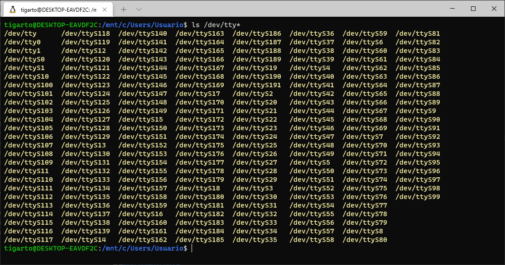
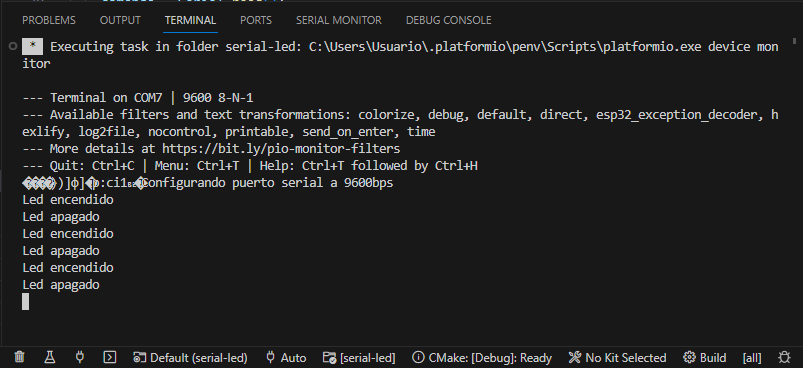
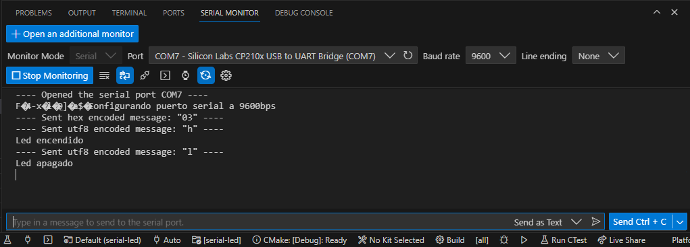

# Paso 1 - Implentacion del programa en el ESP32

## Hardware

### Lista de componentes

|Elemento|Descripcion|
|--|--|
|1|Placa de desarrollo ESP32|


### Conexion

A continuación se muestra el diagrama de conexión. El led se conecta al puerto P26 (GPIO26) de la tarjeta como se muestra a continuación:


## Sofware

El programa que se descargara en la ESP32 se muestra a continuación:

```ino
#include <Arduino.h>

#define LED 2   // Assign LED to pin GPIO2 (Built-in LED)

byte comando;

void setup() {
  // initialize serial communication at 9600 bits per second:
  Serial.begin(9600);
  Serial.write("Configurando puerto serial a 9600bps\n");
  // initialize digital pin LED as an output.
  pinMode(LED, OUTPUT);
}

void loop() {
  // check if data has been sent from the computer
  if (Serial.available()) {
    // read the most recent byte 
    comando = Serial.read();
    if(comando == 'h') {
      digitalWrite(LED, !HIGH);
      Serial.write("Led encendido\n");
    }
    else if(comando == 'l') {
      digitalWrite(LED, !LOW);
      Serial.write("Led apagado\n");
    }
  } 
}
```

## Prueba

Cuando conecte el ESP32 verifique el nombre del puerto COM al que se asocio. Esto se hace en windows mediante el administrador de dispositivos a continuación:


En caso de ser la conexión en una maquina linux, se debe verificar que aparezca dentro del directorio **```/dev```** el puerto asociado al ESP32 el cual sera de la forma **```**ttyUSBx**```** donde **```x```** es un numero (0, 1, 2,...). 

Normalmente aparece de la forma **```**ttyUSB0**```**. La siguiente figura muestra la aplicación del comando (notese que en la siguiente salida no aparece una salida de la forma **```**ttyUSBx**```** indicando no esta conectado el ESP32):



Posteriormente proceda a compilar y a descargar el programa y abra la terminal serial a 9600 bps, luego pruebe enviando caracteres ```'h'``` (prender luz) y ```'l'``` a traves de esta. Si todo sale bien, se deberá prender y apagar el led conectado a esta. La siguiente figura muestra la salida en el monitor serial por defecto:



Si se prueba en el otro monitor serial mas avanzado, la salida será como la que se muestra a continuación:



Cuando la prueba resulte exitosa, vaya al paso 2 ([link](../paso2/README.md)).

