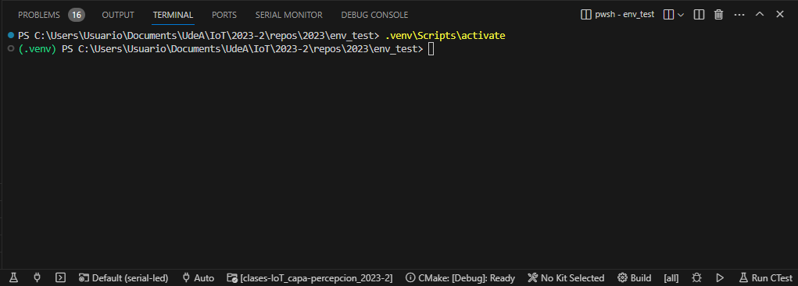

# Paso 4 - Creación del API para controlar el arduino

## Prerequisitos

1. Acceder al entorno virtual ya configurado:

   ```
   cd cd env_test
   .venv\Scripts\activate
   ```

   La siguiente figura muestra el resultado:

   

## Software

### API Endpoints

|HTTP method | API endpoint |Descrición|
|---|---|---|
|```GET``` | ```/ports``` |	Obtiene una lista de puertos |
|```GET``` | ```/connect/<port_id>``` |	Conecta la aplicación al puerto serial elegido |
|```GET``` | ```/disconnect``` | Desconecta la aplicación del puerto serial |
|```GET``` | ```/on``` | Enciende el led (Una vez la aplicación se ha conectado) |
|```GET``` | ```/off``` | Apaga el led (Una vez la aplicación se ha desconectado) |

El codigo de la aplicación se muestra a continuación:

```python
#Python
from typing import Optional
from enum import Enum
import serial
import serial.tools.list_ports

#Pydantic
from pydantic import BaseModel
from pydantic import Field

#FastAPI
from fastapi import FastAPI
from fastapi import Body, Query, Path

app = FastAPI()
app.serial = None

@app.get("/")
async def home():
    return {"App": "Ready"}

@app.get("/ports")
async def listPorts():
   comlist = serial.tools.list_ports.comports()
   ports = []
   for element in comlist:
      ports.append(element.device)
   return {"ports": ports}

@app.get("/connect/{port_id}")
async def connect(port_id): 
    print("Iniciando conexión...")
    app.serial = serial.Serial(port_id,9600)
    if app.serial == None:
        return {"Connection": "Fail"}
    else:
        return {"Connection": "Open", }

@app.get("/disconnect")
async def disconnect():
    app.serial.close()
    return {"Connection": "Close"}

@app.get("/on")
async def led_on():
    app.serial.write(b'h')
    return {"led":"on"}

@app.get("/off")
async def led_off():
    app.serial.write(b'l')
    return {"led":"off"}
```

## Probando la aplicación

Asumiento que la aplicación se guardo como **api_serialLed_esp32.py**, para ejecutar la aplicación se emplea el comando:

```bash
uvicorn api_serialLed_esp32:app --reload
```

Si todo esta bien, deberia salir algo en consola similar a:


Para salir de la aplicación de ejecuta la combinación de letras **```CTRL``` + ```C```**

La salida en el navegador teniendo como URL **127.0.0.1:8000** será:


La siguiente tabla muestra las salidas para cada una de las peticiones enviadas:

|URL Browser|Respuesta|
|---|---|
|http://127.0.0.1:8000|```{"App":"Ready"}```|
|http://127.0.0.1:8000/ports|```{"ports":["COM7","COM9","COM10"]}```|
|http://127.0.0.1:8000/connect/COM7|```{"Connection":"Open"}```|
|http://127.0.0.1:8000/on|```{"led":"on"}```|
|http://127.0.0.1:8000/off|```{"led":"off"}```|
|http://127.0.0.1:8000/disconnect|```{"Connection":"Close"}```|

Para el resto de las pruebas basta con poner en la URL del navegados cualquiera de los endpoints mensionados en la tabla al principio, o para mayor comodidad pasarlo a traves de la interfaz web facilitada por FastAPI para llevar a cabo las pruebas. Para acceder a esta se coloca en el campo de la URL del navegador **127.0.0.1:8000/docs** lo cual deberia arrojar una salida como la que se muestra a continuación:


A continuación se muestra el resultado de la aplicacion de cada uno de los endpoints del API:

* **End point**: ```/```
  
  

* **End point**: ```/ports```
  
  
  
* **End point**: ```/connect/<port_id>```
  
  
  
* **End point**: ```/connect/on```
  
  

* **End point**: ```/connect/off```
  
  
  
* **End point**: ```/connect/disconnect```
  
  


## Referencias

1. https://fastapi.tiangolo.com/
2. https://fastapi.tiangolo.com/tutorial/
3. https://fastapi.tiangolo.com/es/tutorial/
4. https://realpython.com/api-integration-in-python/
5. https://realpython.com/flask-connexion-rest-api/
6. https://realpython.com/flask-connexion-rest-api-part-2/
7. https://realpython.com/flask-connexion-rest-api-part-3/
8. https://realpython.com/courses/python-rest-apis-with-fastapi/