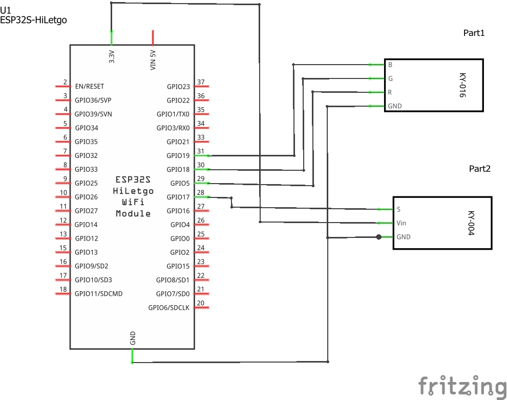
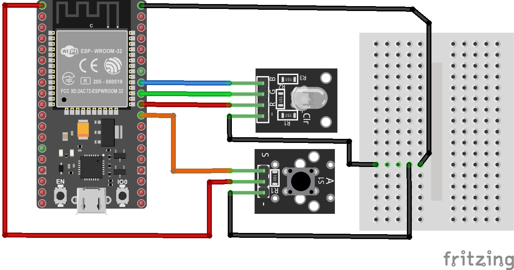
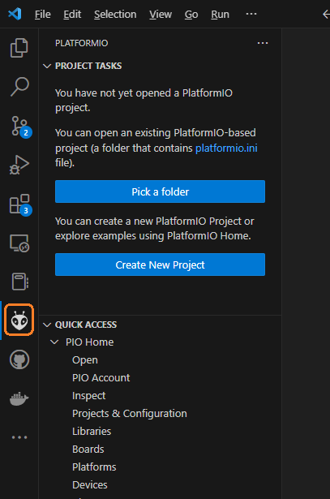

# Trabajando con platformio

## Hardware

Suponga que se va a montar el siguiente circuito:



Cuya conexion es:



## Software

El codigo se muestra a continuación: 

```cpp
#include <Arduino.h>

/* Constantes */

// Para debug
#define DEBUG 1

// Estados 
#define OFF_STATE 0
#define RED_STATE 1
#define GREEN_STATE 2
#define BLUE_STATE 3

// Comunicacion serial
const int baud_rate = 9600;

// Para el programa
const int DEBOUNCE_WINDOW = 40; // in ms

/* Entradas y salidas */

// Entradas
const int PIN_BUTTON = 17;

// Salidas
#define PIN_RED 5      // P5 (GPIO5)
#define PIN_GREEN 18   // P18 (GPI18)
#define PIN_BLUE 19     // P19 (GPI19)

/* Variables*/
int state;          // Estado
int button_val_prev;  // Valor del boton anterior
int button_val_act;  // Valor del boton anterior

/* Funciones */

void put_color(int, int, int);

void setup() {  
  pinMode(PIN_BUTTON, INPUT);  
  state = OFF_STATE;
  button_val_act = LOW; // Valor inicial del boton
  put_color(0, 0, 0);   // Led inicia apagado
  Serial.begin(baud_rate);   
  Serial.println("Dispositivo iniciado: OK");
  Serial.println("Led -> Apagado");
  #ifdef DEBUG   
    Serial.print("Estado actual: ");
    Serial.println(state);
  #endif
}

void loop() {
  // Lectura inicial del boton  
  button_val_act = digitalRead(PIN_BUTTON); // Se lee el boton
  
  // Ventan de tiempo para el debounce
  delay(DEBOUNCE_WINDOW);                   
  
  // Lectura despues de que pasa el rebote del boton 
  button_val_prev = button_val_act;         // Se almacena el valor previo del boton
  button_val_act = digitalRead(PIN_BUTTON); // Se vuelve a leer el boton

  // Comparacion de los valores previo y actual del boton
  if (button_val_act != button_val_prev) {
    // Se pulso el boton
    if(button_val_act == HIGH) {
      // Se verifica que el boton haya cambiado de LOW a HIGH
      // Maquina de estados
      switch (state) {
      case OFF_STATE:            
        state = RED_STATE;    // Proximo estado -> Rojo
        put_color(255, 0, 0); // Led se pone en rojo
        Serial.println("Led -> Rojo");
        #ifdef DEBUG          
          Serial.print("Estado : ");
          Serial.println(state);
        #endif
        break;
      case RED_STATE:            
        state = GREEN_STATE;  // Proximo estado -> Verde
        put_color(0, 255, 0); // Led se pone en verde
        Serial.println("Led -> Verde");
        #ifdef DEBUG          
          Serial.print("Estado : ");
          Serial.println(state);
        #endif
        break;
      case GREEN_STATE:            
        state = BLUE_STATE;   // Proximo estado -> Azul
        put_color(0, 0, 255); // Led se pone en azul
        Serial.println("Led -> Azul");
        #ifdef DEBUG          
          Serial.print("Estado : ");
          Serial.println(state);
        #endif
        break;
      case BLUE_STATE:            
        state = OFF_STATE;   // Proximo estado -> Apagado
        put_color(0, 0, 0); // Led se apaga
        Serial.println("Led -> Apagado");
        #ifdef DEBUG          
          Serial.print("Estado : ");
          Serial.println(state);
        #endif
        break;
      }    
    }
  }
}

// Funciones
void put_color(int R, int G, int B) {
  analogWrite(PIN_RED,R);
  analogWrite(PIN_GREEN,G);
  analogWrite(PIN_BLUE,B);
}
```

## Usando Platformio

1. Iniciar Platformio
   
   

   Si todo esta bien aparecera:

   

2. Crear nuevo proyecto
   
   

3. Seleccionar la plataforma y el lugar donde estara el proyecto.
   
   

   Si todo esta bien el resultado sera como el siguiente:

   
   
4. Abrir el archivo **main.cpp** y editarlo
   
   

5. Subir el codigo a la tarjeta
   
   

   Luego se procede a subir el codigo:

   

6. Ensayar el funcionamiento.
   
   

## Haciendo debug serial

Se puede hacer debug serial empleando el siguiente boton para ello:


A continuación se muestra la prueba de funcionamiento:


