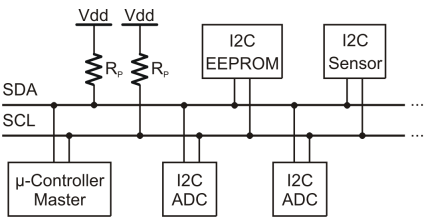
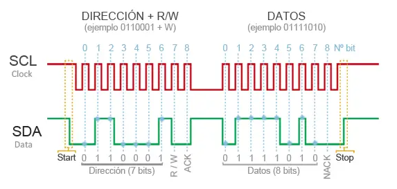
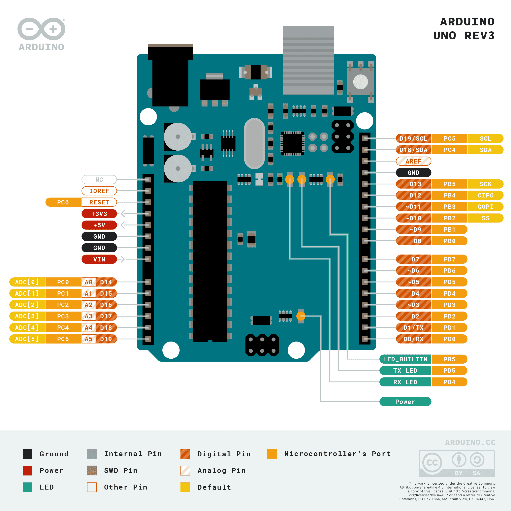

# I2C

> **Objetivos**:
> * En construcción.
> * Disculpe las molestias causadas.

## Protocolo I2C

El estandar **I2C** (Inter-Integrated Circuit), tambien conocido como **TWI** (Two Wired Interface), es un protocolo de comunicación serial que permite el intercambio de información entre diferentes dispositivos usando simplemente un par de cables ([link](https://learn.parallax.com/tutorials/language/propeller-c/propeller-c-simple-protocols/diy-i2c)).



Entre los dispositivos que se pueden conectar se encuentran sensores, actuadores, memorias, displays, GPS e incluso otros microcontroladores por citar algunos casos ([link](https://learn.adafruit.com/i2c-addresses/overview)).


### Clasificación de los dispositivos conectados

El protocolo I2C tiene una arquitectura **master-slave** (maestro esclavo) de modo que cada dispositivo que se conecta puede ser:
* **Master - Controller**: El maestro es el dispositivo encargado de iniciar y terminar la transferencia de información entre los esclavos. Adicionalmente, controla la señal de reloj.   
* **Slave - Peripheral**: Este dispositivo (direccionado por el maestro) puede transmitir y recibir información siempre que lo determine el maestro (la comunicación entre esclavos no es posible).

Cuando se conectan varios dipositivos entre si se pueden tener dos posibles escenarios:
* **Multiples esclavos y un maestro**: De todos los dispositivos conectados, solo hay un maestro, el resto son esclavos. Por ejemplo, un sistema de medición de temperatura puede construirse usando un ESP32, que actua como maestro, que lee los datos de temperatura del sensor esclavo (BME280) y los escribe al display OLED ([link](https://randomnerdtutorials.com/esp32-i2c-communication-arduino-ide/))
  
  

* **Multiples maestros**: Es posible disponer de mas de un maestro conectado, sin embargo, solo uno de estos puede ser maestro a la vez. Debido a la complejidad que esto representa, esta conexión es poco frecuente. Un ejemplo de esto puede darse cuando dos ESP32 estan escribiendo datos a un mismo display OLED conectado por I2C.

La información transmitida a traves del bus I2C es una trama cuyos campos se resumen a continuación ([link](https://www.luisllamas.es/arduino-i2c/)):
* **Dirección**: Dirección del esclavo. (7 o 10 bits).
* **Bit de operación (R/W)**: Operación a realizar sobre el esclavo, lectura o escritura.
* **Bit de validación (ACK)**
* **Bytes de datos**: Datos enviados o recibidos del esclavo.
* **Bit de validación (NACK)**



En el bus cada dispositivo dispone de una dirección unica. Esta dirección puede ser fijada por hardware (modificando los últimos 3 bits mediante jumpers o interruptores) o software. En el siguiente [link](https://i2cdevices.org/addresses) puede encontrar una lista completa de direcciones asociadas a diferentes dispositivos.

### Bus I2C

Para la tranferencia de datos entre los dispositivos, el bus **I2C** utiliza una señal de reloj lo cual hace que el protocolo sea **sincronico**. Las dos lineas empleadas en el bus son:
* **SDA** (Serial Data): Linea a traves de la cual se transfieren los datos entre los dispositivos.
* **SCL** (Serial Clock): Linea (controlada por el maestro) a traves de la cual se transmite la señal de reloj necesaria para sincronizar la comunicación.

Al permitir transmición y recepción de datos, el I2C es un bus bidireccional, sin embargo, como estas operaciones no se pueden realizar de manera simultanea, el bus es **Half duplex**.

Las velocidades tipicas, manejadas para la transferencia de datos, se resumen en la siguiente tabla ([link](https://en.wikipedia.org/wiki/I%C2%B2C)):

|Modo |	Velocidad de transmisión máxima	|Dirección|
|---|---|---|
|Standard Mode (Sm)	|0,1 Mbit/s	|Bidireccional|
|Fast Mode (Fm)	|0,4 Mbit/s|	Bidireccional|
|Fast Mode Plus (Fm+)|1,0 Mbit/s|Bidireccional|
|High Speed Mode (Hs-mode)|3,4 Mbit/s|Bidireccional|
|Ultra Fast-mode (UFm)	|5,0 Mbit/s	|Unidireccional|

### Ventajas y desventajas

La siguiente tabla resume principales ventajas y desventajas de este protocolo:

|Ventajas|Desventajas|
|---|---|
|<ul><li>Requiere pocos cables<li>Dispone de mecanismos para verificar que la señal hay llegado</ul>|<ul><li>Su velocidad es media-baja<li>No es full duplex<li>No hay correción de errores</ul>|

## Pines I2C

### ESP32


Al consultar la tabla de definición de pines del datasheet del Nodemcu-32s ([link](https://docs.ai-thinker.com/_media/esp32/docs/nodemcu-32s_product_specification.pdf)), los pines de interes seran:

|No.| Pin Name |Functional Description|I2C Pin|
|---|---|---|---|
|33 |```P21```|```GPIO21```, ```VSPIHD```, ```EMAC_TX_EN```|```SDA```|
|36 |```P22```|```GPIO22```, ```VSPIWP```, ```U0RTS```, ```EMAC_TXD1```|```SCL```|

### Arduino



|No.| Pin Name |Functional Description|
|---|---|---|
|```18```|```SDA``` |```D18/SDA```, ```PC4```, ```SDA```|
|```19```|```SCL``` |```D19/SCL```, ```PC5```, ```SCL```|

### Sensores Elegoo

En construcción...

## Libreria Wire

En construcción...

## Referencias

* https://learn.adafruit.com/i2c-addresses/overview
* https://randomnerdtutorials.com/esp32-i2c-communication-arduino-ide/
* https://learn.sparkfun.com/tutorials/i2c
* https://programarfacil.com/blog/arduino-blog/comunicacion-i2c-con-arduino/
* https://www.luisllamas.es/arduino-i2c/
* https://learn.parallax.com/tutorials/language/propeller-c/propeller-c-simple-protocols/diy-i2c
* https://www.dummies.com/article/technology/programming-web-design/python/what-is-i2c-python-programming-basics-for-the-raspberry-pi-264864/
* https://learn.adafruit.com/adafruit-kb2040/i2c
* https://www.seeedstudio.com/blog/2022/09/02/i2c-communication-protocol-and-how-it-works/
* https://i2cdevices.org
* https://wiki.seeedstudio.com/I2C_And_I2C_Address_of_Seeed_Product/
* https://learn.adafruit.com/i2c-addresses/the-list
* https://github.com/adafruit/I2C_Addresses/
* https://docs.espressif.com/projects/esp-idf/en/latest/esp32/api-reference/peripherals/i2c.html
* 


it is a bus and can support multiple devices connected to the
same two wires. It also can run at either 5 V or 3.3 V.

I2C devices are either masters or slaves, and there can be more than one master
device per bus. In fact, devices are allowed to change roles, although this is not usually
done. It is common for microcontrollers to have an I2C interface and use it to
exchange data between microcontrollers.
The serial clock line (SCL) is a clock, and the serial data line (SDA) carries the
data. The timing of these pins is shown in Fig. 13.33. The master supplies the SCL

In fact, devices are allowed to change roles, although this is not usually
done. It is common for microcontrollers to have an I2C interface and use it to
exchange data between microcontrollers.

#include <Wire.h>