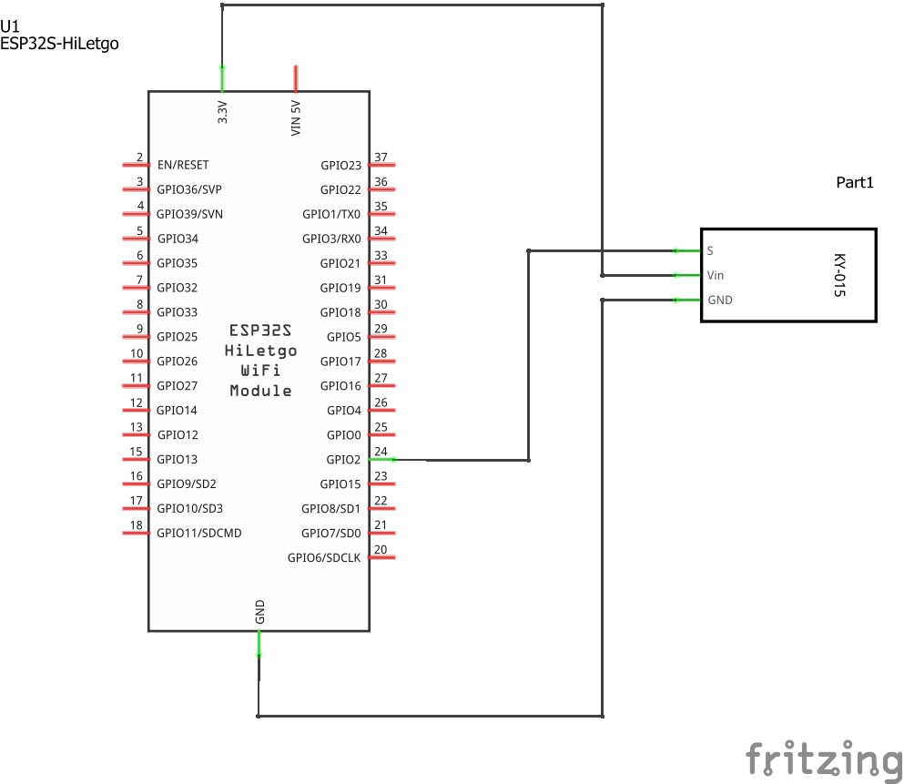
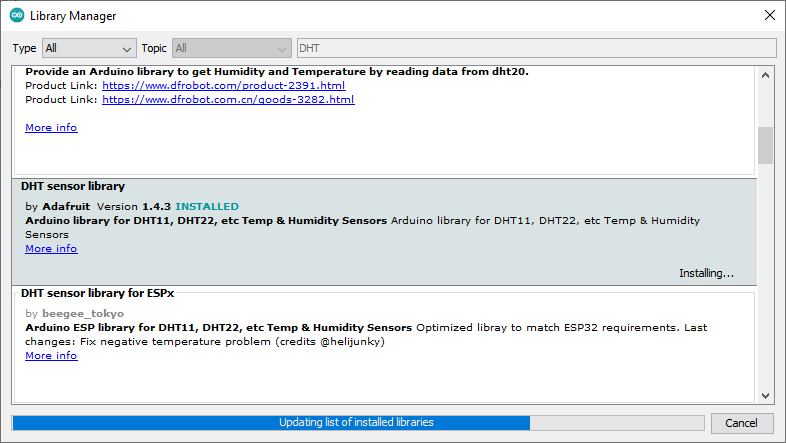
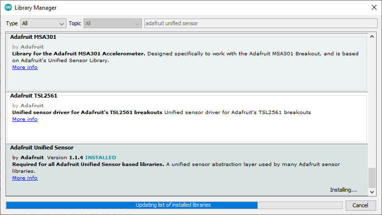

# Medición de temperatura y humedad usando el ESP32

## Resumen

Realizar que imprima la tempetatura y la humedad obtenida con un sensor DHT11 e imprimir el valor usando el monitor serial.

## Hardware

### Componentes

La siguiente tabla muestra los componentes principales del circuito a montar:

|Componentes|Cantidad|Observaciones|
|---|---|---|
|ESP32|1||
|DHT11 Temperature and Humidity Module|1|Disponible en el kit Elegoo ([datasheet](https://cdn.sparkfun.com/assets/b/3/f/9/d/OKY3068-1.pdf))|

Es importante conocer los pines sensor. A continuación se muestra un mapa de estos ([link](https://components101.com/sensors/dht11-temperature-sensor)):


### Esquematico



### Diagrama de conexión

La conexión entre teclado matricial de membrana de 4x4 y el ESP32 se muestra en la siguiente tabla:

|ESP32|DHT11|
|---|---|
|P2 (GPIO2) |S|
|3.3V (VIN3.3V) |VSS|
|GND (GND) |GND|

## Software

Este ejemplo se probo en arduino, se pide que repita el procedimiento usando Platformio.

### Configuración

#### Librerias empleadas

Se agregaron las siguientes librerias:

* **DHT**
  
  

* **Adafruit Unified Sensor**

  

#### Programa

El programa codificado se muestra a continuación:

```ino
#include "DHT.h"

#define DHTPIN 2     // Digital pin connected to the DHT sensor
// Feather HUZZAH ESP8266 note: use pins 3, 4, 5, 12, 13 or 14 --
// Pin 15 can work but DHT must be disconnected during program upload.

// Uncomment whatever type you're using!
#define DHTTYPE DHT11   // DHT 11
//#define DHTTYPE DHT22   // DHT 22  (AM2302), AM2321
//#define DHTTYPE DHT21   // DHT 21 (AM2301)

// Connect pin 1 (on the left) of the sensor to +5V
// NOTE: If using a board with 3.3V logic like an Arduino Due connect pin 1
// to 3.3V instead of 5V!
// Connect pin 2 of the sensor to whatever your DHTPIN is
// Connect pin 3 (on the right) of the sensor to GROUND (if your sensor has 3 pins)
// Connect pin 4 (on the right) of the sensor to GROUND and leave the pin 3 EMPTY (if your sensor has 4 pins)
// Connect a 10K resistor from pin 2 (data) to pin 1 (power) of the sensor

// Initialize DHT sensor.
// Note that older versions of this library took an optional third parameter to
// tweak the timings for faster processors.  This parameter is no longer needed
// as the current DHT reading algorithm adjusts itself to work on faster procs.
DHT dht(DHTPIN, DHTTYPE);

void setup() {
  Serial.begin(9600);
  Serial.println(F("DHTxx test!"));

  dht.begin();
}

void loop() {
  // Wait a few seconds between measurements.
  delay(2000);

  // Reading temperature or humidity takes about 250 milliseconds!
  // Sensor readings may also be up to 2 seconds 'old' (its a very slow sensor)
  float h = dht.readHumidity();
  // Read temperature as Celsius (the default)
  float t = dht.readTemperature();
  // Read temperature as Fahrenheit (isFahrenheit = true)
  float f = dht.readTemperature(true);

  // Check if any reads failed and exit early (to try again).
  if (isnan(h) || isnan(t) || isnan(f)) {
    Serial.println(F("Failed to read from DHT sensor!"));
    return;
  }

  // Compute heat index in Fahrenheit (the default)
  float hif = dht.computeHeatIndex(f, h);
  // Compute heat index in Celsius (isFahreheit = false)
  float hic = dht.computeHeatIndex(t, h, false);

  Serial.print(F("Humidity: "));
  Serial.print(h);
  Serial.print(F("%  Temperature: "));
  Serial.print(t);
  Serial.print(F("°C "));
  Serial.print(f);
  Serial.print(F("°F  Heat index: "));
  Serial.print(hic);
  Serial.print(F("°C "));
  Serial.print(hif);
  Serial.println(F("°F"));
}
```

## Otros recursos

La simulación del programa descargado se encuentra en ([link](https://wokwi.com/projects/357776308749643777))

## Referencias

* https://randomnerdtutorials.com/esp32-dht11-dht22-temperature-humidity-sensor-arduino-ide/
* https://randomnerdtutorials.com/esp32-dht11-dht22-temperature-humidity-web-server-arduino-ide/
* https://learn.sparkfun.com/tutorials/rht03-dht22-humidity-and-temperature-sensor-hookup-guide/all
* https://learn.adafruit.com/dht/overview
* https://programarfacil.com/blog/arduino-blog/sensor-dht11-temperatura-humedad-arduino/
* https://www.arduino.cc/reference/en/libraries/dht-sensor-library/
* https://wiki.seeedstudio.com/Grove-TemperatureAndHumidity_Sensor/
* https://www.seeedstudio.com/Grove-Temperature-Humidity-Sensor-DHT11.html
* https://www.seeedstudio.com/blog/2020/04/07/how-to-pick-the-best-temperature-and-humidity-sensor-for-your-arduino-project/
* https://www.seeedstudio.com/blog/2019/08/22/8-types-of-temperature-sensors-you-should-know/
* https://www.seeedstudio.com/blog/2022/11/11/selection-guide-of-grove-temperature-and-humidity-sensor-that-support-esphome/


