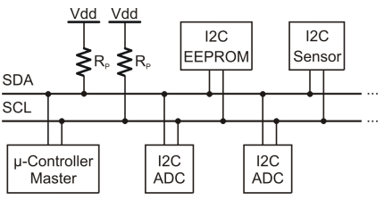
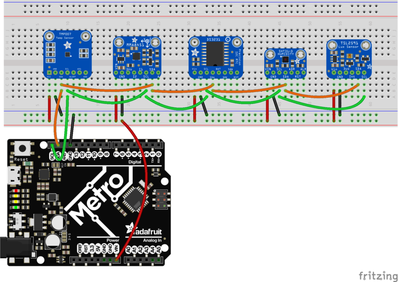
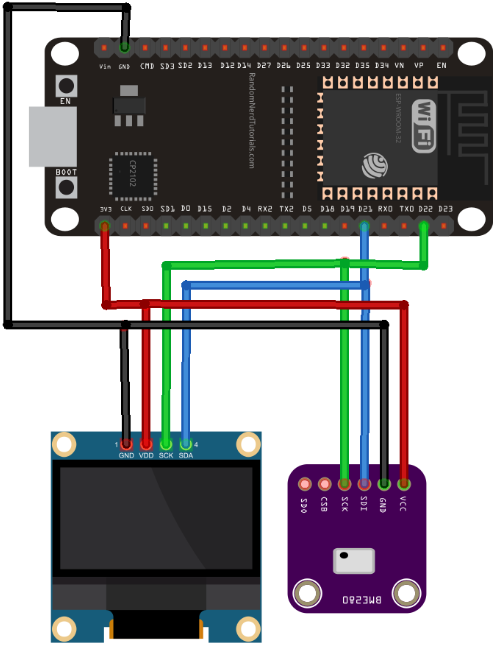
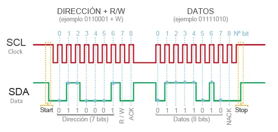
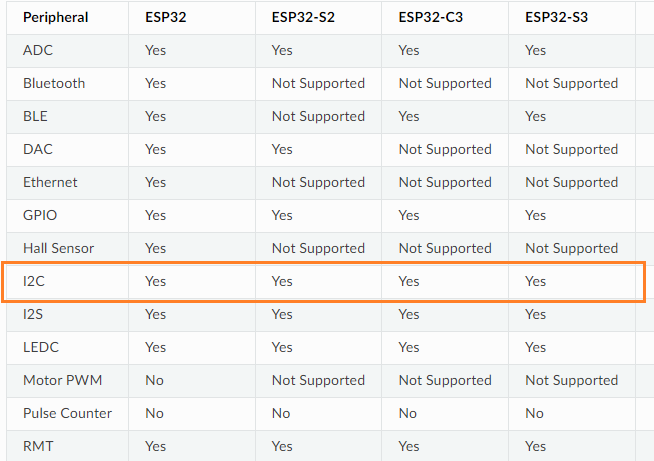
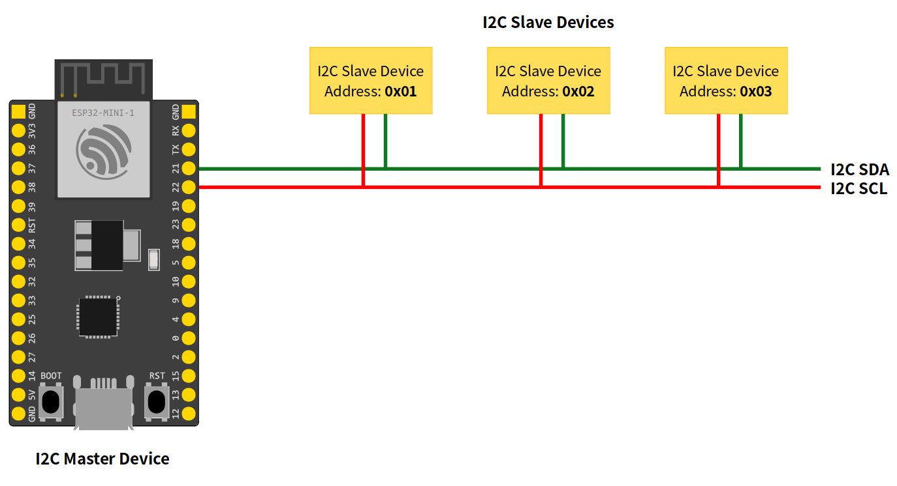
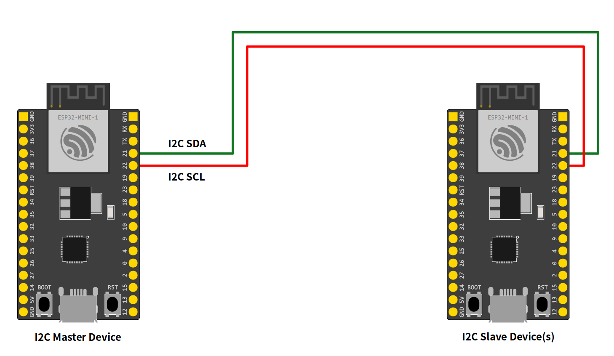
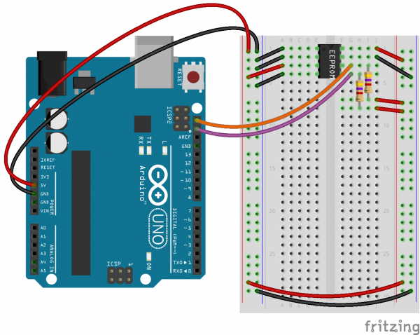

# I2C

> **Objetivos**:
> * En construcción.
> * Disculpe las molestias causadas.

## Protocolo I2C

El estandar **I2C** (Inter-Integrated Circuit), tambien conocido como **TWI** (Two Wired Interface), es un protocolo de comunicación serial que permite el intercambio de información entre diferentes dispositivos usando simplemente un par de cables ([link](https://learn.parallax.com/tutorials/language/propeller-c/propeller-c-simple-protocols/diy-i2c)).



Entre los dispositivos que se pueden conectar se encuentran sensores, actuadores, memorias, displays, GPS e incluso otros microcontroladores por citar algunos casos ([link](https://learn.adafruit.com/i2c-addresses/overview)).



### Clasificación de los dispositivos conectados

El protocolo I2C tiene una arquitectura **master-slave** (maestro esclavo) de modo que cada dispositivo que se conecta puede ser:
* **Master - Controller**: El maestro es el dispositivo encargado de iniciar y terminar la transferencia de información entre los esclavos. Adicionalmente, controla la señal de reloj.   
* **Slave - Peripheral**: Este dispositivo (direccionado por el maestro) puede transmitir y recibir información siempre que lo determine el maestro (la comunicación entre esclavos no es posible).

Cuando se conectan varios dipositivos entre si se pueden tener dos posibles escenarios:
* **Multiples esclavos y un maestro**: De todos los dispositivos conectados, solo hay un maestro, el resto son esclavos. Por ejemplo, un sistema de medición de temperatura puede construirse usando un ESP32, que actua como maestro, que lee los datos de temperatura del sensor esclavo (BME280) y los escribe al display OLED ([link](https://randomnerdtutorials.com/esp32-i2c-communication-arduino-ide/))
  
  

* **Multiples maestros**: Es posible disponer de mas de un maestro conectado, sin embargo, solo uno de estos puede ser maestro a la vez. Debido a la complejidad que esto representa, esta conexión es poco frecuente. Un ejemplo de esto puede darse cuando dos ESP32 estan escribiendo datos a un mismo display OLED conectado por I2C.

La información transmitida a traves del bus I2C es una trama cuyos campos se resumen a continuación ([link](https://www.luisllamas.es/arduino-i2c/)):
* **Dirección**: Dirección del esclavo. (7 o 10 bits).
* **Bit de operación (R/W)**: Operación a realizar sobre el esclavo, lectura o escritura.
* **Bit de validación (ACK)**
* **Bytes de datos**: Datos enviados o recibidos del esclavo.
* **Bit de validación (NACK)**



En el bus cada dispositivo dispone de una dirección unica. Esta dirección puede ser fijada por hardware (modificando los últimos 3 bits mediante jumpers o interruptores) o software. En el siguiente [link](https://i2cdevices.org/addresses) puede encontrar una lista completa de direcciones asociadas a diferentes dispositivos.

### Bus I2C

Para la tranferencia de datos entre los dispositivos, el bus **I2C** utiliza una señal de reloj lo cual hace que el protocolo sea **sincronico**. Las dos lineas empleadas en el bus son:
* **SDA** (Serial Data): Linea a traves de la cual se transfieren los datos entre los dispositivos.
* **SCL** (Serial Clock): Linea (controlada por el maestro) a traves de la cual se transmite la señal de reloj necesaria para sincronizar la comunicación.

Al permitir transmición y recepción de datos, el I2C es un bus bidireccional, sin embargo, como estas operaciones no se pueden realizar de manera simultanea, el bus es **Half duplex**.

Las velocidades tipicas, manejadas para la transferencia de datos, se resumen en la siguiente tabla ([link](https://en.wikipedia.org/wiki/I%C2%B2C)):

|Modo |	Velocidad de transmisión máxima	|Dirección|
|---|---|---|
|Standard Mode (Sm)	|0,1 Mbit/s	|Bidireccional|
|Fast Mode (Fm)	|0,4 Mbit/s|	Bidireccional|
|Fast Mode Plus (Fm+)|1,0 Mbit/s|Bidireccional|
|High Speed Mode (Hs-mode)|3,4 Mbit/s|Bidireccional|
|Ultra Fast-mode (UFm)	|5,0 Mbit/s	|Unidireccional|

### Ventajas y desventajas

La siguiente tabla resume principales ventajas y desventajas de este protocolo:

|Ventajas|Desventajas|
|---|---|
|<ul><li>Requiere pocos cables<li>Dispone de mecanismos para verificar que la señal hay llegado</ul>|<ul><li>Su velocidad es media-baja<li>No es full duplex<li>No hay correción de errores</ul>|

## Pines I2C

Antes de empezar a trabajar con dispositivos que soportan comunicación I2C, es necesario revisar cuales de los pines multiproposito existentes en cada plataforma, implementan el bus I2C. A continuación, se hará la revisión para algunas de las plataformas disponibles en el laboratorio, el procedimiento en general, aplica para otras plataformas.

### ESP32

La siguiente figura muestra el diagrama de pines para el NodeMCU-32S:


Al consultar la tabla de definición de pines del datasheet del Nodemcu-32s ([link](https://docs.ai-thinker.com/_media/esp32/docs/nodemcu-32s_product_specification.pdf)), los pines que se usaran para implementar el bus I2C seran:

|No.| Pin Name |Functional Description|I2C Pin|
|---|---|---|---|
|33 |```P21```|```GPIO21```, ```VSPIHD```, ```EMAC_TX_EN```|```SDA```|
|36 |```P22```|```GPIO22```, ```VSPIWP```, ```U0RTS```, ```EMAC_TXD1```|```SCL```|

Una vez identificados lo pines de interes, el siguiente paso consistirá en consultar si el API **Arduino-ESP32** ([link](https://espressif-docs.readthedocs-hosted.com/projects/arduino-esp32/en/latest/index.html)) tiene soporte para el protocolo I2C, para ello se consulta cuales de los perifericos del ESP32 son soportados usando el API Arduino en la seccion **Libraries** ([link](https://espressif-docs.readthedocs-hosted.com/projects/arduino-esp32/en/latest/libraries.html)):



Como se puede ver en la figura anterior, afortunadamente hay soporte de este protocolo, de modo que no nos tendremos que preocupar por la implementación de los detalles de bajo nivel (en otras palabras, no tendremos que implementar los drivers del protocolo I2C). Asi, el trabajo solo se reduce al uso de funciones de libreria segun las necesidades que se tengan para la aplicación. La documentación para el uso del protocolo I2C para el ESP32 se encuentra en la libreria **I2C** ([link](https://espressif-docs.readthedocs-hosted.com/projects/arduino-esp32/en/latest/api/i2c.html)). 

Tal y como se describe en la pagina la libreria **ESP32 I2C** esta basada en la libreria **Wire** de Arduino ([link](https://www.arduino.cc/reference/en/language/functions/communication/wire/)) e implementa algunas APIS mas, esto hace que la similitud entre los programas escritos para manejar el I2C para el ESP32 sea bastante similar a los que se escriben para el arduino.

Finalmente, la conexión del ESP32 con otros dispositivos I2C, depende del rol que este tome. Si este actua como **maestro**, la conexión es similar a la siguiente:



Por el contrario, si este actua como **esclavo**, la conexión se muestra a continuación:



### Arduino

A continuación se muestra el mapa de pines para el Arduino UNO con el objetivo de determinar cuales son los pines en los que se implementa el bus I2C:


Los pines destinados al bus I2C se pueden conocer al consultar el datasheet del Arduino UNO ([link](https://docs.arduino.cc/resources/datasheets/A000066-datasheet.pdf)). La siguiente tabla muestra dicho resultado:  

|No.| Pin Name |Functional Description|
|---|---|---|
|```18```|```SDA``` |```D18/SDA```, ```PC4```, ```SDA```|
|```19```|```SCL``` |```D19/SCL```, ```PC5```, ```SCL```|

Para comunicar el arduino con dispositivos I2C, se emplea la libreria **Wire** cuya documentación se encuentra en el siguiente [link](https://www.arduino.cc/reference/en/language/functions/communication/wire/)

Para mas información sobre como trabajar con el protocolo I2C del arduino consulte la página **A Guide to Arduino & the I2C Protocol (Two Wire)** ([link](https://docs.arduino.cc/learn/communication/wire))

Un dispositivo I2C tipico es una memoria EEPROM, en la pagina de Sparkfun: **Reading and Writing Serial EEPROMs** ([link](https://learn.sparkfun.com/tutorials/reading-and-writing-serial-eeproms/all)) se muestra un caso de uso tipico que ilustra la comunicación del Arduino con la memoria:




### Dispositivos I2C

En el laboratorio se encuentran los siguientes dispositivos I2C:

|N°|Dispositivo|Kit|Observaciones|
|---|---|---|---|
|1|DS1307 Serial Real Time Clock|37 Sensor Kit - Elegoo||
|2|GY-521 Module|37 Sensor Kit - Elegoo|No se encontró|
|3|Grove - LCD RGB Backlight|Grove - Starter Kit||

## Libreria Wire

A continuación se resumen las principales funciones de la libreria ```Wire.h``` ([link](https://www.arduino.cc/reference/en/))

|Función|Descripción|
|---|---|
|```begin()```|Unirse como maestro|
|```begin(addr)```|Unirse como esclavo usando la dirección ```addr```|
|```requestFrom(address, count)```||
|```beginTransmission(addr)```|Paso 1|
|```send(byte)```|Paso 2|
|```send(char * string)```||
|```send(byte * data, size)```||
|```endTransmission()```|Paso 3|
|```int available()```|Numero de bytes disponibles|
|```onReceive(handler)```||
|```onRequest(handler)```||


## Referencias

* https://learn.adafruit.com/i2c-addresses/overview
* https://randomnerdtutorials.com/esp32-i2c-communication-arduino-ide/
* https://learn.sparkfun.com/tutorials/i2c
* https://programarfacil.com/blog/arduino-blog/comunicacion-i2c-con-arduino/
* https://www.luisllamas.es/arduino-i2c/
* https://learn.parallax.com/tutorials/language/propeller-c/propeller-c-simple-protocols/diy-i2c
* https://www.dummies.com/article/technology/programming-web-design/python/what-is-i2c-python-programming-basics-for-the-raspberry-pi-264864/
* https://learn.adafruit.com/adafruit-kb2040/i2c
* https://www.seeedstudio.com/blog/2022/09/02/i2c-communication-protocol-and-how-it-works/
* https://i2cdevices.org
* https://wiki.seeedstudio.com/I2C_And_I2C_Address_of_Seeed_Product/
* https://learn.adafruit.com/i2c-addresses/the-list
* https://github.com/adafruit/I2C_Addresses/
* https://docs.espressif.com/projects/esp-idf/en/latest/esp32/api-reference/peripherals/i2c.html
* https://docs.espressif.com/projects/esp-idf/en/stable/esp32/api-reference/peripherals/i2c.html
* https://espressif-docs.readthedocs-hosted.com/projects/arduino-esp32/en/latest/libraries.html
* https://www.arduino.cc/education/courses/
* https://www.arduino.cc/education/
* https://learn.adafruit.com/adafruit-24lc32-i2c-eeprom-breakout-32kbit-4-kb/arduino