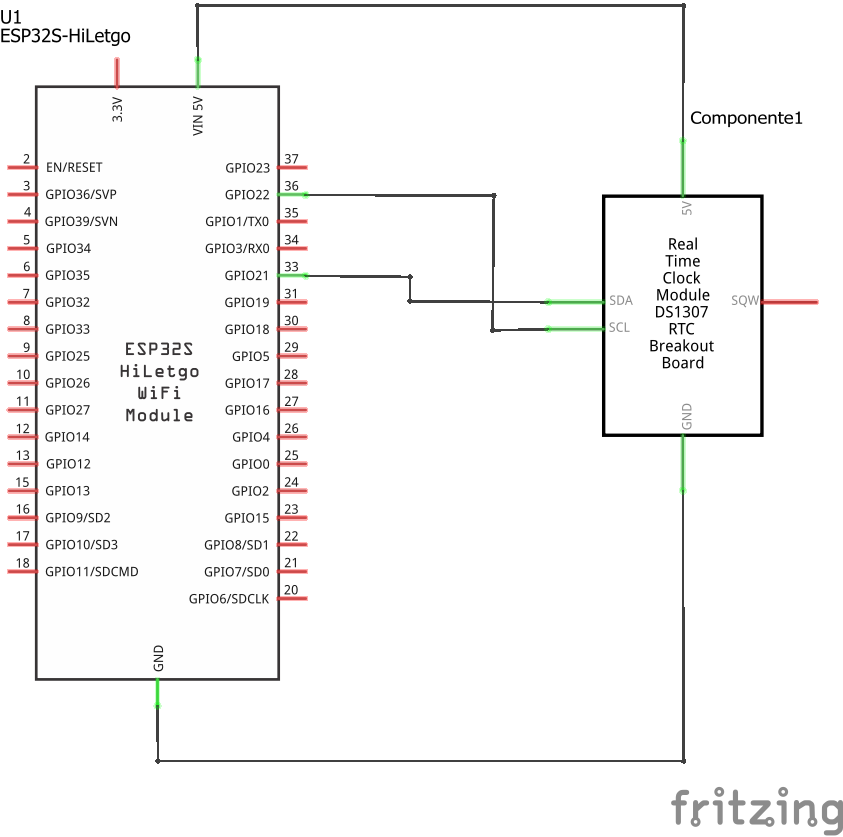
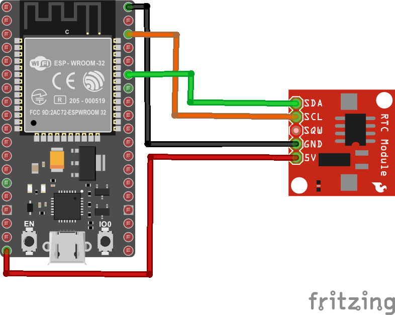
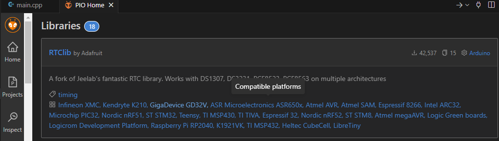
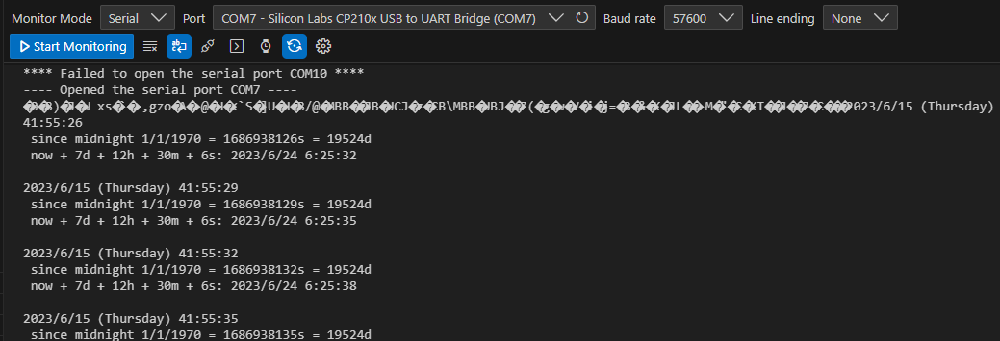

# Uso del RTC

## Descripción

Un RTC (Real Time Clock) es un dispositivo de Hardware que permite llevar un registro del tiempo de manera precisa (segundos, minutos, horas, días, meses y años) sin necesidad de un microcontrolador externo. Esto lo hace un componente perfecto para relojes, calendarios o cualquier otro proyecto de implique medición y retención del tiempo. 

En nuestro caso se usa el modulo DS1307 RTC module  de Elegoo el cual tiene como parte principal un chip **Maxim DS1307** ([link](https://cdn.sparkfun.com/datasheets/BreakoutBoards/DS1307.pdf)) como RTC.
Como caso de uso se muestra programa para el ESP32 el cual inicialmente configura el modulo RTC (fecha y hora) y luego se obtiene en cada iteración del ciclo el valor del tiempo que tiene en la actualidad del RTC desde que fue fue condigurado. Este valor se usa para imprimir diferentes mensajes usando el monitor serial.

## Componentes

La siguiente tabla muestra los componentes principales del circuito a montar:

|Componentes|Descripción|Observaciones|
|---|---|---|
|ESP32|||
|DS1307 RTC module||Modulo DS1307 RTC (Real Time Clock). Para mas información sobre el DS1307 puede consultar el Datasheet ([link](https://www.sparkfun.com/datasheets/Components/DS1307.pdf))|

## Conexión

La conexión entre el sensor de ultrasonido se muestra en la siguiente tabla:

|ESP32|DS1307|
|---|---|
|```GND```|```GND```|
|```5V```|```VCC```|
|```GPIO21 (SDA)```|```SDA```|
|```GPIO22 (SCL)```|```SCL```|

> **Importante**: El pin de alimentación del modulo debe ser conectado en el ESP32 al pin Vin de 5 V. Si se conecta a 3.3V, el RTC no sera conectado.

### Esquematico

A continuación se muestra el esquematico del circuito:



### Conexión

A continuación se muestra la conexión entre los componentes:



## Pasos previos si se usa platformio

1. Configurar en Platformio la plataforma a emplear eligiendo como dispositivo el ESP32 tal y como se resume en la siguiente tabla:
   
   |Parametro|Valor|
   |---|---|
   |**Name**|Nombre del proyecto (ESP32-DS1307)|
   |**Board**|NodeMCU-32S (Board disponible en el laboratorio)|
   |**Framework**|Arduino (Es el que hemos manejado)|

2. Agregue las librerias necesarias: En este caso se instalo la libreria RTClib de adafruit y todas las dependencias necesarias (lo cual se hizo de manera automatica).
   
   

   Al final el archivo **platformio.ini** quedo configurado de la siguiente manera:
    
    ```ini
    [env:nodemcu-32s]
    platform = espressif32
    board = nodemcu-32s
    framework = arduino
    lib_deps = 
    	adafruit/RTClib@^2.1.1
    	offcircuit/RTCDS1307@^1.0.0
    ```

### Programa

A continuación se muestra el programa que se ejecuta en el ESP32. Si este se hubiese implementado en platformio adicionalmente el **main.cpp** tendria incluida la libreria al principio:

```ino
#include <Arduino.h>

// Date and time functions using a DS1307 RTC connected via I2C and Wire lib
#include <SPI.h>  // Se agrega para evitar error
                  // Ver: https://community.platformio.org/t/spi-h-no-such-file-or-directory/12050/8
#include "RTClib.h"

RTC_DS1307 rtc;

char daysOfTheWeek[7][12] = {"Sunday", "Monday", "Tuesday", "Wednesday", "Thursday", "Friday", "Saturday"};

void setup () {
  Serial.begin(57600);

#ifndef ESP8266
  while (!Serial); // wait for serial port to connect. Needed for native USB
#endif

  if (! rtc.begin()) {
    Serial.println("Couldn't find RTC");
    Serial.flush();
    while (1) delay(10);
  }

  if (! rtc.isrunning()) {
    Serial.println("RTC is NOT running, let's set the time!");
    // When time needs to be set on a new device, or after a power loss, the
    // following line sets the RTC to the date & time this sketch was compiled
    rtc.adjust(DateTime(F(__DATE__), F(__TIME__)));
    // This line sets the RTC with an explicit date & time, for example to set
    // January 21, 2014 at 3am you would call:
    // rtc.adjust(DateTime(2014, 1, 21, 3, 0, 0));
  }

  // When time needs to be re-set on a previously configured device, the
  // following line sets the RTC to the date & time this sketch was compiled
  // rtc.adjust(DateTime(F(__DATE__), F(__TIME__)));
  // This line sets the RTC with an explicit date & time, for example to set
  // January 21, 2014 at 3am you would call:
  // rtc.adjust(DateTime(2014, 1, 21, 3, 0, 0));
}

void loop () {
    DateTime now = rtc.now();

    Serial.print(now.year(), DEC);
    Serial.print('/');
    Serial.print(now.month(), DEC);
    Serial.print('/');
    Serial.print(now.day(), DEC);
    Serial.print(" (");
    Serial.print(daysOfTheWeek[now.dayOfTheWeek()]);
    Serial.print(") ");
    Serial.print(now.hour(), DEC);
    Serial.print(':');
    Serial.print(now.minute(), DEC);
    Serial.print(':');
    Serial.print(now.second(), DEC);
    Serial.println();

    Serial.print(" since midnight 1/1/1970 = ");
    Serial.print(now.unixtime());
    Serial.print("s = ");
    Serial.print(now.unixtime() / 86400L);
    Serial.println("d");

    // calculate a date which is 7 days, 12 hours, 30 minutes, and 6 seconds into the future
    DateTime future (now + TimeSpan(7,12,30,6));

    Serial.print(" now + 7d + 12h + 30m + 6s: ");
    Serial.print(future.year(), DEC);
    Serial.print('/');
    Serial.print(future.month(), DEC);
    Serial.print('/');
    Serial.print(future.day(), DEC);
    Serial.print(' ');
    Serial.print(future.hour(), DEC);
    Serial.print(':');
    Serial.print(future.minute(), DEC);
    Serial.print(':');
    Serial.print(future.second(), DEC);
    Serial.println();

    Serial.println();
    delay(3000);
}
```

### Prueba de funcionamiento

La siguiente figura muestra la salida del programa en el monitor serial.  




## Referencias
* https://randomnerdtutorials.com/guide-for-real-time-clock-rtc-module-with-arduino-ds1307-and-ds3231/


