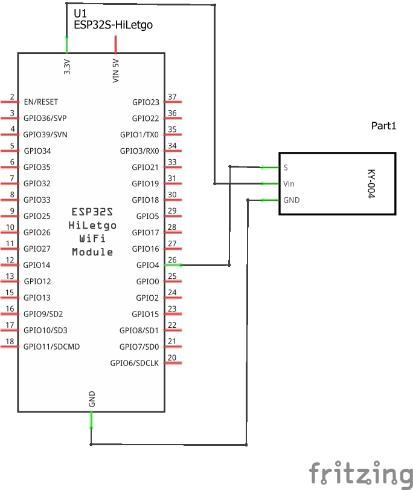
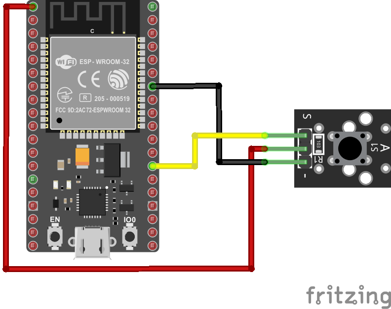
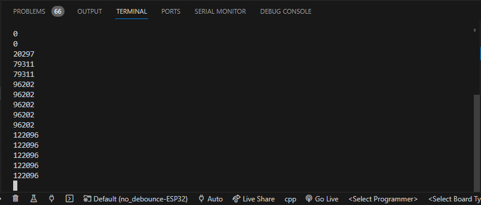
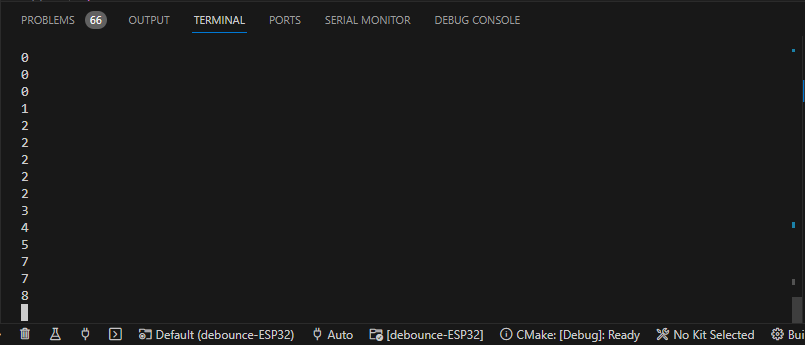

# Interrupciones por pines externos

## Hardware

### Lista de componentes

|Elemento|Descripcion|
|--|--|
|1|Placa de desarrollo ESP32|
|2|KY-004 Button (37 sensor Kid - Ladzo o Elegoo)|

### Esquematico

A continuación se muestra esquematico del circuito:



### Conexion

A continuación se muestra el diagrama de conexión:



## Sofware

El programa que se descargara en la ESP32 se muestra a continuación:

### Caso 1 - Problema con los rebotes

En esta implementación, se tiene un problema con los rebotes. Para ver este problema analice primero la **simulación**: [link](https://wokwi.com/projects/376220446820566017)

**Codigo**: 

```ino
#include <Arduino.h>

int ledPin = LED_BUILTIN;  // LED is attached to digital pin 2
int x = 0;                 // variable to be updated by the interrupt
int buttonPin = 4;         // buttton is attached to digital pin 4

// Interrupt service routine for interrupt 0
void increment() {
  x++;
  digitalWrite(ledPin, HIGH);
}

// Setup
void setup() {
  //enable interrupt 0 (pin 2) which is connected to a button
  //jump to the increment function on rising edge
  pinMode(ledPin, OUTPUT);
  attachInterrupt(digitalPinToInterrupt(buttonPin), increment, RISING);
  Serial.begin(9600);  //turn on serial communication
}

// loop
void loop() {
  digitalWrite(ledPin, LOW);
  delay(3000); //pretend to be doing something useful
  Serial.println(x, DEC); //print x to serial monitor
}
```

### Prueba - Caso 1 

La salida en el monitor serial del platformio muestra el resultado.



### Caso 2 - Solución del problema con los rebotes

En este caso, por medio de la implementación de un retardo, se soluciona el problema del rebote del interruptor. La siguiente **simulación**: [link](https://wokwi.com/projects/376222724903465985) muestra la forma en que esto se hace.

**Codigo**: 

```ino
#include <Arduino.h>

const int DEBOUNCE_DELAY = 300; // debounce delay 
int ledPin = LED_BUILTIN;  // LED is attached to digital pin 2
int x = 0;                 // variable to be updated by the interrupt
int buttonPin = 4;         // buttton is attached to digital pin 4

//variables to keep track of the timing of recent interrupts
unsigned long button_time = 0;  
unsigned long last_button_time = 0; 

// declaration ISR
void increment(); 

void setup() {
  //enable interrupt 0 (pin 2) which is connected to a button
  //jump to the increment function on rising edge
  pinMode(ledPin, OUTPUT);
  attachInterrupt(digitalPinToInterrupt(buttonPin), increment, RISING);
  Serial.begin(9600);  //turn on serial communication
}

void loop() {
  digitalWrite(ledPin, LOW);
  delay(3000); //pretend to be doing something useful
  Serial.println(x, DEC); //print x to serial monitor
}

// Interrupt service routine for interrupt 0
void increment() {
  button_time = millis();
  //check to see if increment() was called in the last 250 milliseconds
  if (button_time - last_button_time > DEBOUNCE_DELAY) {
    x++;
    digitalWrite(ledPin, HIGH);
    last_button_time = button_time;
  }
}
```

### Prueba - Caso 2

La salida en el monitor serial del platformio muestra el resultado.



## Referencias

* https://learn.sparkfun.com/tutorials/processor-interrupts-with-arduino/all
* https://programarfacil.com/blog/arduino-blog/interrupciones-con-arduino-ejemplo-practico/
* https://www.luisllamas.es/que-son-y-como-usar-interrupciones-en-arduino/
* https://randomnerdtutorials.com/esp32-pir-motion-sensor-interrupts-timers/
* https://www.cpe.ku.ac.th/~cpj/219335/slides/05-concurrency.pdf
* https://randomnerdtutorials.com/esp32-dual-core-arduino-ide/
* https://learn.sparkfun.com/tutorials/processor-interrupts-with-arduino/all