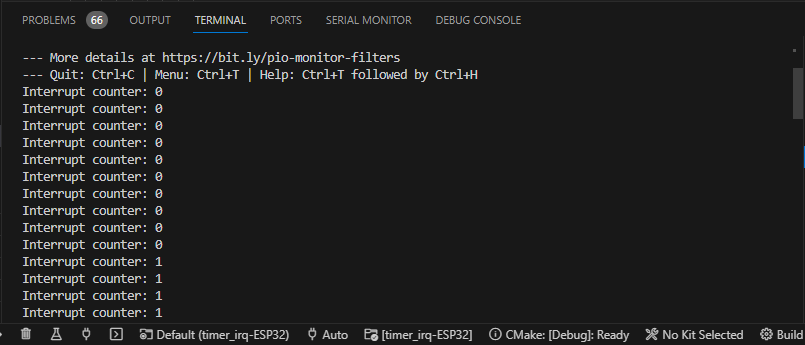

# Interrupciones por timer en el ESP32

## Hardware

### Lista de componentes

|Elemento|Descripcion|
|--|--|
|1|Placa de desarrollo ESP32|


### Esquematico

A continuación se muestra esquematico del circuito:


### Conexion

A continuación se muestra el diagrama de conexión:


## Sofware

El programa que se descargara en la ESP32 ( [link simulación](https://wokwi.com/projects/376235742395502593)) se muestra a continuación:


```ino
#include <Arduino.h>

// Inputs
const int LED_PIN = LED_BUILTIN; // LED_PIN (GPIO2)

// Timers
hw_timer_t * timer = NULL;       // H/W timer 

// Variables (Volatile: They're change in the ISR)
volatile int led_state = LOW;  
volatile uint32_t isrCounter = 0; // Interrupt counter


//ISR: Defining Inerrupt function with IRAM_ATTR for faster access
void ARDUINO_ISR_ATTR onTimer(){
  // Increment the counter and set the time of ISR
  isrCounter++;
  led_state = !led_state; // Change the led's state
}

void setup() {
  // I/O configure
  pinMode (LED_PIN, OUTPUT);
  // Serial configuration
  Serial.begin(9600);

  

  /*
  Step1: initialize timerBegin() Function
  
     timer speed (Hz) = Timer clock speed (Mhz) / prescaler

  */

  
  // timer 0, prescalar: 80, UP counting
  timer = timerBegin(0    /* timer 0*/, 
                     80,  /* Preescaler: 80 */
                     true /* Counting: UP (true)*/ 
                    );

  /*
  Step2: Attach Interrupt
  */

  // Attach onTimer function to our timer.
  timerAttachInterrupt(timer, &onTimer, true);

  /*
  Step3:  Define the match timer value 
  */

  // Set alarm to call onTimer function every second (value in microseconds).
  timerAlarmWrite(timer, 
                  1000000, /* Irq cada 1000000us = 1s */
                  true     /* Repeat the alarm (true) */
                 );

  // Start an alarm (Enable Timer with interrupt (Alarm Enable))
  timerAlarmEnable(timer);
}

void loop() {
  // Print it
  digitalWrite(LED_PIN, led_state);
  Serial.print("Interrupt counter: ");
  Serial.println(isrCounter);
  delay(100);
}
```

## Prueba

La salida en el monitor serial de platformio arrojo el siguiente resultado:




## Rerencias

* https://www.electronicwings.com/esp32/esp32-timer-interrupts
* https://www.sparkfun.com/news/2613
* https://circuitdigest.com/microcontroller-projects/esp32-timers-and-timer-interrupts
* https://deepbluembedded.com/esp32-timers-timer-interrupt-tutorial-arduino-ide/
