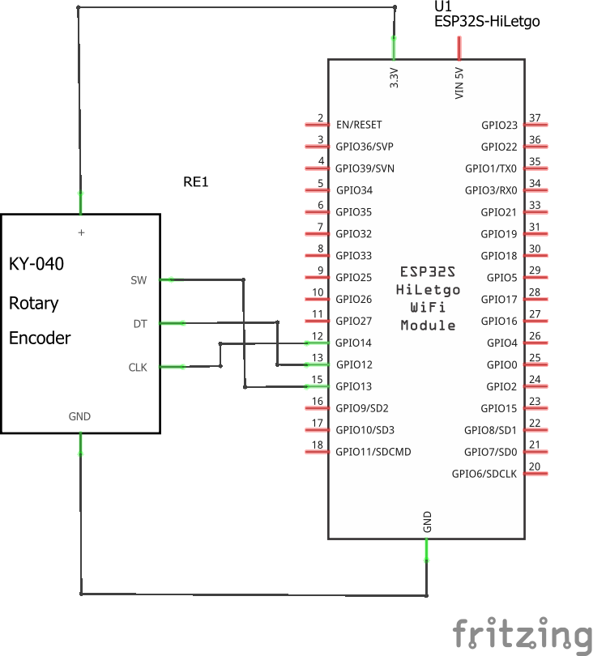
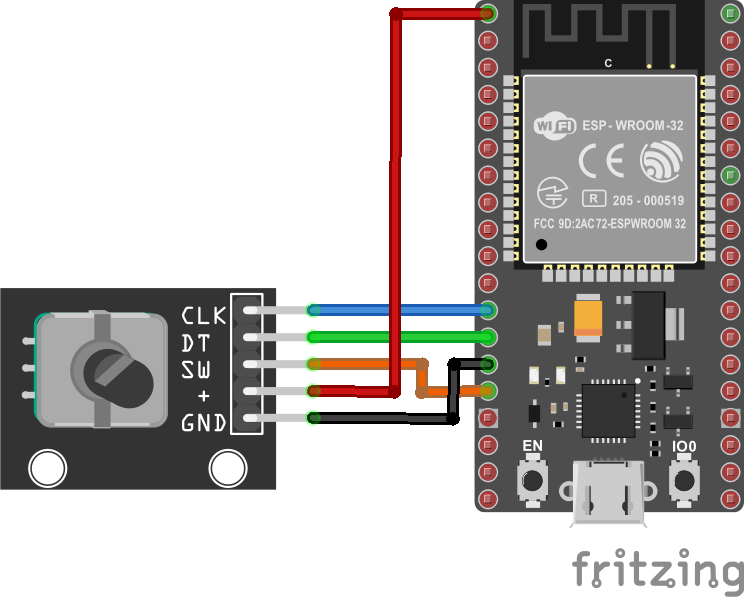
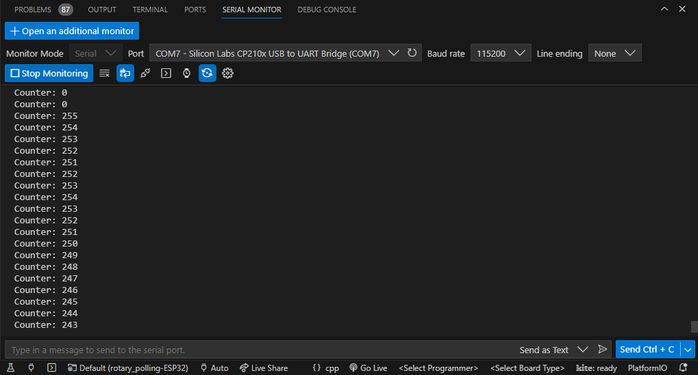
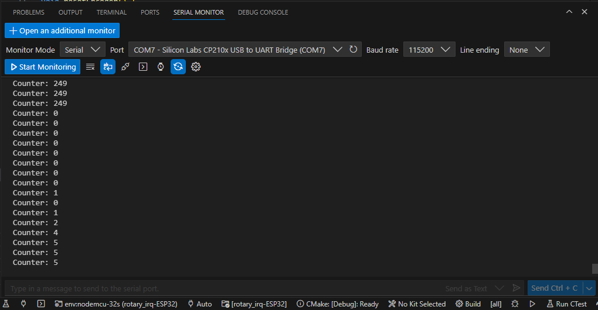

# Rotary encoder en el ESP32

## Hardware

### Lista de componentes

|Elemento|Descripcion|
|--|--|
|1|Placa de desarrollo ESP32|
|2|Rotary encoder (37 sensor Kid de Elegoo)|

### Esquematico

A continuación se muestra esquematico del circuito:



### Conexion

A continuación se muestra el diagrama de conexión:



## Sofware

La implementación del programa se muestra para el caso con interrupciones y sin interrupciones.

### Caso 1 - Implementación por polling

En esta implementación se puede estudiar analizando la **simulación online** ([link](https://wokwi.com/projects/367656993429289985))

**Codigo fuente**

```ino
#include <Arduino.h>

/* ---- Pines I/O ---- */

// Rotary encoder Encoder (I)
#define ENCODER_CLK 14
#define ENCODER_DT  12
#define ENCODER_SW  13
#define DEBUG 1

// Constantes
const char MAX_PUSH_TIME = 50;

// Variables aplicacion
unsigned char counter = 0;       // Brillo led integrado
int lastClk = HIGH;              // Valor anterior señal CLK
long int resetLastChanged = 0;   // cambio reset

/* ---- Inicialización ---- */
void setup() {
  // Inicializacion serial
  Serial.begin(115200);

  // Inicializacion I/O
  pinMode(LED_BUILTIN,OUTPUT);   
  pinMode(ENCODER_CLK, INPUT);
  pinMode(ENCODER_DT, INPUT);
  pinMode(ENCODER_SW, INPUT_PULLUP);

  // Impresion en el monitor serial
  #if DEBUG
    Serial.print("Counter: ");
    Serial.println(counter);      
  #endif

}

/* ---- Loop infinito ---- */
void loop() {
  // Chequeo del reset presionado por un tiempo mayor de MAX_PUSH_TIME 
  if (digitalRead(ENCODER_SW) == LOW && millis() - resetLastChanged > MAX_PUSH_TIME) {
    resetLastChanged = millis();
    counter = 0;
    #if DEBUG
      Serial.print("Counter: ");
      Serial.println(counter);   
    #endif
    analogWrite(LED_BUILTIN,counter);   
  }

  // Actualizancion del brillo
  int newClk = digitalRead(ENCODER_CLK);
  if (newClk != lastClk) {
    // There was a change on the CLK pin
    lastClk = newClk;
    int dtValue = digitalRead(ENCODER_DT);    
    if (newClk == LOW && dtValue == HIGH) {
      // Aumento brillo
      counter++;
      #if DEBUG
        Serial.print("Counter: ");
        Serial.println(counter);
      #endif
    }
    if (newClk == LOW && dtValue == LOW) {
      // Disminución brillo
      counter--;
      #if DEBUG
        Serial.print("Counter: ");
        Serial.println(counter);
      #endif
    }
    analogWrite(LED_BUILTIN,counter);   
  }
}
```

### Prueba - Caso 1 

La salida en el monitor serial de platformio se muestra a continuación:



### Caso 2 - Implementación por interrupciones

En esta implementación por interrupciones se puede analizar ejecutando la siguiente **simulación online** ([link](https://wokwi.com/projects/376267427485299713))

```ino
#include <Arduino.h>

/* ---- Pines I/O ---- */

// Rotary encoder Encoder (I)
#define ENCODER_CLK 14
#define ENCODER_DT  12
#define ENCODER_SW  13
#define DEBUG 1

// Constantes
const char DEBOUNCE_TIME = 50;

// Variables aplicacion
volatile unsigned char counter = 0;       // Brillo led integrado
int valClk = HIGH;
int dtValue = HIGH;
long int clkLastChanged = 0;     // cambio clk
long int resetLastChanged = 0;   // cambio reset

// Reset del brillo
void resetEncoder() {
  if (digitalRead(ENCODER_SW) == LOW && millis() - resetLastChanged > DEBOUNCE_TIME) {
    resetLastChanged = millis();
    counter = 0;
  }
}

// Actualizancion del brillo
void updateEncoder() {
  if ((millis() - clkLastChanged) < DEBOUNCE_TIME)  // debounce time is 50ms
    return;
  dtValue = digitalRead(ENCODER_DT);
  if (dtValue == LOW) {
    // Serial.println("DOWN"); 
    counter--;
  }
  else {
    // Serial.println("UP"); 
    counter++;
  }
  clkLastChanged = millis();
}

/* ---- Inicialización ---- */
void setup() {
  // Inicializacion serial
  Serial.begin(115200);

  // Inicializacion I/O
  pinMode(LED_BUILTIN,OUTPUT);   
  pinMode(ENCODER_CLK, INPUT);
  pinMode(ENCODER_DT, INPUT);
  pinMode(ENCODER_SW, INPUT_PULLUP);

  attachInterrupt(digitalPinToInterrupt(ENCODER_CLK), updateEncoder, CHANGE);
  attachInterrupt(digitalPinToInterrupt(ENCODER_SW), resetEncoder, CHANGE);

  // Impresion en el monitor serial
  Serial.print("Counter: ");
  Serial.println(counter);      
}

/* ---- Loop infinito ---- */
void loop() {
  // Chequeo del reset presionado por un tiempo mayor de MAX_PUSH_TIME 
  analogWrite(LED_BUILTIN,counter); 
  Serial.print("Counter: ");
  Serial.println(counter);   
  delay(100); 
}
```

### Prueba - Caso 2

La salida en el monitor serial se muestra a continuación:



### Caso 3 - Programa mejorado usando interrupciones

La implementación de este código se muestra a continuación [link](https://wokwi.com/projects/376427146413918209)


```ino
#include <Arduino.h>

/* ---- Pines I/O ---- */

// Rotary encoder Encoder (I)
#define ENCODER_CLK 14
#define ENCODER_DT  12
#define ENCODER_SW  13
#define DEBUG 1

// Constantes
const char DEBOUNCE_TIME = 50;

// Variables aplicacion
unsigned char counter = 0;       // Brillo led integrado
int valClk = HIGH;
int dtValue = HIGH;
long int clkLastChanged = 0;     // cambio clk
long int resetLastChanged = 0;   // cambio reset

// Reset del brillo
volatile byte SW_EVENT = LOW;
volatile byte CKL_EVENT = LOW;
volatile byte PRINT_EVENT = LOW;

hw_timer_t *timer_100m = NULL;       // H/W timer 

/* ---- Interrupt handlers ---- */

void ARDUINO_ISR_ATTR event_print(){
  PRINT_EVENT = HIGH;
}

void event_sw() {
  SW_EVENT = HIGH;
}

void event_clk() {
  CKL_EVENT = HIGH;
}

/* ---- Funciones ---- */

// Reset encoder
void resetEncoder() {
  if (digitalRead(ENCODER_SW) == LOW && millis() - resetLastChanged > DEBOUNCE_TIME) {
    resetLastChanged = millis();
    counter = 0;
  }
}

// Actualizancion del brillo
void updateEncoder() {
  if ((millis() - clkLastChanged) < DEBOUNCE_TIME)  // debounce time is 50ms
    return;
  dtValue = digitalRead(ENCODER_DT);
  if (dtValue == LOW) {
    // Serial.println("DOWN"); 
    counter--;
  }
  else {
    // Serial.println("UP"); 
    counter++;
  }
  clkLastChanged = millis();
}

/* ---- Inicialización ---- */
void setup() {
  // Inicializacion serial
  Serial.begin(115200);

  // Inicializacion I/O
  pinMode(LED_BUILTIN,OUTPUT);   
  pinMode(ENCODER_CLK, INPUT);
  pinMode(ENCODER_DT, INPUT);
  pinMode(ENCODER_SW, INPUT_PULLUP);
  
  // Inicializacion de interrupciones externas
  attachInterrupt(digitalPinToInterrupt(ENCODER_CLK), event_clk, CHANGE);
  attachInterrupt(digitalPinToInterrupt(ENCODER_SW), event_sw, CHANGE);

  // Inicializacion del timer 
  timer_100m = timerBegin(0, 80, true);
  timerAttachInterrupt(timer_100m, &event_print, true);
  timerAlarmWrite(timer_100m, 100000, true);
  timerAlarmEnable(timer_100m);

  // Impresion en el monitor serial
  Serial.print("Counter: ");
  Serial.println(counter);      
}

/* ---- Loop infinito ---- */
void loop() {
  // Evento reset
  if (SW_EVENT == HIGH) {
    // Serial.println("Debug: Reset event");
    resetEncoder();    
    analogWrite(LED_BUILTIN,counter); 
    SW_EVENT = LOW; // No olvidar (atencion del evento)
  } 
  // Evento de actualización del contador
  if (CKL_EVENT == HIGH) {
    // Serial.println("Debug: Update event");
    updateEncoder();
    analogWrite(LED_BUILTIN,counter); 
    CKL_EVENT = LOW; // No olvidar (atencion del evento)
  } 
  // Evento para la impresion en pantalla
  if (PRINT_EVENT == HIGH) {
    Serial.print("Counter: ");
    Serial.println(counter);   
    PRINT_EVENT = LOW; // No olvidar (atencion del evento)
  } 
}
```

## Referencias

* https://circuitdigest.com/microcontroller-projects/esp32-timers-and-timer-interrupts
* https://www.electronicwings.com/esp32/esp32-timer-interrupts
* https://deepbluembedded.com/esp32-timers-timer-interrupt-tutorial-arduino-ide/
* https://esp32io.com/tutorials/esp32-rotary-encoder
* https://github.com/igorantolic/ai-esp32-rotary-encoder
* https://www.upesy.com/blogs/tutorials/rotary-encoder-esp32-with-arduino-code
* https://www.arduino.cc/reference/en/libraries/ai-esp32-rotary-encoder/
* https://electricdiylab.com/how-to-connect-optical-encoder-with-esp32/
* https://esp32tutorials.com/esp32-pulse-counter-pcnt-esp-idf-rotary-encoder/
* https://www.adafruit.com/product/5734