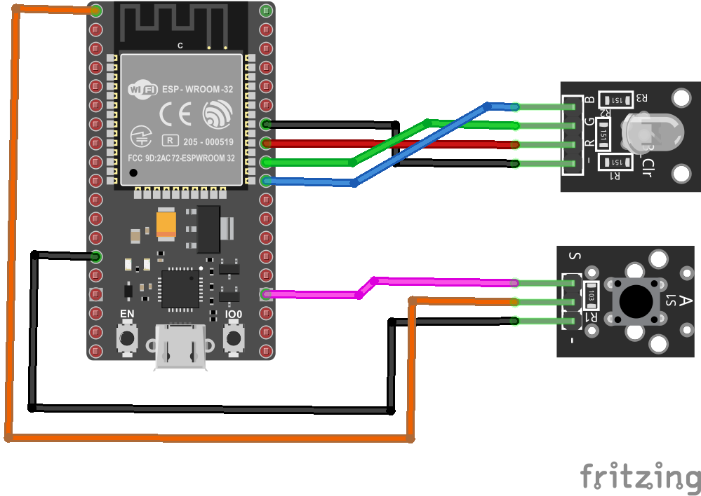

# Programación concurrente

Este material esta basado en las presentaciones **05-concurrency.pfd** ([link](05-concurrency))

## Ejemplos

Repeatedly blinks the red LED for a short time period (100 ms) every 2 seconds

### Code 1 

Repeatedly blinks the red LED for a short time period (100 ms) every 2 seconds

```ino
/* ---- Pines I/O ---- */
int redPin = 19;     // Red RGB pin -> P19 (GPIO19)
int greenPin = 18;   // Green RGB pin -> P18 (GPIO18)
int bluePin = 5;    // Blue RGB pin -> P5 (GPIO5)

/* ---- Setup ---- */
void setup() {
  pinMode(redPin, OUTPUT);
  pinMode(bluePin, OUTPUT);
  pinMode(greenPin, OUTPUT);
  digitalWrite(redPin, LOW);
  digitalWrite(bluePin, LOW);
  digitalWrite(greenPin, LOW);
}

/* ---- Loop ---- */
void loop() {
  digitalWrite(redPin, HIGH); // turn LED on (red)
  delay(100);
  digitalWrite(redPin, LOW); // turn LED off (red)
  delay(1900); 
}
```

**Simulación**: [link](https://wokwi.com/projects/376445757668374529)


### Code 2

When switch S1 is pressed, toggles the green LED

```ino
/* ---- Pines I/O ---- */
const int redPin = 19;     // Red RGB pin -> P19 (GPIO19)
const int greenPin = 18;   // Green RGB pin -> P18 (GPIO18)
const int bluePin = 5;     // Blue RGB pin -> P5 (GPIO5)
const int buttonPin = 15;  // Button pin -> P17 (GPIO17)

int buttonState;

/* ---- Setup ---- */
void setup() {
  pinMode(redPin, OUTPUT);
  pinMode(bluePin, OUTPUT);
  pinMode(greenPin, OUTPUT);
  pinMode(buttonPin, INPUT);
  digitalWrite(redPin, LOW);
  digitalWrite(bluePin, LOW);
  digitalWrite(greenPin, LOW);
  Serial.begin(9600);
}

/* ---- Loop ---- */
void loop() {
  buttonState = digitalRead(buttonPin);
  if (buttonState == LOW) {
    // Color: Red
    Serial.println(buttonState);
    digitalWrite(redPin, HIGH);  
    digitalWrite(greenPin, LOW); 
    digitalWrite(bluePin, LOW);
  }
  else {
    // Color: Green
    Serial.println(buttonState);
    digitalWrite(redPin, LOW);  
    digitalWrite(greenPin, HIGH); 
    digitalWrite(bluePin, LOW);
  }
}
```

**Simulación**: [link](https://wokwi.com/projects/376450804016641025)

## Hardware

A partir de los siguientes ejemplos se montará el siguiente hardware:

#### Esquematico


#### Diagrama de conexion



### Code 3 - Polling

* **Subtask #1**: repeatedly blinks the red LED for a short time period (100 ms)
every 2 seconds
* **Subtask #2**: when switch S1 is pressed, toggles the green LED

```ino
/* ---- Pines I/O ---- */
const int redPin = 19;     // Red RGB pin -> P19 (GPIO19)
const int greenPin = 18;   // Green RGB pin -> P18 (GPIO18)
const int bluePin = 5;     // Blue RGB pin -> P5 (GPIO5)
const int buttonPin = 15;  // Button pin -> P17 (GPIO17)

int buttonState;

/* ---- Setup ---- */
void setup() {
  pinMode(redPin, OUTPUT);
  pinMode(bluePin, OUTPUT);
  pinMode(greenPin, OUTPUT);
  pinMode(buttonPin, INPUT);
  digitalWrite(redPin, LOW);
  digitalWrite(bluePin, LOW);
  digitalWrite(greenPin, LOW);
  // Serial.begin(9600);
}

/* ---- Loop ---- */
void loop() {
  buttonState = digitalRead(buttonPin);
  if (buttonState == LOW) {
    // Led: RED
    // Serial.println(buttonState);
    digitalWrite(redPin, HIGH);  
    digitalWrite(greenPin, LOW); 
    digitalWrite(bluePin, LOW);
  }
  else {
    // Led: GREEN
    // Serial.println(buttonState);
    digitalWrite(redPin, LOW);  
    digitalWrite(greenPin, HIGH); 
    digitalWrite(bluePin, LOW);
  }
  delay(100);
  // Led: OFF 
  digitalWrite(redPin, LOW); 
  digitalWrite(greenPin, LOW); 
  digitalWrite(bluePin, LOW);
  delay(1900);
}
```

**Simulación**: [link](https://wokwi.com/projects/376451666977061889)

## Code 4 - Eventos

```ino
/* ---- Pines I/O ---- */
const int redPin = 19;     // Red RGB pin -> P19 (GPIO19)
const int greenPin = 18;   // Green RGB pin -> P18 (GPIO18)
const int bluePin = 5;     // Blue RGB pin -> P5 (GPIO5)
const int buttonPin = 15;  // Button pin -> P17 (GPIO17)

// Constantes
const int DEBOUNCE_TIME = 50;
const int T_TIME = 2000;

// Eventos
volatile int BUTTON_EVENT = LOW;
volatile int EVENT_DELAY = LOW;
volatile int EVENT_T = LOW;

// Variables de estado
int buttonState;
bool color_red = true; 

// Timers
hw_timer_t *delay_timer = NULL;        // H/W timer (timer 0)
hw_timer_t *period_timer = NULL;       // H/W timer (timer 1) 

void button_handler() {
  BUTTON_EVENT = HIGH;
}

void ARDUINO_ISR_ATTR delay_handler() {
  EVENT_DELAY = HIGH;
}

void ARDUINO_ISR_ATTR period_handler() {
  EVENT_T = HIGH;
}

/* ---- Setup ---- */
void setup() {
  // Inicializacion de pines
  pinMode(redPin, OUTPUT);
  pinMode(bluePin, OUTPUT);
  pinMode(greenPin, OUTPUT);
  pinMode(buttonPin, INPUT);
  digitalWrite(redPin, LOW);
  digitalWrite(bluePin, LOW);
  digitalWrite(greenPin, LOW);
  // Interrupciones externas
  attachInterrupt(digitalPinToInterrupt(buttonPin), button_handler, RISING);
  // Timers
  // delay
  delay_timer = timerBegin(0, 80, true);
  timerAttachInterrupt(delay_timer, &delay_handler, true);
  timerAlarmWrite(delay_timer, DEBOUNCE_TIME*1000, true);
  timerAlarmEnable(delay_timer);
  // period (T)
  period_timer = timerBegin(1, 80, true);
  timerAttachInterrupt(period_timer, &period_handler, true);
  timerAlarmWrite(period_timer, T_TIME*1000, true);
  timerAlarmEnable(period_timer);
  // Serial.begin(9600);
}

/* ---- Loop ---- */
void loop() {
  if (BUTTON_EVENT == HIGH) {
    timerRestart(delay_timer);
    if (EVENT_DELAY == HIGH) {
      // Serial.println("Boton presionado");      
      EVENT_DELAY = LOW;
      color_red = !color_red;
    }
    BUTTON_EVENT = LOW;
  }
  /*
  if (EVENT_DELAY == HIGH) {    
    EVENT_DELAY = LOW;
  }
  */
  if (EVENT_T == HIGH) {
    if (color_red == true) { 
      digitalWrite(redPin, HIGH);  
      digitalWrite(greenPin, LOW); 
    }
    else {
      digitalWrite(redPin, LOW);  
      digitalWrite(greenPin, HIGH); 
    }
    delay(100);
    digitalWrite(redPin, LOW);  
    digitalWrite(greenPin, LOW); 
    EVENT_T = LOW;
  }
}
```

**Simulación**: [link](https://wokwi.com/projects/376452962713330689)

### Code 5 - Multihilo

En los siguientes enlaces puede hacer una consulta para profundizar los aspectos teoricos:
*  https://docs.espressif.com/projects/esp-idf/en/latest/esp32/api-reference/system/pthread.html
*  https://randomnerdtutorials.com/esp32-dual-core-arduino-ide/
*  https://www.circuitstate.com/tutorials/how-to-write-parallel-multitasking-applications-for-esp32-using-freertos-arduino/
*  https://www.electrosoftcloud.com/freertos-en-esp32-esp8266-multi-tarea/

A continuación se muestra el código:

```ino
/* ---- Pines I/O ---- */
const int redPin = 19;     // Red RGB pin -> P19 (GPIO19)
const int greenPin = 18;   // Green RGB pin -> P18 (GPIO18)
const int bluePin = 5;     // Blue RGB pin -> P5 (GPIO5)
const int buttonPin = 15;  // Button pin -> P17 (GPIO17)

// Constantes
const int DEBOUNCE_TIME = 50;
const int T_TIME = 2000;
const int ON_TIME = 100;

// Variables de estado
int buttonState = LOW;
int last_buttonState = LOW; 
bool color_red = true; 

// Hilos
TaskHandle_t hilo1;

//Task1code: blinks an LED every 1000 ms
void cambiarColor( void * pvParameters ){
  for(;;){
    buttonState = digitalRead(buttonPin);
    delay(DEBOUNCE_TIME); // Delay
    last_buttonState = buttonState;
    buttonState = digitalRead(buttonPin);
    if (buttonState == last_buttonState) {
      // Valor estable
      if (buttonState == HIGH) {
        // Serial.println("Cambio");
        color_red = !color_red;
      }
    }   
  } 
}

void setup() {
  // Inicializacion de pines
  pinMode(redPin, OUTPUT);
  pinMode(bluePin, OUTPUT);
  pinMode(greenPin, OUTPUT);
  pinMode(buttonPin, INPUT);
  digitalWrite(redPin, LOW);
  digitalWrite(bluePin, LOW);
  digitalWrite(greenPin, LOW);
  // Serial
  Serial.begin(9600);

  // Hilos
  xTaskCreatePinnedToCore(
                    cambiarColor,   /* Task function. */
                    "cambiarColor",     /* name of task. */
                    10000,       /* Stack size of task */
                    NULL,        /* parameter of the task */
                    1,           /* priority of the task */
                    &hilo1,      /* Task handle to keep track of created task */
                    0);          /* pin task to core 0 */                  
  delay(500); 
}

void loop() {
  // En el hilo principal se realiza el parpadeo
  if(color_red == true) {
    digitalWrite(redPin, HIGH);
    digitalWrite(greenPin, LOW);
  }
  else {
    digitalWrite(redPin, LOW);
    digitalWrite(greenPin, HIGH);
  }
  delay(ON_TIME);
  digitalWrite(redPin, LOW);
  digitalWrite(greenPin, LOW);
  delay(T_TIME - ON_TIME);
}
```

**Simulación**: [link](https://wokwi.com/projects/376459921840141313)

## Reto

* https://randomnerdtutorials.com/esp32-over-the-air-ota-programming/

## Referencias

* https://www.electrosoftcloud.com/freertos-en-esp32-esp8266-multi-tarea/
* https://www.aranacorp.com/es/programa-multitarea-con-esp32-y-freertos/
* https://docs.espressif.com/projects/esp-idf/en/v4.3/esp32/api-reference/system/freertos.html
* https://docs.espressif.com/projects/esp-idf/en/latest/esp32/api-reference/system/freertos.html
* https://randomnerdtutorials.com/esp32-dual-core-arduino-ide/
* https://openthread.io/guides/border-router/espressif-esp32?hl=es-419
* https://www.circuitstate.com/tutorials/how-to-write-parallel-multitasking-applications-for-esp32-using-freertos-arduino/
* https://community.blynk.cc/t/tutorial-esp32-non-blocking-and-concurrent-function-execution/29828
* https://www.instructables.com/Parallelism-and-Much-More-on-the-T-Pico-C3/
* https://softwaremakeshardware.wordpress.com/tag/esp32/
* http://fab.cba.mit.edu/classes/863.16/doc/tutorials/ESP32/index.html
* https://docs.espressif.com/projects/esp-idf/en/latest/esp32/api-reference/system/pthread.html
* https://github.com/espressif/arduino-esp32
* https://github.com/tomerweller/esp32-rtos-webclient
* https://www.exploringarduino.com/
* https://www.exploringarduino.com/content2/ch13/
* https://www.luisllamas.es/esp32-adc/
* https://randomnerdtutorials.com/esp32-pwm-arduino-ide/
* https://www.luisllamas.es/esp32-pwm/


